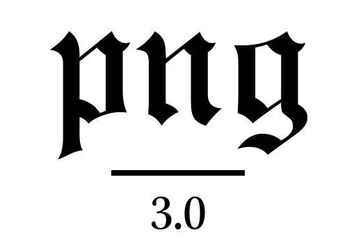

# PNG

[](https://swift.org)
[](https://github.com/kelvin13/png/releases)
[](https://travis-ci.org/kelvin13/png)
[](https://github.com/kelvin13/png/issues?state=open)
[](https://swift.org)
[](https://github.com/kelvin13/png/blob/master/COPYING)
[](https://www.google.com/search?q=no+Foundation+import)



A pure Swift PNG library. Enjoy fast PNG encoding and decoding with strong data types, strict validation, and a safe, expressive, and Swifty API.

---

### getting started

Decode a PNG file to a type of your choice in just one function call.
````swift
import PNG

let (pixels, (x: width, y: height)) = try PNG.rgba(path: "example.png", of: UInt8.self)
// pixels: [PNG.RGBA<UInt8>]
// width:  Int
// height: Int
````

Use a component type of `UInt16` to capture the full color depth of a 16-bit PNG.
````swift
let (pixels, (x: width, y: height)) = try PNG.rgba(path: "example.png", of: UInt16.self)
// pixels: [PNG.RGBA<UInt16>]
// width:  Int
// height: Int
````

Return only the components you need with the grayscale and grayscale-alpha APIs.
````swift
let (pixels, (x: width, y: height)) = try PNG.va(path: "example.png", of: UInt8.self)
// pixels: [PNG.VA<UInt8>]
// width:  Int
// height: Int
````
````swift
let (pixels, (x: width, y: height)) = try PNG.v(path: "example.png", of: UInt8.self)
// pixels: [UInt8]
// width:  Int
// height: Int
````

### documentation

* [**Tutorials**](doc/3.0.0/tutorials.md)
* [**Example code**](examples)
* [**API reference**](doc/3.0.0/api.swift)

### features 

* Supports all standard PNG formats, including indexed and interlaced formats 
* Supports common graphics API interchange formats such as ARGB32 
* Supports ancillary chunks, including private ancillary chunks
* Supports chroma key transparency
* Multi-level APIs, including raw chunk-level APIs
* Strong typing and expressive enumerations to catch invalid states at compile time
* Fixed-layout currency types for efficient C interop
* No Foundation imports and one system dependency, zlib
* Tested on MacOS and Linux
* Thorough API documentation

### versions 

| release | xcode | swift |
| --- | --- | --- |
| `master` | `11` | `trunk` |
| [`3.0.0`](https://github.com/kelvin13/png/releases/tag/v3.0.0) | `10.1` | `4.2.1` |
| [`2.0.1`](https://github.com/kelvin13/png/releases/tag/v2.0.1) | — | `3.1.1` |

### faq

> What’s the difference between bit depth and color type?

Color type refers to the channels present in a PNG. A grayscale PNG has only one color channel, while an RGB PNG has three (red, green, and blue). An RGBA PNG has four — three color channels, plus one alpha channel. Similarly, a grayscale–alpha PNG has two — one grayscale “color” channel and one alpha channel. An indexed-color PNG has one encoded channel in the image data, but the colors the indices represent are always RGBA quadruples. The vast majority of PNGs in the world are either of color type RGB or RGBA.

Bit depth goes one level lower; it represents the size of each *channel*. A PNG with a bit depth of `8` has `8` bits per channel. Hence, one pixel of an RGBA PNG is `4 * 8 = 32` bits long, or `4` bytes.

> What is interlacing?

[Interlacing](https://en.wikipedia.org/wiki/Interlacing_(bitmaps)) is a way of progressively ordering the image data in a PNG so it can be displayed at lower resolution even when partially downloaded. Interlacing is sometimes used in images on social media such as Instagram or Twitter, but rare elsewhere. Interlacing hurts compression, and so it usually significantly increases the size of a PNG file, sometimes as much as thirty percent.

> Why does this package depend on `zlib`?

ZLib is a standard compression/decompression library that is installed by default on MacOS and most Linux systems. Although it is written in C, it is wrapped by almost every major programming language including Java and Python. The only other Swift PNG decoder library in existence at the time of writing, [SwiftGL Image](https://github.com/SwiftGL/Image), actually implements its own, pure Swift, `INFLATE` algorithm. (Note that it doesn’t compile on Swift ≥3.1.)

> Does this package work on MacOS?

Yes.

> How do I access/encode custom PNG metadata chunks?

Use the ancillary chunk API on the `Data.Uncompressed` or `Data.Rectangular` types, which expose ancillary chunk types and data through the `ancillaries` instance property. See [this tutorial](doc/3.0.0/tutorials.md#apply-a-color-ramp-to-a-grayscale-image) for more details. Note that, except for `tRNS`, *PNG* does not parse ancillary chunks, it only provides their data as a `[UInt8]` buffer. Consult the [PNG specification](http://www.libpng.org/pub/png/spec/1.2/PNG-Chunks.html) to interpret the ancillary chunks.

> Does this package do gamma correction?

No. Gamma is meant to be applied at the image *display* stage. *PNG* only gives you the base pixel values in the image (with indexed pixel dereferencing and chroma key substitution). Gamma is also easy to apply to raw color data but computationally expensive to remove. Some PNGs include gamma data in a chunk called `gAMA`, but most don’t, and viewers will just apply a `γ = 2.2` regardless.

### building
Build *PNG* with the swift package manager, `swift build` (`-c release`). Make sure you have the `zlib` headers on your computer (`sudo apt-get install libz-dev`).
