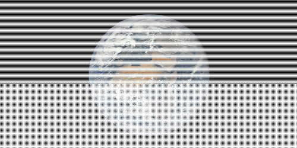
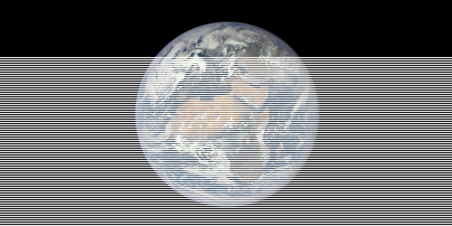

# Online decoding

Learn how to use the contextual api to manually manage decoder state, display partially-downloaded images, display previews of partially-downloaded interlaced images with overdrawing, rebind image data to a different image layout, and customize the chunk granularity in emitted PNG files.

## Key terms

-   term *decoder context*:
    A context that holds the state of a PNG decoder. The context is used to manage the decoder’s state, and to control the decoding process.

-   term *critical chunk*:
    A chunk that is required for the correct interpretation of the image data. The critical chunks are the `IHDR`, `PLTE`, `IDAT`, and `IEND` chunks.

-   term *ancillary chunk*:
    A chunk that is not required for the correct interpretation of the image data.

-   term *chunk granularity*:
    The size of the chunks in the emitted PNG file. The chunk granularity is the number of bytes in the emitted file that are allocated to each chunk.

-   term *overdrawing*:
    The process of drawing more-detailed image data over less-detailed image data. Overdrawing is a technique used to display previews of partially-downloaded interlaced images.

## Worked example

Many applications using PNG images transmit them to users over a network. It is often valuable for such applications to be able to display a lower-quality preview of the image before it is fully downloaded onto a user’s device.

In this tutorial, we will simulate an asynchronously-loaded PNG file, and use *Swift PNG*’s contextual decoding API to display partial “snapshots” of the image as portions of the file arrive. As with the <doc:ImagesInMemory> tutorial, if you have used the analogous [*Swift JPEG* API](https://github.com/tayloraswift/jpeg/tree/master/examples#online-decoding), the process here should be very familiar. We will also explore ways to make these previews more user-friendly through interlacing and overdrawing.

@Image(source: "OnlineDecoding.png", alt: "input png") {
    The example image.

    Source: [Wikimedia Commons](https://commons.wikimedia.org/wiki/File:Africa_and_Europe_from_a_Million_Miles_Away.png)
}

To simulate a file being transferred over a network, we are going to modify the blob type from the [previous tutorial](ImagesInMemory) by adding an integer field `available` representing the amount of the file we “have” at a given moment.

@Snippet(id: "OnlineDecoding", slice: "STREAM_TYPE")

Each time we try to ``_PNGBytestreamSource/read(count:)`` from this stream, it will either return data from the available portion of the buffer, or it will return `nil` and “download” an additional 4 KB of the file. We also allow for rewinding the current file position to an earlier state.

@Snippet(id: "OnlineDecoding", slice: "STREAM_CONFORMANCE")

For the purposes of this tutorial we again populate our mock data stream using the file system APIs, though we could just as easily imagine the data coming over an actual network.

@Snippet(id: "OnlineDecoding", slice: "BOOTSTRAP")

The key to making this work is understanding that if the ``_PNGBytestreamSource/read(count:)`` call on the stream instance returns `nil`, then one of three library errors will get thrown:

- ``PNG.LexingError.truncatedSignature``
- ``PNG.LexingError.truncatedChunkHeader``
- ``PNG.LexingError.truncatedChunkBody(expected:)``

These errors get thrown from the library’s lexer functions, which lex PNG chunks out of a raw bytestream. There are two lexer functions. The ``_PNGBytestreamSource/signature()`` method lexes the PNG signature bytes from the beginning of a PNG file, and it can throw a ``PNG/LexingError/truncatedSignature`` error. The ``_PNGBytestreamSource/chunk()`` method lexes a PNG chunk, and it can throw a ``PNG/LexingError/truncatedChunkHeader`` or ``PNG/LexingError/truncatedChunkBody(expected:)`` error.

```swift
mutating
func signature() throws

mutating
func chunk() throws -> (type:PNG.Chunk, data:[UInt8])
```

A valid PNG file consists of a signature, followed by a sequence of chunks.

The lexer functions are provided as extensions on the ``PNG.BytestreamSource`` protocol, so they are available on any conforming data stream type, including our custom `Stream` type.

Normally, the three aforementioned errors would indicate an unexpected end-of-stream. In this case, they just mean that there is not enough data available yet, so the client needs to wait for more of the file to arrive before decoding can proceed. To allow the lexing functions to recover on end-of-stream instead of crashing the application, we wrap them in the following `waitSignature(stream:)` and `waitChunk(stream:)` functions, making sure to reset the file position if end-of-stream is encountered.

@Snippet(id: "OnlineDecoding", slice: "WAIT_FUNCTIONS")

There are other possible ``PNG/LexingError``s that report problems such as invalid signatures or corrupted chunk data, so we only sequester the three end-of-stream errors.

Because we are trying to interact with a decoded image while it is in an incomplete state, we have to take on the responsibility of managing decoder state ourselves. The basic rules that apply here are:

1. The first chunk in a PNG file is an ``PNG/Chunk/IHDR`` (``PNG.Header``) chunk, unless it is an [iPhone-optimized image](iPhoneOptimized), in which case the first chunk is a ``PNG/Chunk/CgBI`` chunk, immediately followed by the ``PNG/Chunk/IHDR`` chunk.

2. A PNG file can contain, at most, one ``PNG/Chunk/PLTE`` (``PNG.Palette``), one ``PNG/Chunk/tRNS`` (``PNG.Transparency``), and one ``PNG/Chunk/bKGD`` (``PNG.Background``) chunk. If it contains a ``PNG/Chunk/PLTE`` chunk, it must come before the ``PNG/Chunk/tRNS`` and ``PNG/Chunk/bKGD`` chunks, if applicable.

3. The image data in a PNG file is stored in a series of ``PNG/Chunk/IDAT`` chunks, which must occur in a single, contiguous sequence, and after any ``PNG/Chunk/PLTE``, ``PNG/Chunk/tRNS``, or ``PNG/Chunk/bKGD`` chunks.

4. The last chunk in a PNG file is an ``PNG/Chunk/IEND`` chunk.

The ``PNG/Chunk/CgBI``, ``PNG/Chunk/IHDR``, ``PNG/Chunk/PLTE``, ``PNG/Chunk/IDAT``, and ``PNG/Chunk/IEND`` chunks are known as **critical chunks**. The rest of the chunk types are known as **ancillary chunks**. The ancillary chunks can be thought of as “metadata chunks”, though the line between data and metadata isn’t always clear. Notably, *Swift PNG* treats the `tRNS` and `bKGD` chunks as part of the image color format, so our custom decoder implementation should handle them explicitly, along with all of the critical chunks.

A full list of critical and ancillary chunk types is given below.

| type code     | type  | unique | ordering                           | dependencies    |
| ------------- | ----------------- | ------ | ---------------------------------- | --------------- |
| **``PNG/Chunk/CgBI``**    | ``Void``                  | yes    | first                              |                 |
| **``PNG/Chunk/IHDR``**    | ``PNG.Header``            | yes    | first, or immediately after ``PNG/Chunk/CgBI`` | ``PNG/Chunk/CgBI``          |
| **``PNG/Chunk/PLTE``**    | ``PNG.Palette``           | yes    | after ``PNG/Chunk/IHDR``, and before ``PNG/Chunk/IDAT``    | ``PNG/Chunk/IHDR``          |
| **``PNG/Chunk/IDAT``**    | `[UInt8]`                 | no     |                                    | ``PNG/Chunk/IHDR``, ``PNG/Chunk/PLTE``, ``PNG/Chunk/tRNS``, ``PNG/Chunk/bKGD`` |
| **``PNG/Chunk/IEND``**    | ``Void``                  | yes    | last                               |                 |
||||||
|   ``PNG/Chunk/cHRM``      | ``PNG.Chromaticity``      | yes    | before ``PNG/Chunk/PLTE``                      |                 |
|   ``PNG/Chunk/gAMA``      | ``PNG.Gamma``             | yes    | before ``PNG/Chunk/PLTE``                      |                 |
|   ``PNG/Chunk/iCCP``      | ``PNG.ColorProfile``      | yes    | before ``PNG/Chunk/PLTE``                      |                 |
|   ``PNG/Chunk/sRGB``      | ``PNG.ColorRendering``    | yes    | before ``PNG/Chunk/PLTE``                      |                 |
|   ``PNG/Chunk/sBIT``      | ``PNG.SignificantBits``   | yes    | before ``PNG/Chunk/PLTE``                      | ``PNG/Chunk/IHDR``          |
||||||
|   ``PNG/Chunk/tRNS``      | ``PNG.Transparency``      | yes    | after ``PNG/Chunk/PLTE``, and before ``PNG/Chunk/IDAT``    | ``PNG/Chunk/IHDR``, ``PNG/Chunk/PLTE``  |
|   ``PNG/Chunk/bKGD``      | ``PNG.Background``        | yes    | after ``PNG/Chunk/PLTE``, and before ``PNG/Chunk/IDAT``    | ``PNG/Chunk/IHDR``, ``PNG/Chunk/PLTE``  |
|   ``PNG/Chunk/hIST``      | ``PNG.Histogram``         | yes    | after ``PNG/Chunk/PLTE``, and before ``PNG/Chunk/IDAT``    | ``PNG/Chunk/IHDR``, ``PNG/Chunk/PLTE``  |
||||||
|   ``PNG/Chunk/pHYs``      | ``PNG.PhysicalDimensions``| yes    | before ``PNG/Chunk/IDAT``                      |                 |
|   ``PNG/Chunk/sPLT``      | ``PNG.SuggestedPalette``  | no     | before ``PNG/Chunk/IDAT``                      |                 |
||||||
|   ``PNG/Chunk/tIME``      | ``PNG.TimeModified``      | yes    |                                    |                 |
|   ``PNG/Chunk/iTXt``      | ``PNG.Text``              | no     |                                    |                 |
|   ``PNG/Chunk/tEXt``      | ``PNG.Text``              | no     |                                    |                 |
|   ``PNG/Chunk/zTXt``      | ``PNG.Text``              | no     |                                    |                 |

If a chunk has dependencies, that means it gets parsed differently depending on the contents of the upstream chunks. It does not mean that the upstream chunks must appear — indeed, in some situations, the upstream chunks must *not* appear. It *does* mean that none of the upstream chunks may appear after the dependent chunk.

>   Note:
>   The full lexing space of a PNG file can be expressed as a directed graph. If you ignore text chunks and ``PNG/Chunk/sPLT`` chunks, and collapse sequences of ``PNG/Chunk/IDAT`` chunks into a single vertex, this graph is also acyclic.

The ordering constraints and chunk dependencies might seem like a lot to keep track of, but they come out naturally in the type signatures of *Swift PNG*’s contextual decoding interfaces, so everything should just click together. The amount of code we have to write is actually quite small.

To do online decoding, we are going to write a function `decodeOnline(stream:overdraw:capture:)` with the following signature:

@Snippet(id: "OnlineDecoding", slice: "DECODE_ONLINE")

The `capture` parameter is a delegate that will receive a partially-decoded image each time an image data chunk has been decompressed. The `overdraw` parameter is a switch which we will use later in this tutorial.

The first thing we do is lex the PNG signature bytes from the beginning of the file.

@Snippet(id: "OnlineDecoding", slice: "LEX_SIGNATURE")

The next step is to parse the PNG header, and the preceeding ``PNG/Chunk/CgBI`` chunk, if present. The following code reads at least one chunk (and at most two chunks) from the beginning of the PNG file using the `waitChunk(stream:)` function. If the first chunk is a ``PNG/Chunk/CgBI`` chunk, the image is an iphone-optimized image, and we move on to the next chunk. Otherwise we mark the image as non-iphone-optimized, and do not advance the chunk position. We then check that the current chunk is an ``PNG/Chunk/IHDR`` chunk, and use the ``PNG.Header.init(parsing:standard:)`` initializer to parse the chunk data. (``PNG/Chunk/CgBI`` chunks also contain data, but it isn’t relevant for us, so we do not parse them.)

@Snippet(id: "OnlineDecoding", slice: "LEX_HEADERS")

>   Note:
>   The parsing interfaces in [*swift jpeg*](https://github.com/tayloraswift/jpeg) are spelled as static `parse(_:...)` constructors. In *swift png*, these have been provided as `init(parsing:...)` initializers to better conform to Swift API conventions.

The next step is to process all the chunks up to, but not including, the first ``PNG/Chunk/IDAT`` chunk. The goal is to be able to construct a **decoder context** (``PNG.Context``) by the time we reach the image data, using any ``PNG/Chunk/PLTE``, ``PNG/Chunk/bKGD``, or ``PNG/Chunk/tRNS`` chunks we have encountered in the meantime.

There are a great many ways to spell this loop. Here, we have written it with a single-use closure that returns a ``PNG/Context`` structure upon encountering the first ``PNG/Chunk/IDAT`` chunk. This reduces the amount of ``Optional``s we have to deal with. A competent Swift developer should be able to translate it into her preferred pattern.

We declare variables to hold an optional palette (``PNG.Palette``), background (``PNG.Background``), and transparency (``PNG.Transparency``) structure. A ``PNG.Metadata`` structure tracks all other chunk types.

@Snippet(id: "OnlineDecoding", slice: "LEX_WITH_CONTEXT")

If we encounter a ``PNG/Chunk/PLTE`` chunk, we parse it with the ``PNG.Palette.init(parsing:pixel:)`` initializer. Since palette chunks have a dependency on the header chunk, this initializer takes a ``PNG.Format.Pixel`` parameter.

For any other (allowed) chunk type besides ``PNG/Chunk/IDAT`` we delegate it to the metadata structure through its ``PNG/Metadata/push(ancillary:pixel:palette:background:transparency:)`` method. This method parses the chunk using the appropriate parsing function, and stores it internally, or in its two `inout` parameters, if applicable. It also enforces all relevant chunk ordering constraints.

>   Note:
>   The ``PNG/Metadata`` type does not handle palette chunks, because ``PNG/Chunk/PLTE`` is a critical chunk type. It also does not track background or transparency chunks internally, since this information will ultimately live in the image color format, so storing it in the image metadata would be redundant.

Finally, once we encounter an ``PNG/Chunk/IDAT`` chunk, we construct the decoder context using everything we have parsed so far. The ``PNG.Context.init(standard:header:palette:background:transparency:metadata:uninitialized:)`` initializer is failable. It returns nil if an image with an indexed color format is missing a palette. (The opposite problem — an image with a grayscale or grayscale-alpha color format containing a palette that shouldn’t be there — would have gotten caught by the ``PNG.Palette.init(parsing:pixel:)`` initializer.)

The `uninitialized` parameter specifies whether the image buffer in the decoder context gets cleared or not. It’s not uncommon for Swift to allocate new image buffers right on top of recently-deallocated image buffers, so a partially-decoded image might contain pieces of a previously decoded image. When doing non-progressive decoding, this doesn’t matter, but it can look weird for the progressive use case, so we have set this parameter to false.

We return from the closure before advancing to the next chunk.

@Snippet(id: "OnlineDecoding", slice: "LEX_CASES")

The image decoding takes place in the next phase of the loop. The ``PNG/Context/push(data:overdraw:)`` method on the decoder context does this for each ``PNG/Chunk/IDAT`` chunk. This is also the usage point of the `overdraw` parameter provided to the `decodeOnline(stream:overdraw:capture:)` function. We’ll see later what it does. For now, assume it has been set to `false`.

After decompressing an image data chunk, we feed the image state, which is available through the ``PNG/Context/image`` property on the decoder context, to the `capture` delegate.

@Snippet(id: "OnlineDecoding", slice: "LEX_IDAT")

In the last phase of the loop, we process all the trailing metadata chunks by passing them to the ``PNG/Context/push(ancillary:)`` method on the decoder context. This method is a lot like the ``PNG/Metadata/push(ancillary:pixel:palette:background:transparency:)`` method on a ``PNG.Metadata`` structure, except it only accepts chunk types that are allowed to appear after the image data. We halt upon encountering the ``PNG/Chunk/IEND`` chunk.

@Snippet(id: "OnlineDecoding", slice: "LEX_TRAILERS")

>   Note:
>   You can pass an ``PNG/Chunk/IEND`` chunk to the ``PNG/Context/push(ancillary:)`` method, as we have done above, even though ``PNG/Chunk/IEND`` is a critical chunk type. This makes the decoder context check that the compressed image data stream has been properly terminated.

We can invoke `decodeOnline(stream:overdraw:capture:)` on the stream structure we created earlier, saving each partially-decoded image snapshot to a separate PNG file. The pixel-unpacking call in the middle of the delegate function doesn’t do anything; it’s just there to demonstrate that the snapshots are normal ``PNG.Image`` instances that we can treat like any other image data instance.

@Snippet(id: "OnlineDecoding", slice: "SILENT_MAJORITY")

| chunk | image |
| ----- | ----- |
| 0     |  |
| 1     |  |
| 2     |  |
| 3     |  |
| 4     |  |
| 5     |  |
| 6     |  |
| 7     |  |
| 8     |  |
| 9     |  |
| 10    |  |

Our example image was a non-interlaced image, so it gets decoded as a sequence of scanlines from top-to-bottom.

We can make the previews more useful by preprocessing the image into an interlaced layout. (In a real use case, you would do this on the server, before sending it to client applications.) One way to do this is to unpack and repack the image pixels to a new image layout. A faster way to do it is to use the ``PNG/Image/bindStorage(to:)`` method on the image data instance, which provides a safe interface for changing image layouts without unnecessary repacking operations. This method requires that both image layouts have the same color format enumeration case, though not necessarily the same values for `fill` or `key`. Furthermore, if the color format is an indexed format, the new image palette must have the same number of entries as the old palette.

When emitting the preprocessed file, we have manually set the **chunk granularity** to 2<sup>12</sup> bytes, which is much smaller than the default of 2<sup>15</sup> bytes. The purpose of this is to make the encoder emit smaller ``PNG/Chunk/IDAT`` chunks, so that we can observe a larger number of intermediate snapshots.

@Snippet(id: "OnlineDecoding", slice: "SAVE_INTERLACED")

We can invoke `decodeOnline(stream:overdraw:capture:)` on the interlaced image as follows.

@Snippet(id: "OnlineDecoding", slice: "PROGRESSIVE")

| chunk | image |
| ----- | ----- |
| 0     |  |
| 1     |  |
| 2     |  |
| 3     |  |
| 4     |  |
| 5     |  |
| 6     |  |
| 7     |  |
| 8     |  |
| 9     |  |
| 10    |  |
| 11    |  |

If we enable **overdrawing**, *Swift PNG* will pre-fill missing pixels with values from nearby pixels that are currently available. The term *overdrawing* comes from the fact that these pre-filled pixels will be overwritten when their actual contents become available. We can enable overdrawing by setting the `overdraw` parameter to true.

@Snippet(id: "OnlineDecoding", slice: "PROGRESSIVE_OVERDRAW")

>   Warning:
>   Overdrawing does not eliminate the need to initialize the image buffer. However, every pixel in the image buffer will be written to by the end of the first [ADAM7 scan](https://en.wikipedia.org/wiki/Adam7_algorithm), which often fits easily into the first ``PNG/Chunk/IDAT`` chunk. This makes it significantly less likely that you will observe uninitialized pixels.

When overdrawing is enabled, the intermediate snapshots look somewhat more user-friendly than they do without it.

| chunk | image |
| ----- | ----- |
| 0     |  |
| 1     |  |
| 2     |  |
| 3     |  |
| 4     |  |
| 5     |  |
| 6     |  |
| 7     |  |
| 8     |  |
| 9     |  |
| 10    |  |
| 11    |  |

Overdrawing has no effect if the image is not interlaced.
