# *swift png* benchmarks 

> generated on **January 14, 2021** for commit **[`dfd3571`](https://github.com/kelvin13/png/commit/dfd35719e17a87f47e3c805c7e89f9c69df8ecde)** using **[`utils/benchmark`](../utils/benchmark)**

## running benchmarks 

*Swift PNG*’s benchmarks live in the `benchmarks` directory. They are divided into compression benchmarks ([`benchmarks/compression`](compression)) and decompression benchmarks ([`benchmarks/decompression`](decompression)). Each benchmark compares a *Swift PNG* test application to an equivalent *libpng*-based implementation. All performance benchmarks are *cold-start* measurements, meaning that the code sleeps for a fraction of a second before each trial run.

All benchmarks run on a test suite of **28** images. 

<em>Click to show test image table</em>

| Test image | Size |
| ---------- | ---- |
| `indexed8-color-nonphotographic.png`    | 43,496 B |
| `indexed8-color-photographic.png`    | 65,487 B |
| `indexed8-monochrome-nonphotographic.png`    | 62,888 B |
| `indexed8-monochrome-photographic.png`    | 82,014 B |
| `rgb16-color-nonphotographic.png`    | 365,253 B |
| `rgb16-color-photographic.png`    | 477,784 B |
| `rgb16-monochrome-nonphotographic.png`    | 244,077 B |
| `rgb16-monochrome-photographic.png`    | 379,113 B |
| `rgb8-color-nonphotographic.png`    | 130,595 B |
| `rgb8-color-photographic.png`    | 174,298 B |
| `rgb8-monochrome-nonphotographic.png`    | 76,636 B |
| `rgb8-monochrome-photographic.png`    | 92,023 B |
| `rgba16-color-nonphotographic.png`    | 394,493 B |
| `rgba16-color-photographic.png`    | 518,368 B |
| `rgba16-monochrome-nonphotographic.png`    | 143,935 B |
| `rgba16-monochrome-photographic.png`    | 414,526 B |
| `rgba8-color-nonphotographic.png`    | 147,023 B |
| `rgba8-color-photographic.png`    | 196,537 B |
| `rgba8-monochrome-nonphotographic.png`    | 84,098 B |
| `rgba8-monochrome-photographic.png`    | 101,521 B |
| `v16-monochrome-nonphotographic.png`    | 123,371 B |
| `v16-monochrome-photographic.png`    | 176,236 B |
| `v8-monochrome-nonphotographic.png`    | 48,191 B |
| `v8-monochrome-photographic.png`    | 59,743 B |
| `va16-monochrome-nonphotographic.png`    | 143,935 B |
| `va16-monochrome-photographic.png`    | 209,902 B |
| `va8-monochrome-nonphotographic.png`    | 60,478 B |
| `va8-monochrome-photographic.png`    | 76,280 B |

## results

### decoding 

The decompression benchmarks compare the performance of *Swift PNG* to that of *libpng* while decoding the **28** images in the library test suite. Run times are normalized according to the *median* runtime of the baseline (*libpng*) implementation *for each test image*. 

In the density plot below, the labeled curves represent the *aggregate distribution* of run times across all **28** test images. The unlabeled curves are the distributions for each individual test image. The dashed curve indicates the distribution for one of the 8-bit RGB test images (`rgb8-color-photographic`), one of the most common PNG image types.

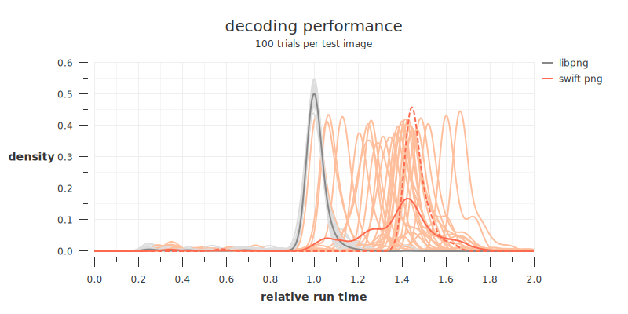

As of commit **[`dfd3571`](https://github.com/kelvin13/png/commit/dfd35719e17a87f47e3c805c7e89f9c69df8ecde)**, *Swift PNG*’s median decoding time was **135.9 percent** that of *libpng*.

### encoding 

The compression benchmarks are similar to the decompression benchmarks except we measure ten of the library’s thirteen compression levels separately. (The three highest compression levels have no *libpng* equivalent.)

Note that *Swift PNG* and *libpng* compression levels generally don’t correspond to one another. In particular, *Swift PNG*’s speed-vs-compression curve is “flatter” than *libpng*’s. This means *Swift PNG* performs more compression (using more resources) than *libpng* for the first few compression levels, and some of the higher compression levels as well. This is by design, because *libpng* has the undesirable property in that for many input images, its speed does not decrease monotonically as the compression parameter increases.

In the density plots below, the labeled curves represent the *aggregate distribution* of run times across all **28** test images. The unlabeled curves are the distributions for each individual test image. The dashed curve indicates the distribution for one of the 8-bit RGB test images (`rgb8-color-photographic`), one of the most common PNG image types.

#### compression level 0

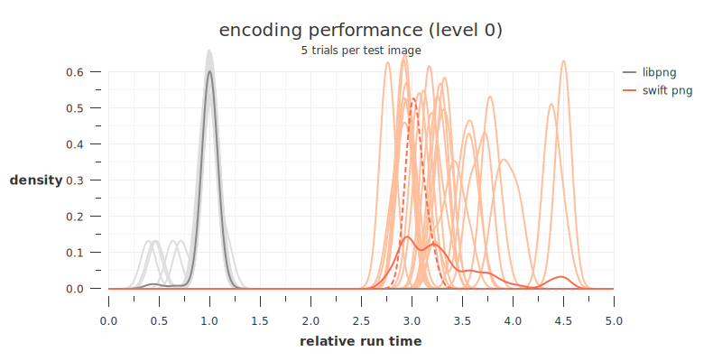

As of commit **[`dfd3571`](https://github.com/kelvin13/png/commit/dfd35719e17a87f47e3c805c7e89f9c69df8ecde)**, *Swift PNG*’s median encoding time at its 0th compression level was **330.44 percent** that of *libpng*. *Swift PNG*’s encoding time for the `rgb8-color-photographic` test image was **302.06 percent** that of *libpng*.

*Swift PNG*’s generated file size for the `rgb8-color-photographic` test image was **58.4 percent** that of *libpng*.

#### compression level 1

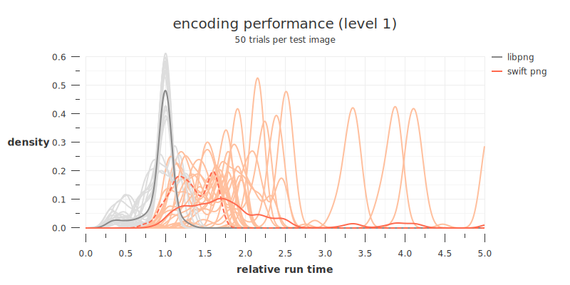

As of commit **[`dfd3571`](https://github.com/kelvin13/png/commit/dfd35719e17a87f47e3c805c7e89f9c69df8ecde)**, *Swift PNG*’s median encoding time at its 1st compression level was **185.14 percent** that of *libpng*. *Swift PNG*’s encoding time for the `rgb8-color-photographic` test image was **168.62 percent** that of *libpng*.

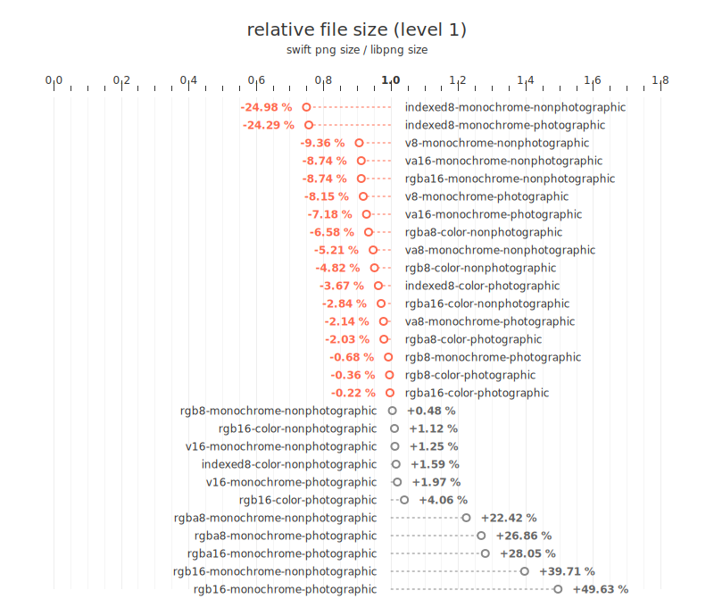

*Swift PNG*’s generated file size for the `rgb8-color-photographic` test image was **99.64 percent** that of *libpng*.

#### compression level 2

As of commit **[`dfd3571`](https://github.com/kelvin13/png/commit/dfd35719e17a87f47e3c805c7e89f9c69df8ecde)**, *Swift PNG*’s median encoding time at its 2nd compression level was **178.37 percent** that of *libpng*. *Swift PNG*’s encoding time for the `rgb8-color-photographic` test image was **163.21 percent** that of *libpng*.

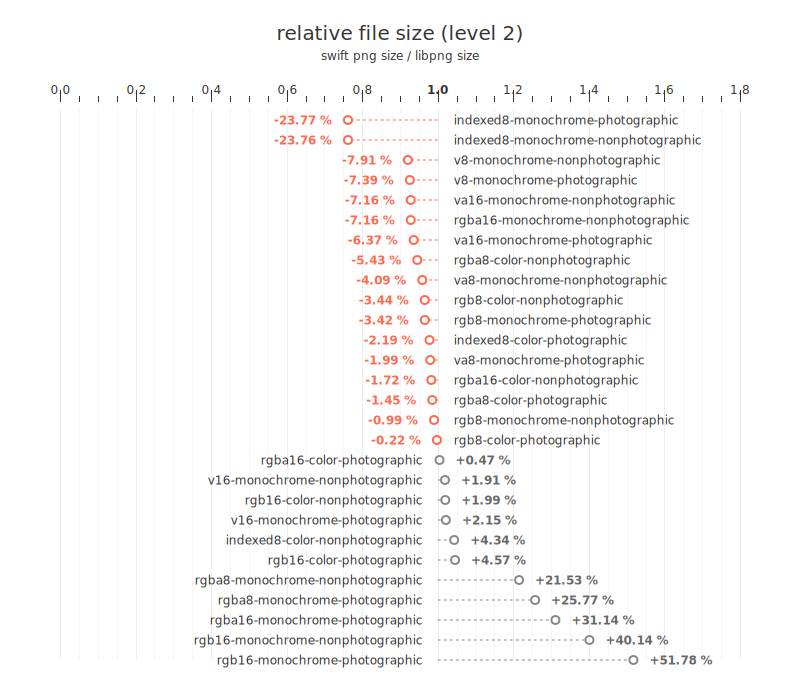

*Swift PNG*’s generated file size for the `rgb8-color-photographic` test image was **99.78 percent** that of *libpng*.

#### compression level 3

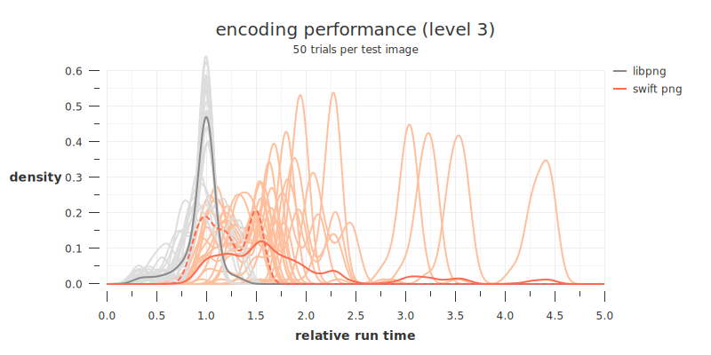

As of commit **[`dfd3571`](https://github.com/kelvin13/png/commit/dfd35719e17a87f47e3c805c7e89f9c69df8ecde)**, *Swift PNG*’s median encoding time at its 3rd compression level was **170.88 percent** that of *libpng*. *Swift PNG*’s encoding time for the `rgb8-color-photographic` test image was **148.27 percent** that of *libpng*.

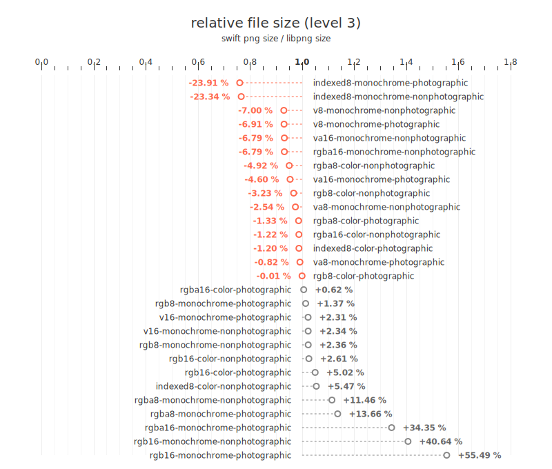

*Swift PNG*’s generated file size for the `rgb8-color-photographic` test image was **99.99 percent** that of *libpng*.

#### compression level 4

As of commit **[`dfd3571`](https://github.com/kelvin13/png/commit/dfd35719e17a87f47e3c805c7e89f9c69df8ecde)**, *Swift PNG*’s median encoding time at its 4th compression level was **167.56 percent** that of *libpng*. *Swift PNG*’s encoding time for the `rgb8-color-photographic` test image was **131.12 percent** that of *libpng*.

*Swift PNG*’s generated file size for the `rgb8-color-photographic` test image was **100.93 percent** that of *libpng*.

#### compression level 5

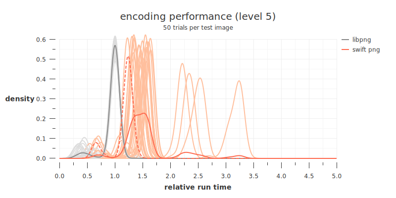

As of commit **[`dfd3571`](https://github.com/kelvin13/png/commit/dfd35719e17a87f47e3c805c7e89f9c69df8ecde)**, *Swift PNG*’s median encoding time at its 5th compression level was **148.72 percent** that of *libpng*. *Swift PNG*’s encoding time for the `rgb8-color-photographic` test image was **127.73 percent** that of *libpng*.

*Swift PNG*’s generated file size for the `rgb8-color-photographic` test image was **101.1 percent** that of *libpng*.

#### compression level 6

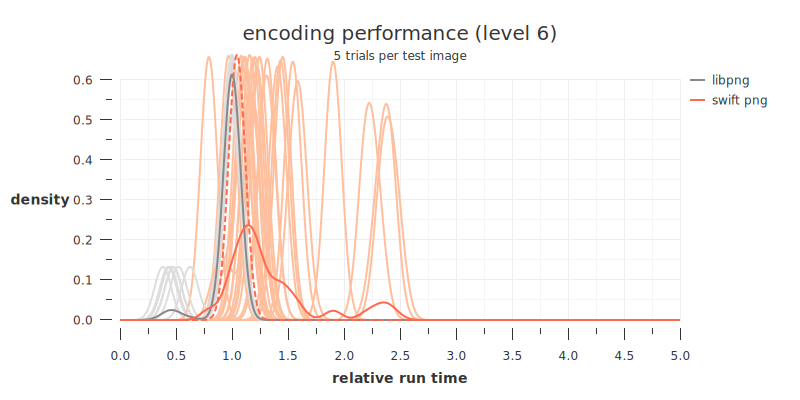

As of commit **[`dfd3571`](https://github.com/kelvin13/png/commit/dfd35719e17a87f47e3c805c7e89f9c69df8ecde)**, *Swift PNG*’s median encoding time at its 6th compression level was **120.88 percent** that of *libpng*. *Swift PNG*’s encoding time for the `rgb8-color-photographic` test image was **104.71 percent** that of *libpng*.

*Swift PNG*’s generated file size for the `rgb8-color-photographic` test image was **101.71 percent** that of *libpng*.

#### compression level 7

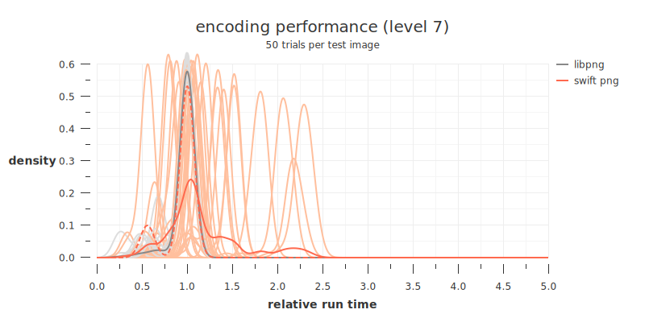

As of commit **[`dfd3571`](https://github.com/kelvin13/png/commit/dfd35719e17a87f47e3c805c7e89f9c69df8ecde)**, *Swift PNG*’s median encoding time at its 7th compression level was **111.08 percent** that of *libpng*. *Swift PNG*’s encoding time for the `rgb8-color-photographic` test image was **100.13 percent** that of *libpng*.

*Swift PNG*’s generated file size for the `rgb8-color-photographic` test image was **101.84 percent** that of *libpng*.

#### compression level 8

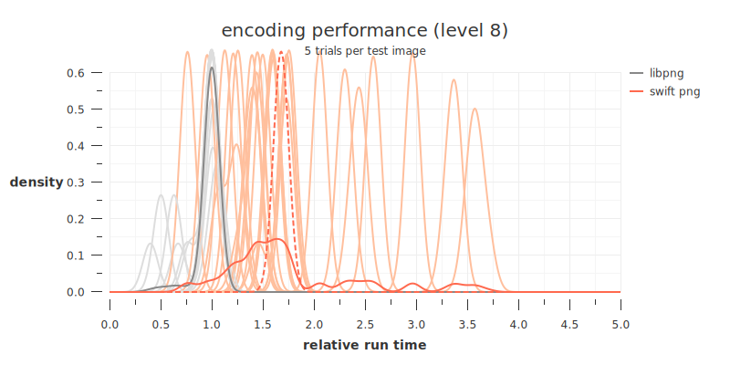

As of commit **[`dfd3571`](https://github.com/kelvin13/png/commit/dfd35719e17a87f47e3c805c7e89f9c69df8ecde)**, *Swift PNG*’s median encoding time at its 8th compression level was **159.73 percent** that of *libpng*. *Swift PNG*’s encoding time for the `rgb8-color-photographic` test image was **168.35 percent** that of *libpng*.

*Swift PNG*’s generated file size for the `rgb8-color-photographic` test image was **99.13 percent** that of *libpng*.

#### compression level 9

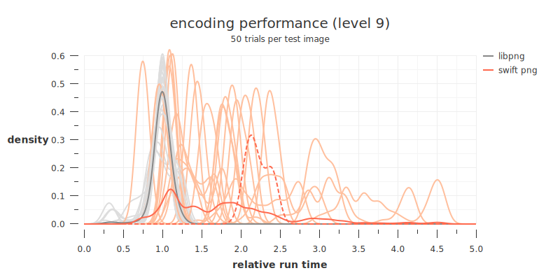

As of commit **[`dfd3571`](https://github.com/kelvin13/png/commit/dfd35719e17a87f47e3c805c7e89f9c69df8ecde)**, *Swift PNG*’s median encoding time at its 9th compression level was **174.21 percent** that of *libpng*. *Swift PNG*’s encoding time for the `rgb8-color-photographic` test image was **208.28 percent** that of *libpng*.

*Swift PNG*’s generated file size for the `rgb8-color-photographic` test image was **98.27 percent** that of *libpng*.

