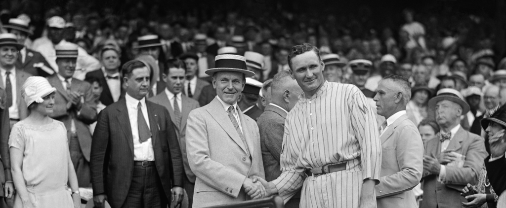
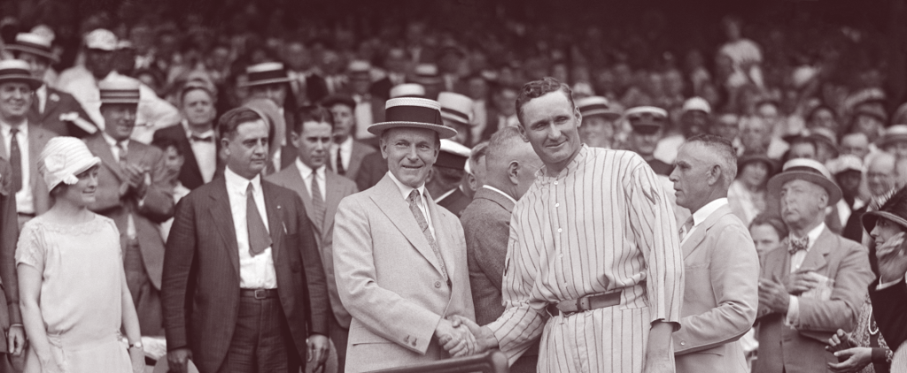
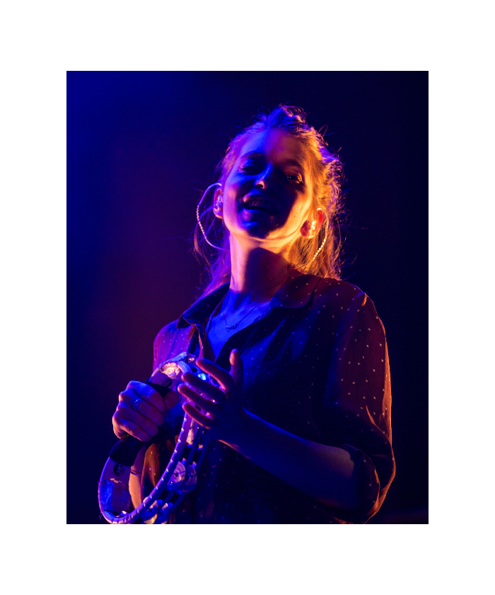
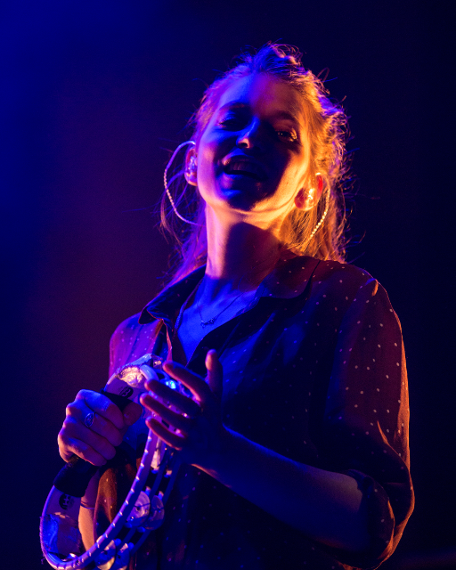
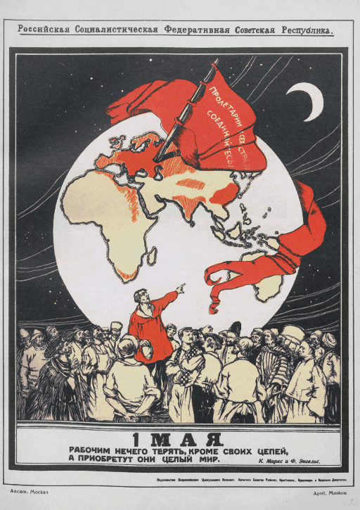
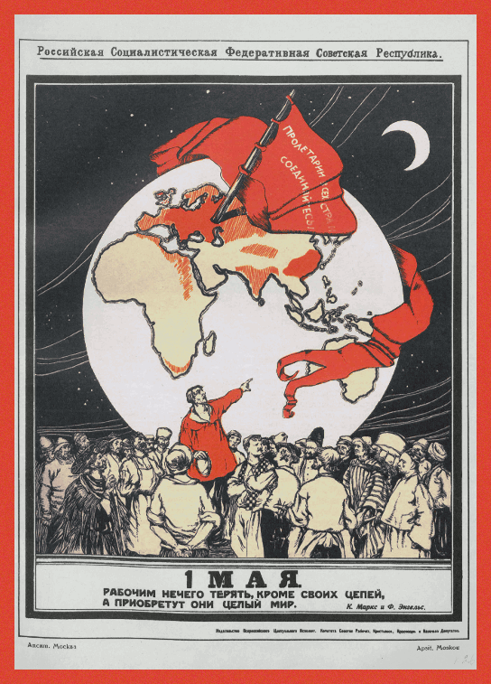

# *PNG* tutorials

## Convert color images to grayscale using natural luminance


*Example input: *Spiral staircase of the Exhibition Hall of the German Historical Museum*, [Ansgar Koreng / CC BY-SA 3.0 (DE)](https://commons.wikimedia.org/wiki/File:Treppenturm,_Deutsches_Historisches_Museum,_Berlin,_150118,_ako.jpg)*

We will write the following function, `luminance(input:output:)`, which will load a PNG image from the given path, convert it to grayscale using a natural luminance formula, and save it at the given destination.

```swift 
func luminance(input inputPath:String, output outputPath:String) 
```

The easiest way to load a PNG file with *PNG* is to use the `rgba(path:of:)` function defined at the root of the `enum PNG` namespace. This function takes two arguments: a file path, and a component type. (As is typical with Swift APIs, *PNG* makes you supply the metatype object `UInt8.self` explicitly.) It returns a tuple containing a row-major array of the image’s pixel values, and its size, in pixels. The product of the size dimensions is guaranteed to equal the `count` of the array.

```swift
    guard let (rgba, (x, y)):([PNG.RGBA<UInt8>], (x:Int, y:Int)) = 
        try? PNG.rgba(path: inputPath, of: UInt8.self) 
```

The type argument specifies what component type you want the output `RGBA<T>` pixel values to have. Any type that conforms to both [`FixedWidthInteger`](https://developer.apple.com/documentation/swift/fixedwidthinteger) and [`UnsignedInteger`](https://developer.apple.com/documentation/swift/unsignedinteger) is a valid argument for this parameter, but only `UInt8`, `UInt16`, `UInt32`, `UInt64`, and `UInt` have specializations in the library. (Specializations remove generic abstraction overhead from the API.)

The `rgba(path:of:)` function can throw errors. The most common will probably be (`PNG.`)`File.Error.couldNotOpen`, which usually means you gave a wrong file path, though other errors can occur in the case of a corrupted PNG image. In this example, we’ll just gather up all errors with a `try?` and `guard` statement.

```swift 
    else 
    {
        print("failed to decode '\(inputPath)'")
        return 
    }
```

The pixel array can be transformed like any other Swift array. Here we apply a standard luminance formula, `l = 1742/8192 R + 5859/8192 G + 591/8192 B`.

```swift 
    let v:[UInt8] = rgba.map 
    {
        (c:PNG.RGBA<UInt8>) in 
        
        // widen components to avoid overflow
        let r:UInt = .init(c.r), 
            g:UInt = .init(c.g), 
            b:UInt = .init(c.b)
        
        // use the luminance formula:
        // l = 1742/8192 R + 5859/8192 G + 591/8192 B
        return .init((r * 1742 + g * 5859 + b * 591) >> 13)
    }
```

The easiest way to save the output is to use the `encode(v:size:as:chromaKey:path:level:)` function. The first argument is an array of scalar pixel values, which is generic over all [`FixedWidthInteger`](https://developer.apple.com/documentation/swift/fixedwidthinteger) and [`UnsignedInteger`](https://developer.apple.com/documentation/swift/unsignedinteger) types. Like `rgba(path:of:)`, it has specializations for all the default unsigned Swift integer types. This function also has three variants, `encode(va:size:as:chromaKey:path:level:)`, `encode(rgba:size:as:chromaKey:path:level:)`, and `encode(indices:palette:size:as:chromaKey:path:level:)`, which take `VA<T>` grayscale–alpha pairs, `RGBA<T>` color quadruples, and indexed palette colors, respectively.

The second argument specifies the size of the output image, which in this example, remains unchanged. Supplying a `size` that disagrees with the pixel array `count` will result in a `ConversionError.pixelCount` error.

The third argument specifies the format of the output image. The `.v8` argument means we are creating an 8-bit PNG with one (grayscale) color channel.

The fourth argument is optional, and allows us to supply a chroma key for the output image. A PNG chroma key indicates to viewers to display all pixels that match it as transparent, though not all viewers support it. However, if a PNG file contains a valid chroma key, *PNG* functions like `rgba(path:of:)` will honor it, by setting the alpha component of all matching pixels to 0. Chroma keys are only meaningful for PNGs with a color format that lacks transparency, for example, RGB, as opposed to RGBA.

> Note: By default, *PNG* does not use premultiplied alpha, so its chroma key substitutions are non-destructive.

The fifth argument specifies the file path where the encoded PNG file will be written to. The sixth argument is optional, and allows us to specify a compression level in the range `0 ... 9`. By default, its value is `9`, which is the most aggressive level of compression. Giving a value outside the valid range will result in a precondition failure.

```swift 
    guard let _:Void = 
        try? PNG.encode(v: v, size: (x, y), as: .v8, path: outputPath)
    else 
    {
        print("failed to encode '\(outputPath)'")
        return 
    }
```

Here, we chose `.v8` for the format argument because our pixel data was an array of `UInt8` scalars. However, other bit depths such as `.v4` and `.v16` are available. Using a bit depth that is smaller than the bit width of the given pixel data will result in a smaller output file, at the expense of some data loss. Other color types like `.va8` (8-bit grayscale–alpha) and `.rgb16` (16-bit RGB color) are also available, and will result in visually identical output images, but in this case are a waste of space as the library will simply fill the extra channels with empty data. The following table lists the available color formats, excluding indexed formats.

### `encode(v: :::::)`

| Format | (V) → *Encoding* | Bit depth
| --- | --- | --- |
| `.v1` | `V` | 1 
| `.v2` | `V` | 2 
| `.v4` | `V` | 4 
| `.v8` | `V` | 8 
| `.v16` | `V` | 16 
| `.va8` | `(V, UInt8.max)` | 8 
| `.va16` | `(V, UInt16.max)` | 16 
| `.rgb8` | `(V, V, V)` | 8 
| `.rgb16` | `(V, V, V)` | 16 
| `.rgba8` | `(V, V, V, UInt8.max)` | 8 
| `.rgba16` | `(V, V, V, UInt16.max)` | 16 

Its variant functions operate on similar principles, though in some cases, pixel data is discarded, for example, when narrowing RGBA data to a grayscale target format.

### `encode(va: :::::)`

| Format | (V, A) → *Encoding* | Bit depth
| --- | --- | --- |
| `.v1` | `V` | 1 
| `.v2` | `V` | 2 
| `.v4` | `V` | 4 
| `.v8` | `V` | 8 
| `.v16` | `V` | 16 
| `.va8` | `(V, A)` | 8 
| `.va16` | `(V, A)` | 16 
| `.rgb8` | `(V, V, V)` | 8 
| `.rgb16` | `(V, V, V)` | 16 
| `.rgba8` | `(V, V, V, A)` | 8 
| `.rgba16` | `(V, V, V, A)` | 16 

### `encode(rgba: :::::)`

| Format | (R, G, B, A) → *Encoding* | Bit depth
| --- | --- | --- |
| `.v1` | `R` | 1 
| `.v2` | `R` | 2 
| `.v4` | `R` | 4 
| `.v8` | `R` | 8 
| `.v16` | `R` | 16 
| `.va8` | `(R, A)` | 8 
| `.va16` | `(R, A)` | 16 
| `.rgb8` | `(R, G, B)` | 8 
| `.rgb16` | `(R, G, B)` | 16 
| `.rgba8` | `(R, G, B, A)` | 8 
| `.rgba16` | `(R, G, B, A)` | 16 


*Example output*

The full code for this example can be found at [`examples/luminance.swift`](../../examples/luminance.swift).

## Apply a color ramp to a grayscale image



*Example input: *Walter Johnson and Calvin Coolidge shake hands*, [National Photo Company / PD](https://commons.wikimedia.org/wiki/File:Walter_Johnson_and_Calvin_Coolidge_shake_hands_FINAL.jpg)*

In this example, we will write the following function, `sepia(input:output:)`, which will apply a “sepia” color ramp to a grayscale input image. 

```swift 
func sepia(input inputPath:String, output outputPath:String)
```

Here, we are using a slightly lower-level *PNG* API to decode the input file in multiple steps. The first stage is failable and decompresses the image into a `Data.Uncompressed` structure, which contains the decoded image pixels, though not necessarily arranged in a rectangular row-major pixel matrix. The second step performs any necessary [deinterlacing](https://en.wikipedia.org/wiki/Adam7_algorithm) to rearrange the pixels in the `Uncompressed` image into a rectangular pixel array represented by the `Data.Rectangular` type.

```swift
    guard let input:PNG.Data.Uncompressed = try? .decompress(path: inputPath) 
    else 
    {
        print("failed to decode '\(inputPath)'")
        return 
    }

    let rectangular:PNG.Data.Rectangular = input.deinterlaced()
```

Interlaced images these days are rare, and are usually produced when someone accidentally selects the “interlace” option in an image editor, so the second step is almost always a no-op. The two calls can be replaced with a single call to `decompress(path:)` directly on the `Data.Rectangular` type, so the following code is equivalent to the above code.

```swift
    guard let input:PNG.Data.Rectangular = try? .decompress(path: inputPath) 
    else 
    {
        ...
    }
```

The `Data.Rectangular` structure has an instance method `rgba(of:)` which returns an array of `RGBA<T>` quadruples and is analogous to the namespace-level `rgba(path:of)` function in the previous example. Both functions have variants `va(of:)`/`va(path:of:)` and `v(of:)`/`v(path:of:)` which return `VA<T>` pairs and `T` scalars, respectively. They work on all PNG files, regardless of color format, in essentially the same way as the `encode()` functions in the previous example, so calling `rgba(of:)` on an opaque grayscale image will return `RGBA<T>` pixels with the same value in all three color components, and `T.max` in the alpha component. However, since we only require grayscale samples, we will use the `v(of:)` instance method.

```swift 
    // define the black- and white-stops of the color ramp
    let black:PNG.RGBA<UInt16> = .init(12000, 5000, 6000, .max), 
        white:PNG.RGBA<UInt16> = .init(.max, .max, .max, .max)

    let sepia:[PNG.RGBA<UInt16>] = rectangular.v(of: UInt16.self).map 
    {
        (value:UInt16) in 
        
        let r:UInt16 = lerp(black.r, white.r, by: value), 
            g:UInt16 = lerp(black.g, white.g, by: value), 
            b:UInt16 = lerp(black.b, white.b, by: value)
        return .init(r, g, b)
    }
```

The `lerp(_:_:by:)` function is a standard linear interpolation implementation. 

```swift 
func lerp(_ a:UInt16, _ b:UInt16, by t:UInt16) -> UInt16
{
    let a32:UInt32 = .init(a), 
        b32:UInt32 = .init(b)
    
    let f1:UInt32  = .init(UInt16.max - t) + 1, 
        f2:UInt32  = .init(             t)
    return .init((a32 * f1 + b32 * f2) >> UInt16.bitWidth)
}
```

You might notice we are using 16-bit color with `UInt16.self` as the argument to the `v(of:)` function’s metatype parameter. We are doing this to increase the precision of the linear interpolation, so that distinct pixel values in the input image will get distinct pixel values in the output image. (Though no one could probably tell the difference.) The input PNG file is actually an 8-bit image, so pixels with the value `255` (pure white, `UInt8.max`) will be seen as `65535` (`UInt16.max`) by our program. We could also have chosen `UInt32.self` or `UInt64.self` if we wanted even more precision.

While using `Data.Uncompressed` and `Data.Rectangular` is more verbose than using the single-stage `v`/`va`/`rgba(path:of:)` APIs, the image data types give us access to the image metadata through their `properties` members. This structure has type `Properties`, and contains information like the size, interlacing algorithm, palette, chroma key, and color format of the image. We can, for example, assert that our input image has a grayscale color format (including grayscale–alpha), since it wouldn’t make sense to apply a color ramp to a multi-color image.

```swift 
    let format:PNG.Properties.Format = rectangular.properties.format
    guard !format.code.hasColor
    else 
    {
        print("input image is not grayscale (color format '\(format.code)')")
        return 
    }
```

> Warning: An image can be visually monochrome, and still be encoded in an RGB or RGBA color format, simply by having the same component values in all three color channels. In that case, the above guard statement will reject the image.

The `convert(rgba:size:to:chromaKey:ancillaries:)` function does the same thing as the first half of the `encode(rgba:size:as:chromaKey:path:level:)`, but also gives us the option to supply additional PNG metadata chunks, called “ancillary chunks”, to the output image through the `ancillaries:` argument. This parameter takes a tuple containing a `Dictionary` of non-repeatable ancillary chunks, and an `Array` of repeatable ancillary chunks. 

We can access the ancillary chunks in the original image through the `ancillaries` instance property on the `Data.Uncompressed` structure. The same property also exists on `Data.Rectangular`. If we print it out to the terminal we can see our input image has four ancillary chunks:

```swift
(
    unique: 
    [
        // 39,370 x 39,370 pixels per square meter (1,000 pixels per inch)
        PNG.PNG.Chunk.Unique.physicalDimensions: [0, 0, 153, 202, 0, 0, 153, 202, 1], 
        // 2019-1-5 at 4:02:18 UTC
        PNG.PNG.Chunk.Unique.time: [7, 227, 1, 5, 4, 2, 18], 
        // (255), a.k.a. solid white
        PNG.PNG.Chunk.Unique.background: [0, 255]
    ], 
    repeatable: 
    [
        // “Comment: Created with GIMP”
        (PNG.PNG.Chunk.Repeatable.textUTF8, 
        [67, 111, 109, 109, 101, 110, 116, 0, 0, 0, 0, 0, 67, 114, 101, 97, 116, 
         101, 100, 32, 119, 105, 116, 104, 32, 71, 73, 77, 80])
    ]
)
```

According to the PNG standard, not all ancillary chunks should be copied over the the output image after editing. We can query each chunk type to find out if it should be preserved using the `safeToCopy` property.

```swift 
    // preserve some of the ancillary chunks 
    let ancillaries:PNG.Data.Ancillaries = 
    (
        rectangular.ancillaries.unique.filter{ $0.key.safeToCopy }, 
        rectangular.ancillaries.repeatable.filter{ $0.0.safeToCopy } 
    )
```

The `Data.Ancillaries` type is a typealias for `(unique:[Chunk.Unique: [UInt8]], repeatable:[(Chunk.Repeatable, [UInt8])])`.

We can now use `convert(rgba:size:to:chromaKey:ancillaries:)` to pack the output pixels back into a `Data.Uncompressed` byte buffer, and the `compress(path:chunkSize:level:)` instance method to encode it and save it to disk. The `convert(rgba:size:to:chromaKey:ancillaries:)` function can throw, but if you stick with the non-indexed color formats, the only possible error is `ConversionError.pixelCount`.

The `chunkSize:` argument is optional and by default is set to 2<sup>16</sup> bytes. It specifies the size of the internal data blocks in the compressed PNG file, and there is rarely a good reason to change it. At the default, the library will emit 20–30ish chunks for a “normal” size image (“1K” resolution).

The `level:` argument is also optional, and by default it’s set to 9 (just like for the `encode` functions), but here we’ve set it to 8, for no reason other than to show that compression levels other than 9 work.

```swift 
    guard let output:PNG.Data.Uncompressed = 
        try? .convert(rgba: sepia, size: rectangular.properties.size, to: .rgb16, 
                ancillaries: ancillaries)
    else 
    {
        print("failed to convert '\(inputPath)'")
        return 
    }

    guard let _:Void = try? output.compress(path: outputPath, level: 8)
    else 
    {
        print("failed to encode '\(outputPath)'")
        return 
    }
```

The above code is, of course, equivalent to a single call to `encode(rgba: sepia, size: rectangular.properties.size, as: .rgb16, path: outputPath, level: 8)`, though `encode` will strip the ancillary chunks from the output image.

You might wonder why the `Data.Uncompressed` API even exists, if the namespace-level APIs are so much more convenient. The answer is that the `Data.Uncompressed` API is much more flexible. Aside from supporting ancillary chunks and custom data chunking intervals, the `compress(path:chunkSize:level:)` and `decompress(path:)` methods have generic variants `compress<Destination>(to:chunkSize:level:)` and `decompress<Source>(from:)` which take source and destination arguments that conform to the protocols `DataSource` and `DataDestination`, respectively.

```swift 
protocol DataSource
{
    mutating
    func read(count:Int) -> [UInt8]?
}

protocol DataDestination
{
    mutating
    func write(_ buffer:[UInt8]) -> Void?
}
```

These protocols can be used, for example, to implement reading and writing PNG files to memory instead of to disk. (This is out of the scope of this tutorial, but not difficult. Just wrap an ordinary Swift `Array` and implement `read(count:)` and `write(_:)`.)



*Example output*

The full code for this example can be found at [`examples/sepia.swift`](../../examples/sepia.swift).

## Posterize a color image to indexed format


*Example input: *Chucho Valdés & The Afro-Cuban Messengers*, [Carlos Delgado / CC-BY-SA](https://commons.wikimedia.org/wiki/File:Chucho_Vald%C3%A9s_%26_The_Afro-Cuban_Messengers_-_29.jpg)*

In this example, we will write the following function, `indexing(input:output:)`, which reduces the input image to a fixed set of predefined palette colors. 

```swift 
func indexing(input inputPath:String, output outputPath:String)
```

We’re not really doing anything special with the image loading, so we’re just going to use `rgba(path:of:)` with a component type of `UInt8`.

```swift 
    guard let (rgba, (x, y)):([PNG.RGBA<UInt8>], (x:Int, y:Int)) = 
        try? PNG.rgba(path: inputPath, of: UInt8.self) 
    else 
    {
        print("failed to decode '\(inputPath)'")
        return 
    }
```

There are algorithms that can compute an optimal palette for any input image, but that’s out of the scope of this tutorial, so we’ll just hardcode a thirteen-color palette.

```swift 
    let palette:[PNG.RGBA<UInt8>] = 
    [
        .init(  0,   0,  45), 
        .init(  0,   0,  82), 
        .init(  0,   0, 135), 
        .init( 35,   0,  72),
        .init( 72,  18,  98), 
        .init(133,  63, 125), 
        .init(153,   0, 106), 
        .init(153,  16, 142), 
        .init(255,  46, 154), 
        
        .init(254,   1, 137),
        .init(250, 130, 147),
        .init(254, 157, 168),
        .init(255, 195, 198),
        .init(240, 227, 227)
    ]
```

The next thing we need is a function that, given an arbitrary color, returns the index of the palette element that most closely matches it. A simple way to do this is to just compare euclidian distances within the RGB space. 

```swift 
func nearest(to color:PNG.RGBA<UInt8>, in palette:[PNG.RGBA<UInt8>]) -> Int
{
    guard let (i, _):(Int, PNG.RGBA<UInt8>) = 
    (
        zip(palette.indices, palette).min 
        {
            let dr1:Int = .init($0.1.r) - .init(color.r), 
                dg1:Int = .init($0.1.g) - .init(color.g), 
                db1:Int = .init($0.1.b) - .init(color.b)
            let dr2:Int = .init($1.1.r) - .init(color.r), 
                dg2:Int = .init($1.1.g) - .init(color.g), 
                db2:Int = .init($1.1.b) - .init(color.b)
            
            let d1:Int = dr1 * dr1 + dg1 * dg1 + db1 * db1, 
                d2:Int = dr2 * dr2 + dg2 * dg2 + db2 * db2
            
            return d1 < d2
        }
    )
    else 
    {
        fatalError("empty palette")
    }
    
    return i
}
```

Then, we compute palette indices for each pixel in the image. 

```swift 
    let indices:[Int] = rgba.map 
    {
        nearest(to: $0, in: palette)
    } 
```

Notice that in previous examples, we transformed pixels to pixels, like `RGBA<UInt8>`, `VA<UInt8>`, or `UInt8`; here, we are transforming pixels to regular Swift `Int`s. These `Int`s are indices into the color palette we defined, and we can pass them, along with the palette, to the indexed variant of the `encode()` function. (There is also an indexed variant of the `Data.Uncompressed.convert()` function.)

```swift 
    guard let _:Void = 
        try? PNG.encode(indices: indices, palette: palette, size: (x, y), 
                            as: .indexed4, path: outputPath)
    else 
    {
        print("failed to encode '\(outputPath)'")
        return 
    }
```

We picked `.indexed4` as the format target because it uses 4 bits per pixel to index palette entries, so it supports palettes up to 16 entries long. (Ours has 13 entries.) We could have used `.indexed8`, which supports up to 256 palette entries, but that would be a waste of space. Also available are `.indexed2` and `.indexed1`, but if we try to use them with this palette, we will get a `ConversionError.paletteOverflow` error. If any of the supplied indices are out of the range of `palette.indices`, we will also get a `ConversionError.indexOutOfRange` error, even if the index is within the allowed range for that format target.

Note that `.v1`, `.v2`, …, `.rgba16` are all still valid format targets for `encode(indices:palette:size:as:chromaKey:path:level:)`. In such a case, the library will simply flatten the indexed representation and treat the image like any other `RGBA<T>` input.

### `encode(indices:palette: :::::)`

| Format | (R, G, B, A) → *Encoding* | Bit depth | Max palette entries 
| --- | --- | --- | --- |
| `.indexed1` | `(R, G, B, A)` | 8 | 2
| `.indexed2` | `(R, G, B, A)` | 8 | 4
| `.indexed4` | `(R, G, B, A)` | 8 | 16
| `.indexed8` | `(R, G, B, A)` | 8 | 256
| `.v1` | `R` | 1 | `Int.max`
| `.v2` | `R` | 2 | `Int.max`
| `.v4` | `R` | 4 | `Int.max`
| `.v8` | `R` | 8 | `Int.max`
| `.v16` | `R` | 16 | `Int.max`
| `.va8` | `(R, A)` | 8 | `Int.max`
| `.va16` | `(R, A)` | 16 | `Int.max`
| `.rgb8` | `(R, G, B)` | 8 | `Int.max`
| `.rgb16` | `(R, G, B)` | 16 | `Int.max`
| `.rgba8` | `(R, G, B, A)` | 8 | `Int.max`
| `.rgba16` | `(R, G, B, A)` | 16 | `Int.max`

As you might expect, `.indexed1`, …, `.indexed8` are also valid format targets for the non-indexed `encode()` and `convert()` APIs. In these cases, the library will attempt to index the input image for you. However, if the input contains too many distinct colors for the given indexed format, you will get a `ConversionError.paletteOverflow` error. These APIs will never throw `ConversionError.indexOutOfRange` however, because no indices were ever supplied.

### `encode(v: :::::)`

| Format | (V) → *Encoding* | Bit depth | Max distinct colors 
| --- | --- | --- | --- |
| `.indexed1` | `(V, V, V, UInt8.max)` | 8 | 2
| `.indexed2` | `(V, V, V, UInt8.max)` | 8 | 4
| `.indexed4` | `(V, V, V, UInt8.max)` | 8 | 16
| `.indexed8` | `(V, V, V, UInt8.max)` | 8 | 256

### `encode(va: :::::)`

| Format | (V, A) → *Encoding* | Bit depth | Max distinct colors 
| --- | --- | --- | --- |
| `.indexed1` | `(V, V, V, A)` | 8 | 2
| `.indexed2` | `(V, V, V, A)` | 8 | 4
| `.indexed4` | `(V, V, V, A)` | 8 | 16
| `.indexed8` | `(V, V, V, A)` | 8 | 256

### `encode(rgba: :::::)`

| Format | (R, G, B, A) → *Encoding* | Bit depth | Max distinct colors 
| --- | --- | --- | --- |
| `.indexed1` | `(R, G, B, A)` | 8 | 2
| `.indexed2` | `(R, G, B, A)` | 8 | 4
| `.indexed4` | `(R, G, B, A)` | 8 | 16
| `.indexed8` | `(R, G, B, A)` | 8 | 256


*Example output*

The full code for this example can be found at [`examples/indexing.swift`](../../examples/indexing.swift).

## Detect and crop borders from an image



*Example input: *Valeska Steiner of *Boy* at the Schlachthof Wiesbaden*, [Martin Kraft / CC-BY-SA 3.0](https://commons.wikimedia.org/wiki/File:MJK04043_BOY_Valeska_Steiner.jpg)*

Cropping borders from images is not especially difficult, but it seems to be a recurring question, so here’s an example `crop(input:output:)` which will detect and remove the white borders from the above example image.

We can use the `rgba(path:of:)` function to load the image as an `RGBA<UInt8>` pixel array. Nothing new here.

```swift 
    guard let (rgba, (x, y)):([PNG.RGBA<UInt8>], (x:Int, y:Int)) = 
        try? PNG.rgba(path: inputPath, of: UInt8.self) 
    else 
    {
        print("failed to decode '\(inputPath)'")
        return 
    }
```

We scan the image from top to bottom, counting the number of vertical lines that contain nothing but solid white pixels. When we see a line that has image content, we stop. We can do a comparison with `==`, since `RGBA<T>` conforms to [`Hashable`](https://developer.apple.com/documentation/swift/hashable), and therefore [`Equatable`](https://developer.apple.com/documentation/swift/equatable). 

```swift 
    // remove solid white borders
    let border:PNG.RGBA<UInt8> = .init(.max, .max, .max)

    var top:Int = 0 
    for i:Int in 0 ..< y 
    {
        guard (rgba[i * x ..< (i + 1) * x].allSatisfy{ $0 == border }) 
        else 
        {
            break 
        }
        
        top += 1
    }
```

> Warning: Comparing `RGBA<T>` colors with `==` also compares the alpha components. If you want to ignore the alpha components, compare the red, green, and blue components separately.

We do the same thing for the bottom, left, and right sides of the image. 

```swift 
    var bottom:Int = y 
    for i:Int in (0 ..< y).reversed()
    {
        guard (rgba[i * x ..< (i + 1) * x].allSatisfy{ $0 == border }) 
        else 
        {
            break 
        }
        
        bottom -= 1
    }

    var left:Int = 0 
    for j:Int in 0 ..< x 
    {
        guard ((0 ..< y).map{ rgba[$0 * x + j] }.allSatisfy{ $0 == border }) 
        else 
        {
            break 
        }
        
        left += 1
    }

    var right:Int = x 
    for j:Int in (0 ..< x).reversed()
    {
        guard ((0 ..< y).map{ rgba[$0 * x + j] }.allSatisfy{ $0 == border }) 
        else 
        {
            break 
        }
        
        right -= 1
    }
```

We do a sanity check to make sure there will still be an image after the crop. 

```swift 
    guard   top  < bottom, 
            left < right 
    else 
    {
        print("image '\(inputPath)' is entirely borders")
        return 
    }
```

And finally, we crop and save it. 

```swift 
    let cropped:[PNG.RGBA<UInt8>] = (top ..< bottom).flatMap 
    {
        rgba[$0 * x + left ..< $0 * x + right]
    }

    guard let _:Void = 
        try? PNG.encode(  rgba: cropped, size: (right - left, bottom - top), 
                            as: .rgb8, path: outputPath)
    else 
    {
        print("failed to encode '\(outputPath)'")
        return 
    }
```

One thing to keep in mind is that we are saving the cropped image as a `.rgb8` image, which will discard any transparency information the original image had. This can occur even if we assume the input image had an opaque color format, since it could still have had a chroma key. To preserve the chroma key, use the `Data.Rectangular` (or `Data.Uncompressed`) API, get it from the image `properties` structure, and pass it along to the `encode()` function. If we save to an `.rgba8` format, chroma keys are not needed. (In fact, they will be ignored.)

Another potential source of data loss is bit depth narrowing, which can occur since we used `UInt8` as our component type. 16-bit PNGs are rare outside of professional photography and scientific contexts (and few screens can display their full color depth), so `UInt8` is good for most purposes. However, no PNG color format supports more than 16-bit precision, so a `UInt16` component type will never result in bit depth narrowing.



*Example output*

The full code for this example can be found at [`examples/crop.swift`](../../examples/crop.swift).

## Add pixels to an indexed image



*Example input: *May 1st*, [Alexander Petrowitsch Apsit / PD](https://commons.wikimedia.org/wiki/File:%D0%90%D0%BF%D1%81%D0%B8%D1%82._1_%D0%9C%D0%B0%D1%8F.jpg)*

In this example, we will write the following function, `border(input:output:)`, which will add a colored border around the outside of the indexed input image, using colors already present in the PNG. 

```swift 
func border(input inputPath:String, output outputPath:String)
```

We’ll use the `Data.Rectangular` API since we will need to access the image’s color palette. 

```swift 
    guard let input:PNG.Data.Rectangular = try? .decompress(path: inputPath) 
    else 
    {
        print("failed to decode '\(inputPath)'")
        return 
    }
```

Color palettes are stored directly within the enumeration payloads of `Properties.Format` cases. 

```swift 
    // extract palette 
    let format:PNG.Properties.Format = input.properties.format, 
        palette:[PNG.RGBA<UInt8>]
    switch format 
    {
        case    .indexed1(let _palette), 
                .indexed2(let _palette), 
                .indexed4(let _palette), 
                .indexed8(let _palette):
            palette = _palette
        
        default:
            print("input image is not indexed (color format '\(format.code)')")
            return 
    }
```

Alternatively, we could have checked for an indexed format using the `Format.code.isIndexed` instance property, and retrieved the palette using the `Format.palette` optional instance property. Note that we would need to check that the image specifically has an indexed color format, since other color formats can optionally have color palettes as well. (These color palettes serve as “suggested quantization palettes”, and are not used by the library.)

The case declarations of the `Properties.Format` enumeration are as follows.

```swift 
enum Format
{
    case    v1,
            v2,
            v4,
            v8,
            v16,
            rgb8(_ palette:[RGBA<UInt8>]?),
            rgb16(_ palette:[RGBA<UInt8>]?),
            indexed1(_ palette:[RGBA<UInt8>]),
            indexed2(_ palette:[RGBA<UInt8>]),
            indexed4(_ palette:[RGBA<UInt8>]),
            indexed8(_ palette:[RGBA<UInt8>]),
            va8,
            va16,
            rgba8(_ palette:[RGBA<UInt8>]?),
            rgba16(_ palette:[RGBA<UInt8>]?)
}
```

This type is *not* the same as the type of the format code `enum`s (`Properties.Format.Code`) we pass to functions like `convert(rgba:size:to:)`, which do not carry palettes, but there is a one-to-one correspondence between their cases, and the codes can be accessed from the formats through the `Format.code` instance property.

We can select some of the most saturated swatches in the palette by scoring the palette entries by their “redness”. 

```swift
    // sort palette entries by redness
    let reddest:[Int] = palette.indices.sorted 
    {        
        return redness(palette[$0]) < redness(palette[$1])
    }
    // select the 16 reddest colors in the palette 
    let borderColors:ArraySlice = reddest.suffix(16)
```

A useful scoring formula is `R^2 / (2 G + B + 1)`.

```swift 
func redness(_ c:PNG.RGBA<UInt8>) -> Int 
{
    // score ‘redness’ by formula: R^2 / (2G + B + 1)
    return .init(c.r) * .init(c.r) / (2 * .init(c.g) + .init(c.b) + 1)
}
```

The next step is to get the index scalars from the input image. We can’t use `v(of:)`, `va(of:)`, or `rgba(of:)`, since those methods would look up the indices in the color palette, and return the color values, whereas we want the indices themselves. Instead we use the `map(_:)` method, which transforms the unprocessed scalar values encoded directly in the image. Note that this `map(_:)` is an instance method on `Data.Rectangular`, not a regular Swift `Array.map(_:)`, though it works on similar principles.

```swift 
    let image:[Int] = input.map{ $0 }!
```

Like many *PNG* APIs, `map(_:)` is generic over all types that conform to [`FixedWidthInteger`](https://developer.apple.com/documentation/swift/fixedwidthinteger). Unlike many *PNG* APIs, [`UnsignedInteger`](https://developer.apple.com/documentation/swift/unsignedinteger) is not a requirement. The `map(_:)` invocation above has been inferred to map over `Int`s. The full signature of the method is:

```swift 
func map<Sample, Result>(_ body:(Sample) -> Result) -> [Result]?
    where Sample:FixedWidthInteger
```

It has specializations for `Sample` types `UInt8`, `UInt16`, `UInt32`, `UInt64`, `UInt`, and `Int`.

Unlike `v(of:)`, `va(of:)`, `rgba(of:)`, and many other *PNG* APIs, `map(_:)` *does not scale pixel values to the range of its integer type parameter*. If `v(of: UInt8.self)` sees the value `255` for a given pixel, `v(of: UInt16.self)` will see the value `65535` for the same pixel, and `v(of: UInt32.self)` will see the value `4294967295`. However, `map(_:)` will see the same integer value in all three cases, and will only *cast* the pixel values to the integer type of its closure argument’s argument. Along with not dereferencing palette indices, `map(_:)` also does not perform chroma key substitutions. 

Because `map(_:)` transforms scalars, calling it only makes sense on images with one color channel, so it will return `nil` when called on any image that doesn’t have a ‘`v`’ or ‘`indexed`’ color format. (Indexed images have four components, but only one channel, because while the palette entries are RGBA quadruples, the indices are scalars.) We already verified this six code blocks ago though, so we’ll just [go ahead](https://twitter.com/ericasadun/status/638502420696305664?lang=en) with a force-unwrap.

The `map(_:)` method also has a variant, `mapIntensity(_:)`, which doesn’t dereference indices or perform chroma key substitutions, but *does* scale pixel values to the range of its type parameter. It has four overloads that correspond to ‘`v`’ or ‘`indexed`’ (1-channel), ‘`va`’ (2-channel), ‘`rgb`’ (3-channel), and ‘`rgba`’ (4-channel) images. Their type signatures are as follows.

```swift 
func mapIntensity<Sample, Result>(_ body:(Sample) -> Result) -> [Result]?
    where Sample:FixedWidthInteger & UnsignedInteger

func mapIntensity<Sample, Result>(_ body:(Sample, Sample) -> Result) -> [Result]?
    where Sample:FixedWidthInteger & UnsignedInteger

func mapIntensity<Sample, Result>(_ body:(Sample, Sample, Sample) -> Result) -> [Result]?
    where Sample:FixedWidthInteger & UnsignedInteger

func mapIntensity<Sample, Result>(_ body:(Sample, Sample, Sample, Sample) -> Result) -> [Result]?
    where Sample:FixedWidthInteger & UnsignedInteger
```

Note that the first overload *will* work on images with indexed color formats, since they have one channel, but there is probably never a reason to actually use it on such images, since normalizing an index doesn’t make any sense at all.

The next step in our example is to build the pixel array for the image with a red border added to it. We fill in the border pixels with random indices pointing to the reddest entries in the image’s palette to give it some texture. 

```swift 
    // new dimensions 
    let (xp, yp):(Int, Int) = (x + 2 * borderWidth, y + 2 * borderWidth)

    var output:[Int] = [] 
        output.reserveCapacity(xp * yp)
    
    guard !borderColors.isEmpty 
    else 
    {
        print("empty palette (corrupt PNG)")
    }
        
    // top border 
    for _ in 0 ..< xp * borderWidth 
    {
        output.append(borderColors.randomElement()!)
    }
    // left and right borders 
    for i:Int in 0 ..< y 
    {
        for _ in 0 ..< borderWidth 
        {
            output.append(borderColors.randomElement()!)
        }
        
        output.append(contentsOf: image[i * x ..< (i + 1) * x])
        
        for _ in 0 ..< borderWidth 
        {
            output.append(borderColors.randomElement()!)
        }
    }
    // bottom border 
    for _ in 0 ..< xp * borderWidth 
    {
        output.append(borderColors.randomElement()!)
    }
```

Finally, we save the new indexed image. Since we don’t know (didn’t check) exactly how many palette entries the original image had, but do know that we didn’t add any new ones, we can just reuse the original image’s color format, since we know we won’t need extra bits to reference the palette entries. 

```swift 
    guard let _:Void = 
        try? PNG.encode(indices: output, palette: palette, size: (xp, yp), 
                            as: format.code, path: outputPath)
    else 
    {
        print("failed to encode '\(outputPath)'")
        return 
    }
```



*Example output*

The full code for this example can be found at [`examples/border.swift`](../../examples/border.swift).
