# swift png tutorials 

*jump to:*

1. [basic decoding](#basic-decoding) ([sources](decode-basic/))
2. [basic encoding](#basic-encoding) ([sources](encode-basic/))
3. [using indexed images](#using-indexed-images) ([sources](indexed/))
4. [using iphone-optimized images](#using-iphone-optimized-images) ([sources](iphone-optimized/))
5. [working with metadata](#working-with-metadata) ([sources](metadata/))
6. [using in-memory images](#using-in-memory-images) ([sources](in-memory/))
7. [online decoding](#online-decoding) ([sources](decode-online/))
8. [custom color targets](#custom-color-targets) ([sources](custom-color/))

## basic decoding 

[`sources`](decode-basic/)

> ***by the end of this tutorial, you should be able to:***
> - *decompress a png file to its rectangular image representation*
> - *unpack rectangular image data to the built-in rgba, grayscale-alpha, and scalar color targets*

> ***key terms:***
> - **color target**

On platforms with built-in file system support (MacOS and Linux), decoding a PNG file to a pixel array takes just two function calls.

```swift 
import PNG 

let path:String = "examples/decode-basic/example"

guard let image:PNG.Data.Rectangular = try .decompress(path: "\(path).png")
else 
{
    fatalError("failed to open file '\(path).png'")
}

let rgba:[PNG.RGBA<UInt8>] = image.unpack(as: PNG.RGBA<UInt8>.self)
```


> the example image, decoded to an rgba data file, and re-encoded as a png (for display purposes).
> 
> *source: [wikimedia commons](https://commons.wikimedia.org/wiki/File:Ada_Lovelace_portrait.jpg)*

The element type of the output array, [`PNG.RGBA<UInt8>`](https://kelvin13.github.io/swift-png/PNG/RGBA/), is called a **color target**. The pixels in the array are arranged in row-major order. The pixel in the top-left corner of the image is the first element of the array.

We could also have unpacked the image pixels to the [`PNG.VA<UInt8>`](https://kelvin13.github.io/swift-png/PNG/VA/) built-in color target, which produces an identically-shaped array of grayscale-alpha pixels.

```swift 
let va:[PNG.VA<UInt8>] = image.unpack(as: PNG.VA<UInt8>.self)
```


> the example image, decoded to an grayscale-alpha data file, and re-encoded as a png.

The [`unpack(as:)`](https://kelvin13.github.io/swift-png/PNG/Data/Rectangular/unpack(as:)/) method is [non-mutating](https://docs.swift.org/swift-book/LanguageGuide/Methods.html#ID239), so you can unpack the same image to multiple color targets without having to re-decode the file each time.

The [`unpack(as:)`](https://kelvin13.github.io/swift-png/PNG/Data/Rectangular/unpack(as:)/) method also has an [overload](https://kelvin13.github.io/swift-png/PNG/Data/Rectangular/1-unpack(as:)/) which allows you to unpack an image into scalar grayscale samples.

```swift 
let v:[UInt8] = image.unpack(as: UInt8.self)
```

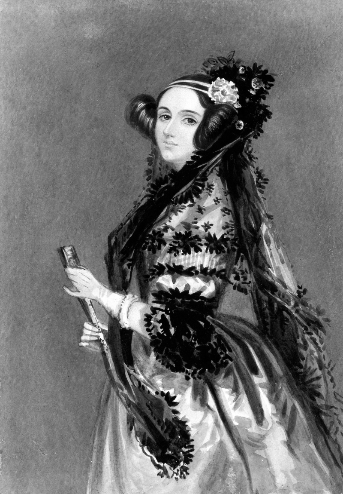

> the example image, decoded to an grayscale data file, and re-encoded as a png. it looks the same as the grayscale-alpha output because the original image has no transparent pixels.

The two `unpack(as:)` methods support all Swift integer types that conform to [`FixedWidthInteger`](https://developer.apple.com/documentation/swift/fixedwidthinteger)`&`[`UnsignedInteger`](https://developer.apple.com/documentation/swift/unsignedinteger). They have generic specializations for [`UInt8`](https://developer.apple.com/documentation/swift/uint8), [`UInt16`](https://developer.apple.com/documentation/swift/uint16), [`UInt32`](https://developer.apple.com/documentation/swift/uint32), [`UInt64`](https://developer.apple.com/documentation/swift/uint64), and [`UInt`](https://developer.apple.com/documentation/swift/uint). 

If you unpack an image to an integer type `T` with a bit width different from the color depth of the original image, the samples will be scaled to fill the range `T.min ... T.max`. The scaling is done arithmetically, so if you unpack an 8-bit image to a [`UInt16`](https://developer.apple.com/documentation/swift/uint16)-based color target, then samples with the value `255` will become `65535`, not `65280`.

> **warning:** the built-in grayscale color targets do not compute luminance for rgb- and rgba-type images. they simply use the red component as the gray value, and discard the green and blue components. to perform more sophisticated pixel unpacking, [define a custom pixel kernel](#custom-color-targets).

## basic encoding 

[`sources`](encode-basic/)

> ***by the end of this tutorial, you should be able to:***
> - *define a png image layout*
> - *understand the relationship between color formats and color targets*
> - *create a rectangular image data instance from a pixel array*
> - *compress images at different compression levels*

> ***key terms:***
> - **image layout** 
> - **interlacing** 
> - **color format** 
> - **color depth** 
> - **bit depth**
> - **chroma key**
> - **compression level**

This tutorial will assume you have the image you want to encode stored as an array of pixels. In the [example code](encode-basic/main.swift) for this tutorial, we have loaded it from a raw `.rgba` data file using the library’s [file system APIs](https://kelvin13.github.io/swift-png/System/File/). (As previously mentioned, these APIs are only available on MacOS and Linux.)

```swift 
import PNG

let path:String         = "examples/encode-basic/example", 
    size:(x:Int, y:Int) = (800, 1228)
guard let rgba:[PNG.RGBA<UInt8>] = (System.File.Source.open(path: "\(path).rgba")
{
    guard let data:[UInt8] = $0.read(count: 4 * size.x * size.y)
    else 
    {
        fatalError("failed to read from file '\(path).rgba'")
    }

    return (0 ..< size.x * size.y).map 
    {
        (i:Int) -> PNG.RGBA<UInt8> in
        .init(data[4 * i], data[4 * i + 1], data[4 * i + 2], data[4 * i + 3])
    }
}) 
else
{
    fatalError("failed to open file '\(path).rgba'")
}
```

The first step to encoding a PNG file is to define an **image layout**. An image layout specifies everything about a PNG image that is not strictly “metadata” or content. Here, we have defined an 8-bit RGB layout, as well as an 8-bit grayscale layout which we will use later.

```swift 
let layout:(rgb:PNG.Layout, v:PNG.Layout) = 
(
    rgb:    .init(format: .rgb8(palette: [], fill: nil, key: nil)),
    v:      .init(format:   .v8(             fill: nil, key: nil))
)
```

The signature of the [`PNG.Layout`](https://kelvin13.github.io/swift-png/PNG/Layout/) initializer is given below: 

```swift 
init(format:PNG.Format, interlaced:Bool = false) 
```

The `format` parameter specifies the **color format** of the layout. A color format is the internal representation that a PNG file uses to store image data. You can encode any color target to any color format, though some combinations can result in information loss. For example, the alpha channel of the [`PNG.RGBA<UInt8>`](https://kelvin13.github.io/swift-png/PNG/RGBA/) pixel array will be lost when encoding in the 8-bit RGB format. 

We can enable **interlacing** by setting the `interlaced` parameter to `true`. [Interlacing](https://en.wikipedia.org/wiki/Adam7_algorithm) is an alternative way of storing the image data within the PNG file’s internal representation. This parameter is `false` by default. There is rarely a good reason to enable it, and it usually hurts the compression ratio, so we have omitted it in this example. We will explore a possible use case for it in the [online decoding tutorial](#online-decoding).

*Swift PNG* supports all fifteen standard PNG color formats, plus two formats from Apple’s PNG extensions. The **bit depth** refers to the bit width of the samples in each pixel. The **color depth** refers to the bit width of the color channels in each pixel. The bit depth is different from the color depth for the indexed color formats, because the pixel samples are indices referencing 8-bit palette colors.

|          enumeration case             |    color model    | bit depth | color depth | standard  | 
| ------------------------------------- | ----------------- | --------- | ----------- | --------- |
| `PNG.Format.v1(fill:key:)`            | grayscale         | 1         | 1           | core      |
| `PNG.Format.v2(fill:key:)`            | grayscale         | 2         | 2           | core      |
| `PNG.Format.v4(fill:key:)`            | grayscale         | 4         | 4           | core      |
| `PNG.Format.v8(fill:key:)`            | grayscale         | 8         | 8           | core      |
| `PNG.Format.v16(fill:key:)`           | grayscale         | 16        | 16          | core      |
||||||
| `PNG.Format.va8(fill:)`               | grayscale-alpha   | 8         | 8           | core      |
| `PNG.Format.va16(fill:)`              | grayscale-alpha   | 16        | 16          | core      |
||||||
| `PNG.Format.indexed1(palette:fill:)`  | indexed           | 1         | 8           | core      |
| `PNG.Format.indexed2(palette:fill:)`  | indexed           | 2         | 8           | core      |
| `PNG.Format.indexed4(palette:fill:)`  | indexed           | 4         | 8           | core      |
| `PNG.Format.indexed8(palette:fill:)`  | indexed           | 8         | 8           | core      | 
||||||
| `PNG.Format.bgr8(palette:fill:key:)`  | BGR               | 8         | 8           | apple     |
| `PNG.Format.rgb8(palette:fill:key:)`  | RGB               | 8         | 8           | core      |
| `PNG.Format.rgb16(palette:fill:key:)` | RGB               | 16        | 16          | core      |
||||||
| `PNG.Format.bgra8(palette:fill:)`     | BGRA              | 8         | 8           | apple     |
| `PNG.Format.rgba8(palette:fill:)`     | RGBA              | 8         | 8           | core      |
| `PNG.Format.rgba16(palette:fill:)`    | RGBA              | 16        | 16          | core      |

The `fill` field specifies a solid background color which some PNG viewers use to display the image. Formats that lack a full alpha channel also have a `key` field, which specifies a **chroma key**. Most PNG viewers use this chroma key to display transparency for such images. Such viewers will display pixels as transparent if they match the chroma key. The type of the `fill` and `key` fields varies depending on the color format. For example, they are `(r:UInt8, g:UInt8, b:UInt8)` tuples in the [`rgb8(palette:fill:key:)`](https://kelvin13.github.io/swift-png/PNG/Format/rgb8(palette:fill:key:)/) format, and [`Int`](https://developer.apple.com/documentation/swift/int) indices in the [`indexed8(palette:fill:)`](https://kelvin13.github.io/swift-png/PNG/Format/indexed8(palette:fill:)/) format. (Indexed images do not support chroma keys, because they contain a full alpha channel.)

Most PNG viewers ignore the `fill` field, and a few ignore the `key` field as well. It is common to leave both fields as `nil` to disable this functionality.

The non-grayscale color formats include a `palette` field. Setting it to the empty array `[]` is analogous to setting `fill` or `key` to `nil`. For the indexed color formats, a non-empty `palette` is mandatory. For the other formats, it is optional (meaning it can be set to `[]`), and furthermore, ignored by almost all PNG clients, since it only specifies a suggested [posterization](https://en.wikipedia.org/wiki/Posterization) for the image.

To create a rectangular image data instance, use the [`init(packing:size:layout:metadata:)`](https://kelvin13.github.io/swift-png/PNG/Data/Rectangular/init(packing:size:layout:metadata:)/) initializer. This initializer is the inverse of the [`unpack(as:)`](https://kelvin13.github.io/swift-png/PNG/Data/Rectangular/unpack(as:)/) method we used in the [basic decoding](#basic-decoding) tutorial. Needless to say, the length of the pixel array must equal `size.x * size.y`. The `metadata` argument has a default value, which is an empty metadata record.

```swift 
let image:PNG.Data.Rectangular  = .init(packing: rgba, size: size, layout: layout.rgb)
```

On platforms with built-in file system support, we can compress it to a file using the [`compress(path:level:hint:)`](https://kelvin13.github.io/swift-png/PNG/Data/Rectangular/compress(path:level:hint:)/) method. The `hint` argument provides a size hint for the emitted image data chunks. Its default value is `32768`, which is fine for almost all use cases. We will explore the `hint` parameter in more detail in the [online decoding](#online-decoding) tutorial.

The `level` argument specifies the **compression level**. It should be in the range `0 ... 13`, where `13` is the most aggressive setting. Its default value is `9`. Setting `level` to a value less than `0` is the same as setting it to `0`. Likewise, setting it to a value greater than `13` is the same as setting it to `13`.

Compression level `9` is roughly equivalent to *libpng*’s maximum compression setting in terms of compression ratio and encoding speed. The higher levels (`10` through `13`) are very computationally expensive, so you should only use them if you really need to optimize for file size. You can find experimental comparisons between *Swift PNG* and *libpng*’s compression settings on [this page](../benchmarks).

```swift 
try image.compress(path: "\(path)-color-rgb.png", level: 9)
```


> the example image, encoded by *swift png* in the 8-bit rgb color format.
> 
> *source: [wikimedia commons](https://commons.wikimedia.org/wiki/File:Another_explosion_at_hand_-_Keppler._LCCN2010651330.jpg)*

We can compress the same image to different files, and at different compression levels, without having to repack the pixel data. 

```swift 
for level:Int in [0, 4, 8, 13]
{
    try image.compress(path: "\(path)-color-rgb@\(level).png", level: level)
}
```

If we inspect the emitted PNG files, we can verify that the higher compression settings result in smaller images. 

| compression level | file size     | 
| ----------------- | ------------- |
| 0                 | 1,762,033 B   |
| 4                 | 1,743,114 B   |
| 8                 | 1,712,486 B   |
| 9                 | 1,696,536 B   |
| 13                | 1,689,166 B   |

We can also encode the same pixel data using the grayscale layout we defined earlier.

```swift 
let image:PNG.Data.Rectangular  = .init(packing: rgba, size: size, layout: layout.v)
try image.compress(path: "\(path)-color-v.png", level: 9)
```

The built-in [`PNG.RGBA<T>`](https://kelvin13.github.io/swift-png/PNG/RGBA/) color target will discard the green, blue, and alpha channels when encoding to a grayscale format.

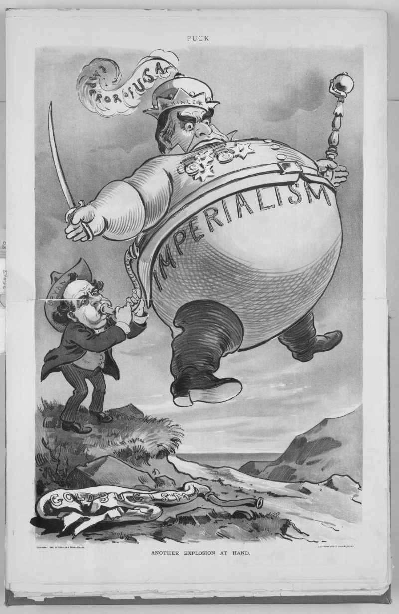

> the example image, encoded by *swift png* in the 8-bit grayscale color format.

Like the [`unpack(as:)`](https://kelvin13.github.io/swift-png/PNG/Data/Rectangular/unpack(as:)/) method, the [`init(packing:size:layout:metadata:)`](https://kelvin13.github.io/swift-png/PNG/Data/Rectangular/init(packing:size:layout:metadata:)/) initializer is generic and can take an array of any color target. It also has an [overload](https://kelvin13.github.io/swift-png/PNG/Data/Rectangular/1-init(packing:size:layout:metadata:)/) which takes an array of scalars. To demonstrate this use case, we will compute the luminance of our example image (using a standard formula), and store it as a `[UInt8]` array. 

```swift 
let luminance:[UInt8] = rgba.map 
{
    let r:Double = .init($0.r), 
        g:Double = .init($0.g),
        b:Double = .init($0.b)
    let l:Double = (0.299 * r * r + 0.587 * g * g + 0.114 * b * b).squareRoot()
    return .init(max(0, min(l.rounded(), 255)))
}
```

We can encode it to a file just as we did with the array of [`PNG.RGBA<UInt8>`](https://kelvin13.github.io/swift-png/PNG/RGBA/) colors:

```swift 
let image:PNG.Data.Rectangular  = .init(packing: luminance, size: size, layout: layout.v)
try image.compress(path: "\(path)-luminance-v.png", level: 9)
```


> the computed luminance of the example image, encoded by *swift png* in the 8-bit grayscale color format. the output image is 590.6 kb in size.

Observe that it looks different from the previous output, since we used information from all three color channels to compute the grayscale values.

We could also have encoded it using an RGB color format, which produces a visually identical image. 

```swift 
let image:PNG.Data.Rectangular  = .init(packing: luminance, size: size, layout: layout.rgb)
try image.compress(path: "\(path)-luminance-rgb.png", level: 9)
```


> the computed luminance of the example image, encoded by *swift png* in the 8-bit rgb color format. the output image is 880.4 kb in size.

The resulting file is much larger than the one encoded in the grayscale format, since it contains two redundant color channels. So there’s rarely a good reason to save a grayscale image in an non-grayscale color format.

## using indexed images 

[`sources`](indexed/)

> ***by the end of this tutorial, you should be able to:***
> - *define a color palette*
> - *encode an image from an index array*
> - *decode an image to an index array*
> - *use custom indexing and deindexing functions*

> ***key terms:***
> - **image palette** 
> - **palette aggregate**
> - **indexing function** 
> - **deindexing function** 

In this tutorial, we will use *Swift PNG*’s indexing APIs to colorize the following grayscale image:


> the example image, which is an 8-bit grayscale png.
> 
> *source: [wikimedia commons](https://commons.wikimedia.org/wiki/File:20081206_Alexandros_Grigoropoulos_december_2008_riots_Sina_Street_Athens_Greece.jpg)*

We already saw in the [basic decoding](#decode-basic) tutorial how to read grayscale samples from an input PNG. 

```swift 
import PNG

let path:String = "examples/indexing/example"

guard let image:PNG.Data.Rectangular = try .decompress(path: "\(path).png")
else 
{
    fatalError("failed to open file '\(path).png'")
}

let v:[UInt8] = image.unpack(as: UInt8.self)
```

What we want to do is map the grayscale [`UInt8`](https://developer.apple.com/documentation/swift/uint8) values to some color gradient, where gray value `0` gets the color at the bottom of the gradient, and gray value `255` gets the color at the top of the gradient. We will do this by creating a new, indexed image where the gray values in the original image are the indices in the new image, and where each index references a gradient value stored in the **image palette**.

We define a simple, six-stop gradient function with the following code. It generates a gradient that is black at the bottom, red in the middle, and yellow at the top.

```swift 
func lerp(_ a:(r:Double, g:Double, b:Double), _ b:(r:Double, g:Double, b:Double), t:Double) 
    -> (r:Double, g:Double, b:Double) 
{
    (
        a.r * (1.0 - t) + b.r * t,
        a.g * (1.0 - t) + b.g * t,
        a.b * (1.0 - t) + b.b * t
    )
}
func gradient<T>(_ x:T) -> (r:UInt8, g:UInt8, b:UInt8, a:UInt8) 
    where T:FixedWidthInteger
{
    let stops:
    (
        (r:Double, g:Double, b:Double), 
        (r:Double, g:Double, b:Double), 
        (r:Double, g:Double, b:Double), 
        (r:Double, g:Double, b:Double), 
        (r:Double, g:Double, b:Double), 
        (r:Double, g:Double, b:Double)
    ) 
    = 
    (
        (0.0, 0.0, 0.0), 
        (0.1, 0.1, 0.1), 
        (1.0, 0.2, 0.3), 
        (1.0, 0.3, 0.2),
        (1.0, 0.4, 0.3),
        (1.0, 0.8, 0.4)
    )
    let t:Double = (.init(x) - .init(T.min)) / (.init(T.max) - .init(T.min))
    let y:(r:Double, g:Double, b:Double) 
    switch t 
    {
    case         ..<0.0:    y = stops.0
    case    0.0 ..< 0.2:    y = lerp(stops.0, stops.1, t: (t      ) / 0.2)
    case    0.2 ..< 0.4:    y = lerp(stops.1, stops.2, t: (t - 0.2) / 0.2)
    case    0.4 ..< 0.6:    y = lerp(stops.2, stops.3, t: (t - 0.4) / 0.2)
    case    0.6 ..< 0.8:    y = lerp(stops.3, stops.4, t: (t - 0.6) / 0.2)
    case    0.8...     :    y = lerp(stops.4, stops.5, t: (t - 0.8) / 0.2)
    default            :    y = stops.5
    }
    return 
        (
        r: .init(max(0, min(y.r * 255, 255))),
        g: .init(max(0, min(y.g * 255, 255))),
        b: .init(max(0, min(y.b * 255, 255))),
        a: .max
        )
}
```

Of course, we can’t encode a gradient function directly in a PNG file, since PNG viewers can’t execute Swift code. So we have to tabularize it as a 256-element array. 

```swift 
let gradient:[(r:UInt8, g:UInt8, b:UInt8, a:UInt8)] = 
    (UInt8.min ... UInt8.max).map(gradient(_:))
```

The gradient function doesn’t really have anything to do with *Swift PNG*, so if you want, you can copy-and-paste the following array literal instead: 

<details>
<summary><em>Click to show gradient array literal</em></summary>

```swift 
let gradient:[(r:UInt8, g:UInt8, b:UInt8, a:UInt8)] =
[
    (r: 0, g: 0, b: 0, a: 255),
    (r: 0, g: 0, b: 0, a: 255),
    (r: 1, g: 1, b: 1, a: 255),
    (r: 1, g: 1, b: 1, a: 255),
    (r: 2, g: 2, b: 2, a: 255),
    (r: 2, g: 2, b: 2, a: 255),
    (r: 3, g: 3, b: 3, a: 255),
    (r: 3, g: 3, b: 3, a: 255),
    (r: 4, g: 4, b: 4, a: 255),
    (r: 4, g: 4, b: 4, a: 255),
    (r: 5, g: 5, b: 5, a: 255),
    (r: 5, g: 5, b: 5, a: 255),
    (r: 6, g: 6, b: 6, a: 255),
    (r: 6, g: 6, b: 6, a: 255),
    (r: 7, g: 7, b: 7, a: 255),
    (r: 7, g: 7, b: 7, a: 255),
    (r: 8, g: 8, b: 8, a: 255),
    (r: 8, g: 8, b: 8, a: 255),
    (r: 9, g: 9, b: 9, a: 255),
    (r: 9, g: 9, b: 9, a: 255),
    (r: 10, g: 10, b: 10, a: 255),
    (r: 10, g: 10, b: 10, a: 255),
    (r: 11, g: 11, b: 11, a: 255),
    (r: 11, g: 11, b: 11, a: 255),
    (r: 12, g: 12, b: 12, a: 255),
    (r: 12, g: 12, b: 12, a: 255),
    (r: 13, g: 13, b: 13, a: 255),
    (r: 13, g: 13, b: 13, a: 255),
    (r: 14, g: 14, b: 14, a: 255),
    (r: 14, g: 14, b: 14, a: 255),
    (r: 14, g: 14, b: 14, a: 255),
    (r: 15, g: 15, b: 15, a: 255),
    (r: 16, g: 16, b: 16, a: 255),
    (r: 16, g: 16, b: 16, a: 255),
    (r: 17, g: 17, b: 17, a: 255),
    (r: 17, g: 17, b: 17, a: 255),
    (r: 18, g: 18, b: 18, a: 255),
    (r: 18, g: 18, b: 18, a: 255),
    (r: 19, g: 19, b: 19, a: 255),
    (r: 19, g: 19, b: 19, a: 255),
    (r: 20, g: 20, b: 20, a: 255),
    (r: 20, g: 20, b: 20, a: 255),
    (r: 21, g: 21, b: 21, a: 255),
    (r: 21, g: 21, b: 21, a: 255),
    (r: 22, g: 22, b: 22, a: 255),
    (r: 22, g: 22, b: 22, a: 255),
    (r: 23, g: 23, b: 23, a: 255),
    (r: 23, g: 23, b: 23, a: 255),
    (r: 24, g: 24, b: 24, a: 255),
    (r: 24, g: 24, b: 24, a: 255),
    (r: 25, g: 25, b: 25, a: 255),
    (r: 25, g: 25, b: 25, a: 255),
    (r: 29, g: 26, b: 26, a: 255),
    (r: 34, g: 26, b: 27, a: 255),
    (r: 38, g: 27, b: 28, a: 255),
    (r: 43, g: 27, b: 29, a: 255),
    (r: 47, g: 28, b: 30, a: 255),
    (r: 52, g: 28, b: 31, a: 255),
    (r: 56, g: 29, b: 32, a: 255),
    (r: 61, g: 29, b: 33, a: 255),
    (r: 65, g: 30, b: 34, a: 255),
    (r: 70, g: 30, b: 35, a: 255),
    (r: 74, g: 31, b: 36, a: 255),
    (r: 79, g: 31, b: 37, a: 255),
    (r: 83, g: 32, b: 38, a: 255),
    (r: 88, g: 32, b: 39, a: 255),
    (r: 93, g: 33, b: 40, a: 255),
    (r: 97, g: 33, b: 41, a: 255),
    (r: 101, g: 34, b: 42, a: 255),
    (r: 106, g: 34, b: 43, a: 255),
    (r: 111, g: 35, b: 44, a: 255),
    (r: 115, g: 35, b: 45, a: 255),
    (r: 119, g: 36, b: 46, a: 255),
    (r: 124, g: 36, b: 47, a: 255),
    (r: 129, g: 37, b: 48, a: 255),
    (r: 133, g: 37, b: 49, a: 255),
    (r: 138, g: 38, b: 50, a: 255),
    (r: 142, g: 38, b: 51, a: 255),
    (r: 147, g: 39, b: 52, a: 255),
    (r: 151, g: 39, b: 53, a: 255),
    (r: 155, g: 40, b: 54, a: 255),
    (r: 160, g: 40, b: 55, a: 255),
    (r: 165, g: 41, b: 56, a: 255),
    (r: 169, g: 41, b: 57, a: 255),
    (r: 173, g: 42, b: 58, a: 255),
    (r: 178, g: 42, b: 59, a: 255),
    (r: 183, g: 43, b: 60, a: 255),
    (r: 187, g: 43, b: 61, a: 255),
    (r: 191, g: 44, b: 62, a: 255),
    (r: 196, g: 44, b: 63, a: 255),
    (r: 201, g: 45, b: 64, a: 255),
    (r: 205, g: 45, b: 65, a: 255),
    (r: 210, g: 46, b: 66, a: 255),
    (r: 214, g: 46, b: 67, a: 255),
    (r: 219, g: 47, b: 68, a: 255),
    (r: 223, g: 47, b: 69, a: 255),
    (r: 227, g: 48, b: 70, a: 255),
    (r: 232, g: 48, b: 71, a: 255),
    (r: 237, g: 49, b: 72, a: 255),
    (r: 241, g: 49, b: 73, a: 255),
    (r: 245, g: 50, b: 74, a: 255),
    (r: 250, g: 50, b: 75, a: 255),
    (r: 255, g: 51, b: 76, a: 255),
    (r: 255, g: 51, b: 76, a: 255),
    (r: 255, g: 52, b: 75, a: 255),
    (r: 255, g: 52, b: 75, a: 255),
    (r: 255, g: 53, b: 74, a: 255),
    (r: 255, g: 53, b: 74, a: 255),
    (r: 255, g: 54, b: 73, a: 255),
    (r: 255, g: 54, b: 73, a: 255),
    (r: 255, g: 55, b: 72, a: 255),
    (r: 255, g: 55, b: 72, a: 255),
    (r: 255, g: 56, b: 71, a: 255),
    (r: 255, g: 56, b: 71, a: 255),
    (r: 255, g: 57, b: 70, a: 255),
    (r: 255, g: 57, b: 70, a: 255),
    (r: 255, g: 57, b: 69, a: 255),
    (r: 255, g: 58, b: 69, a: 255),
    (r: 255, g: 59, b: 68, a: 255),
    (r: 255, g: 59, b: 68, a: 255),
    (r: 255, g: 60, b: 67, a: 255),
    (r: 255, g: 60, b: 67, a: 255),
    (r: 255, g: 61, b: 66, a: 255),
    (r: 255, g: 61, b: 66, a: 255),
    (r: 255, g: 62, b: 65, a: 255),
    (r: 255, g: 62, b: 65, a: 255),
    (r: 255, g: 63, b: 64, a: 255),
    (r: 255, g: 63, b: 64, a: 255),
    (r: 255, g: 64, b: 63, a: 255),
    (r: 255, g: 64, b: 63, a: 255),
    (r: 255, g: 65, b: 62, a: 255),
    (r: 255, g: 65, b: 62, a: 255),
    (r: 255, g: 66, b: 61, a: 255),
    (r: 255, g: 66, b: 60, a: 255),
    (r: 255, g: 67, b: 60, a: 255),
    (r: 255, g: 67, b: 60, a: 255),
    (r: 255, g: 68, b: 59, a: 255),
    (r: 255, g: 68, b: 59, a: 255),
    (r: 255, g: 69, b: 58, a: 255),
    (r: 255, g: 69, b: 58, a: 255),
    (r: 255, g: 70, b: 57, a: 255),
    (r: 255, g: 70, b: 56, a: 255),
    (r: 255, g: 71, b: 56, a: 255),
    (r: 255, g: 71, b: 56, a: 255),
    (r: 255, g: 72, b: 55, a: 255),
    (r: 255, g: 72, b: 55, a: 255),
    (r: 255, g: 73, b: 54, a: 255),
    (r: 255, g: 73, b: 54, a: 255),
    (r: 255, g: 74, b: 53, a: 255),
    (r: 255, g: 74, b: 52, a: 255),
    (r: 255, g: 75, b: 52, a: 255),
    (r: 255, g: 75, b: 52, a: 255),
    (r: 255, g: 76, b: 51, a: 255),
    (r: 255, g: 76, b: 51, a: 255),
    (r: 255, g: 77, b: 51, a: 255),
    (r: 255, g: 77, b: 52, a: 255),
    (r: 255, g: 78, b: 52, a: 255),
    (r: 255, g: 78, b: 53, a: 255),
    (r: 255, g: 79, b: 53, a: 255),
    (r: 255, g: 79, b: 54, a: 255),
    (r: 255, g: 80, b: 54, a: 255),
    (r: 255, g: 80, b: 55, a: 255),
    (r: 255, g: 81, b: 55, a: 255),
    (r: 255, g: 81, b: 56, a: 255),
    (r: 255, g: 82, b: 56, a: 255),
    (r: 255, g: 82, b: 57, a: 255),
    (r: 255, g: 83, b: 57, a: 255),
    (r: 255, g: 83, b: 58, a: 255),
    (r: 255, g: 84, b: 58, a: 255),
    (r: 255, g: 84, b: 59, a: 255),
    (r: 255, g: 85, b: 59, a: 255),
    (r: 255, g: 85, b: 60, a: 255),
    (r: 255, g: 86, b: 60, a: 255),
    (r: 255, g: 86, b: 61, a: 255),
    (r: 255, g: 87, b: 61, a: 255),
    (r: 255, g: 87, b: 62, a: 255),
    (r: 255, g: 88, b: 62, a: 255),
    (r: 255, g: 88, b: 63, a: 255),
    (r: 255, g: 89, b: 63, a: 255),
    (r: 255, g: 89, b: 64, a: 255),
    (r: 255, g: 90, b: 64, a: 255),
    (r: 255, g: 90, b: 65, a: 255),
    (r: 255, g: 91, b: 65, a: 255),
    (r: 255, g: 91, b: 66, a: 255),
    (r: 255, g: 92, b: 66, a: 255),
    (r: 255, g: 92, b: 67, a: 255),
    (r: 255, g: 93, b: 67, a: 255),
    (r: 255, g: 93, b: 68, a: 255),
    (r: 255, g: 94, b: 68, a: 255),
    (r: 255, g: 94, b: 69, a: 255),
    (r: 255, g: 95, b: 69, a: 255),
    (r: 255, g: 95, b: 70, a: 255),
    (r: 255, g: 96, b: 70, a: 255),
    (r: 255, g: 96, b: 71, a: 255),
    (r: 255, g: 97, b: 71, a: 255),
    (r: 255, g: 97, b: 72, a: 255),
    (r: 255, g: 98, b: 72, a: 255),
    (r: 255, g: 98, b: 73, a: 255),
    (r: 255, g: 99, b: 73, a: 255),
    (r: 255, g: 99, b: 74, a: 255),
    (r: 255, g: 100, b: 74, a: 255),
    (r: 255, g: 100, b: 75, a: 255),
    (r: 255, g: 101, b: 75, a: 255),
    (r: 255, g: 101, b: 76, a: 255),
    (r: 255, g: 102, b: 76, a: 255),
    (r: 255, g: 104, b: 77, a: 255),
    (r: 255, g: 105, b: 77, a: 255),
    (r: 255, g: 107, b: 77, a: 255),
    (r: 255, g: 109, b: 78, a: 255),
    (r: 255, g: 111, b: 78, a: 255),
    (r: 255, g: 113, b: 79, a: 255),
    (r: 255, g: 115, b: 79, a: 255),
    (r: 255, g: 118, b: 80, a: 255),
    (r: 255, g: 120, b: 81, a: 255),
    (r: 255, g: 121, b: 81, a: 255),
    (r: 255, g: 123, b: 81, a: 255),
    (r: 255, g: 125, b: 82, a: 255),
    (r: 255, g: 127, b: 82, a: 255),
    (r: 255, g: 129, b: 83, a: 255),
    (r: 255, g: 131, b: 83, a: 255),
    (r: 255, g: 134, b: 84, a: 255),
    (r: 255, g: 136, b: 85, a: 255),
    (r: 255, g: 138, b: 85, a: 255),
    (r: 255, g: 139, b: 85, a: 255),
    (r: 255, g: 141, b: 86, a: 255),
    (r: 255, g: 143, b: 86, a: 255),
    (r: 255, g: 145, b: 87, a: 255),
    (r: 255, g: 147, b: 87, a: 255),
    (r: 255, g: 150, b: 88, a: 255),
    (r: 255, g: 152, b: 89, a: 255),
    (r: 255, g: 154, b: 89, a: 255),
    (r: 255, g: 155, b: 89, a: 255),
    (r: 255, g: 157, b: 90, a: 255),
    (r: 255, g: 159, b: 90, a: 255),
    (r: 255, g: 161, b: 91, a: 255),
    (r: 255, g: 163, b: 91, a: 255),
    (r: 255, g: 166, b: 92, a: 255),
    (r: 255, g: 168, b: 93, a: 255),
    (r: 255, g: 170, b: 93, a: 255),
    (r: 255, g: 171, b: 93, a: 255),
    (r: 255, g: 173, b: 94, a: 255),
    (r: 255, g: 175, b: 94, a: 255),
    (r: 255, g: 177, b: 95, a: 255),
    (r: 255, g: 179, b: 95, a: 255),
    (r: 255, g: 182, b: 96, a: 255),
    (r: 255, g: 184, b: 97, a: 255),
    (r: 255, g: 186, b: 97, a: 255),
    (r: 255, g: 187, b: 97, a: 255),
    (r: 255, g: 189, b: 98, a: 255),
    (r: 255, g: 191, b: 98, a: 255),
    (r: 255, g: 193, b: 99, a: 255),
    (r: 255, g: 195, b: 99, a: 255),
    (r: 255, g: 198, b: 100, a: 255),
    (r: 255, g: 200, b: 101, a: 255),
    (r: 255, g: 202, b: 101, a: 255),
    (r: 255, g: 203, b: 101, a: 255),
]
```

</details>

We can visualize the gradient using the same APIs we used in the [basic encoding](#basic-encoding) tutorial.

```swift 
let swatch:[PNG.RGBA<UInt8>] = (0 ..< 16).flatMap 
{
    _ -> [PNG.RGBA<UInt8>] in 
    (0 ..< 256).map 
    {
        let (r, g, b, a):(UInt8, UInt8, UInt8, UInt8) = gradient[$0]
        return .init(r, g, b, a)
    }
}
let visualization:PNG.Data.Rectangular = .init(packing: swatch, size: (256, 16), 
    layout: .init(format: .rgb8(palette: [], fill: nil, key: nil)))
try visualization.compress(path: "examples/indexing/gradient-visualization.png")
```


> a visualization of the generated gradient.

We can create an indexed image by defining an indexed layout, and passing the grayscale samples we obtained earlier to one of the pixel-packing APIs. The [`init(packing:size:layout:metadata:)`](https://kelvin13.github.io/swift-png/PNG/Data/Rectangular/1-init(packing:size:layout:metadata:)/) initializer will treat the grayscale samples as pixel colors, not indices, and will try to match the pixel colors to entries in the given palette. This is not what we want, so we need to use a variant of that function, [`init(packing:size:layout:metadata:indexer:)`](https://kelvin13.github.io/swift-png/PNG/Data/Rectangular/1-init(packing:size:layout:metadata:indexer:)/), and pass it a custom **indexing function**.

```swift 
let indexed:PNG.Data.Rectangular = .init(packing: v, size: image.size, 
    layout:  .init(format: .indexed8(palette: gradient, fill: nil)), 
    metadata: image.metadata)
{
    _ in Int.init(_:)
}
```

The best way to understand the indexing function is to compare it with the behavior of the [`init(packing:size:layout:metadata:)`](https://kelvin13.github.io/swift-png/PNG/Data/Rectangular/1-init(packing:size:layout:metadata:)/) initializer. Calling that initializer is equivalent to calling [`init(packing:size:layout:metadata:indexer:)`](https://kelvin13.github.io/swift-png/PNG/Data/Rectangular/1-init(packing:size:layout:metadata:indexer:)/) with the following indexing function.

```swift 
{
    (palette:[(r:UInt8, g:UInt8, b:UInt8, a:UInt8)]) -> (UInt8) -> Int in 
    
    let lookup:[(r:UInt8, g:UInt8, b:UInt8, a:UInt8): Int] = 
        .init(uniqueKeysWithValues: zip(palette, palette.indices))
    return { (v:UInt8) -> Int in lookup[(v, v, v, .max), default: 0] }
}
```

> **note:** at the time of writing, the above code does not compile due to a [current bug](https://github.com/apple/swift/pull/28833) in the compiler.

Its type is `([(r:UInt8, g:UInt8, b:UInt8, a:UInt8)]) -> (UInt8) -> Int`. This construct can be a little confusing, especially if you aren’t familiar with functional programming, so let’s walk through it.

The *outer function* is a [pure function](https://en.wikipedia.org/wiki/Pure_function) that takes a palette argument of type `[(r:UInt8, g:UInt8, b:UInt8, a:UInt8)]`. This palette comes from the `palette` field of the image’s color format, if the format is one of the indexed color formats. (If the image layout has a non-indexed color format, the indexing function never gets invoked in the first place.) 

The default implementation of the outer function then constructs a dictionary mapping the palette entries to their array indices, using [`init(uniqueKeysWithValues:)`](https://developer.apple.com/documentation/swift/dictionary/3127165-init). 

The return value of the outer function is an *inner function* of type `(UInt8) -> Int`. As its signature suggests, the inner function takes an argument of type [`UInt8`](https://developer.apple.com/documentation/swift/uint8), and returns an [`Int`](https://developer.apple.com/documentation/swift/int) index. The [`UInt8`](https://developer.apple.com/documentation/swift/uint8) is a grayscale sample from the given pixel array. The inner function is not generic. If you pass a `[UInt16]` array to the packing initializer, the 16-bit grayscale samples will get rescaled to the range of a [`UInt8`](https://developer.apple.com/documentation/swift/uint8) before getting passed to the inner function.

Its default implementation [encloses](https://en.wikipedia.org/wiki/Closure_%28computer_programming%29) the dictionary variable, and uses it to look up the palette index of the function’s grayscale sample argument, expanded to RGBA form. If there is no matching palette entry, it returns index `0`. As you might expect, this can be inefficient for some use cases (though not terribly so), so the custom indexing APIs are useful if you want to manipulate indices without re-indexing the entire image.

Depending on the color target, the inner function may take a tuple argument instead of a scalar. For the [`PNG.VA<T>`](https://kelvin13.github.io/swift-png/PNG/VA) color target, the inner function recieves `(UInt8, UInt8)` tuples. For the [`PNG.RGBA<T>`](https://kelvin13.github.io/swift-png/PNG/RGBA) color target, it receives `(UInt8, UInt8, UInt8, UInt8)` tuples. (The return type is always [`Int`](https://developer.apple.com/documentation/swift/int).) In *Swift PNG*, the inner function argument is called a **palette aggregate**.

Let’s go back to the custom indexing function: 

```swift 
{
    _ in Int.init(_:)
}
```

Since we just want to cast the grayscale samples directly to index values, we don’t need the palette parameter, so we discard it with the `_` binding. We then return the [`Int.init(_:)`](https://developer.apple.com/documentation/swift/int/2885075-init) initializer, which casts the grayscale samples to [`Int`](https://developer.apple.com/documentation/swift/int)s. The Swift type inferencer will specialize it to the desired type `(UInt8) -> Int`.

On appropriate platforms, we can encode the image to a file with the [`compress(path:level:hint:)`](https://kelvin13.github.io/swift-png/PNG/Data/Rectangular/compress(path:level:hint:)/) method. 

```swift 
try indexed.compress(path: "\(path)-indexed.png")
```

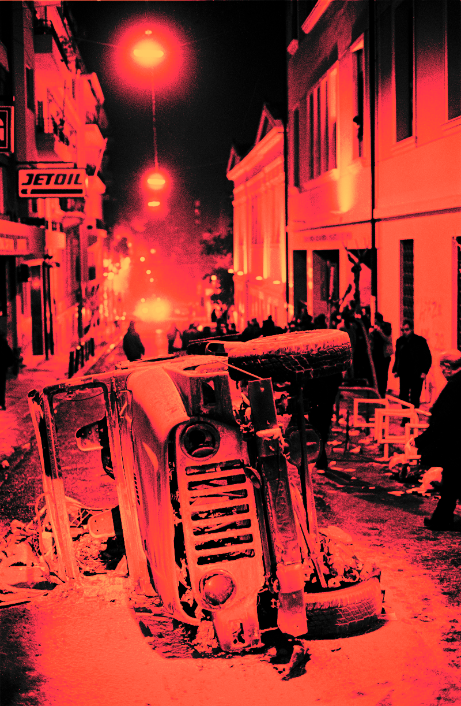

> the example image, colorized as an indexed png.

To read back the index values from the indexed image, we can use a custom **deindexing function**, which we pass to [`unpack(as:deindexer:)`](https://kelvin13.github.io/swift-png/PNG/Data/Rectangular/1-unpack(as:deindexer:)/). 

```swift 
let indices:[UInt8] = indexed.unpack(as: UInt8.self) 
{
    _ in UInt8.init(_:)
}
```

For the scalar pixel packing API, deindexing functions have the type `([(r:UInt8, g:UInt8, b:UInt8, a:UInt8)]) -> (Int) -> UInt8`. Its return type, `(Int) -> UInt8` is exactly the opposite of that of an indexing function. Its default behavior is equivalent to the following implementation, which should be self-explanatory.

```swift 
{
    (palette:[(r:UInt8, g:UInt8, b:UInt8, a:UInt8)]) -> (Int) -> UInt8 in 
    {
        (i:Int) -> UInt8 in palette[i].r
    }
}
```

> **warning:** do not unpack indices to a color target that is not [`UInt8`](https://developer.apple.com/documentation/swift/uint8). if you unpack them to a target of a different bit width, such as [`UInt16`](https://developer.apple.com/documentation/swift/uint16), the indices will get rescaled to fill the range of that integer type.

We can verify that the indices we read back with our custom deindexing function are identical to the grayscale samples we originally passed to the packing initializer.

```swift 
print(indices == v)
``` 

```bash
true
```

## using iphone-optimized images
[`sources`](iphone-optimized/)

> ***by the end of this tutorial, you should be able to:***
> - *read and create iphone-optimized png files*
> - *premultiply and straighten alpha*
> - *access packed image data*

> ***key terms:***
> - **iphone-optimized image**
> - **modular redundancy check**
> - **bgr/bgra color format**
> - **premultiplied alpha**
> - **straight alpha**

As of version 4.0, *Swift PNG* has first-class support for **iphone-optimized images**. iPhone-optimized images are an Apple extension to the PNG standard. Sometimes people refer to them as *CgBI images*. This name comes from the [`CgBI`](https://kelvin13.github.io/swift-png/PNG/Chunk/CgBI/) application chunk present at the beginning of such files, whose name in turn comes from the [`CGBitmapInfo`](https://developer.apple.com/documentation/coregraphics/cgbitmapinfo) option set in the Apple Core Graphics framework. 

iPhone-optimized images are occasionally more space-efficient than standard PNG images, because the color model they use (discussed shortly) quantizes away color information that the user will never see. It is a common misconception that iphone-optimized images are optimized for file size. They are mainly optimized for computational efficiency, by omitting the [**modular redundancy check**](https://en.wikipedia.org/wiki/Adler-32) from the compressed image data stream. ([Some authors](https://iphonedevwiki.net/index.php/CgBI_file_format) erroneously refer to it as the *cyclic redundancy check*, which is a distinct concept, and completely unaffected by iphone optimizations.) iPhone-optimized images also use the **BGR/BGRA color formats**, the latter of which is the native color format of an iphone. This makes it possible to blit image data to an idevice’s graphics hardware without having to do as much post-processing on it.

First-class support means that *Swift PNG* supports iphone-optimized images out of the box. Most PNG libraries such as *libpng* require third-party plugins to handle them, since there is some debate in the open source community over whether such images should be considered real PNG files. *Swift PNG* is, of course, a Swift library, so it supports them anyway, on all platforms, including non-Apple platforms. A possible use case is to have a Linux server serve iphone-optimized images to an iOS client, thus reducing battery consumption on users’ devices.

In this tutorial, we will convert the following iphone-optimized image to a standard PNG file, and then convert it back into an iphone-optimized image.


> an iphone-optimized example image. unless you are using safari, your browser most likely cannot display this image. if you are on an apple platform, you can download this file and view it normally.
>
> *source: [wikimedia commons](https://commons.wikimedia.org/wiki/File:Soviet_Union-1963-stamp-Valentina_Vladimirovna_Tereshkova.jpg)*

You don’t need any special settings to handle iphone-optimized images. You can decode them as you would any other PNG file. 

```swift 
import PNG 

let path:String = "examples/iphone-optimized/example"

guard var image:PNG.Data.Rectangular = try .decompress(path: "\(path).png")
else 
{
    fatalError("failed to open file '\(path).png'")
}
```

We can check if a file is an iphone-optimized image by inspecting its color format. 

```swift 
print(image.layout.format)
``` 

```
bgra8(palette: [], fill: nil)
```

The [`bgra8(palette:fill:)`](https://kelvin13.github.io/swift-png/PNG/Format/bgra8(palette:fill:)/) format is one of two iphone-optimized color formats. It is analogous to the [`rgba8(palette:fill:)`](https://kelvin13.github.io/swift-png/PNG/Format/rgba8(palette:fill:)/) format. Another possibility is [`bgr8(palette:fill:key:)`](https://kelvin13.github.io/swift-png/PNG/Format/bgr8(palette:fill:key:)/), which lacks an alpha channel, and is analogous to [`rgb8(palette:fill:key:)`](https://kelvin13.github.io/swift-png/PNG/Format/rgb8(palette:fill:key:)/).

We can unpack iphone-optimized images to any color target. iPhone-optimized images use **premultiplied alpha**, which means the color samples (the blue, green, and red channels in a BGRA image) are scaled by the alpha sample. Occasionally, this facilitates compression by zeroing-out all color channels in fully-transparent pixels. We can convert the pixels back to **straight alpha**, the normal PNG color space, by using the [`straightened`](https://kelvin13.github.io/swift-png/PNG/RGBA/straightened/) property on the built-in [`PNG.RGBA<T>`](https://kelvin13.github.io/swift-png/PNG/RGBA/) and [`PNG.VA<T>`](https://kelvin13.github.io/swift-png/PNG/VA/straightened/) color targets.

```swift 
let rgba:[PNG.RGBA<UInt8>] = image.unpack(as: PNG.RGBA<UInt8>.self).map(\.straightened)
```

It is often convenient to work in the premultiplied color space, so the library does not straighten the alpha automatically. Of course, it’s also unnecessary to straighten the alpha if you know the image has no transparency.

> **note:** unpacking bgra images to a scalar target discards the alpha channel, making it impossible to straighten the grayscale pixels. if you trying to unpack grayscale values from an iphone-optimized image with transparency, unpack it to the [`PNG.VA<T>`](https://kelvin13.github.io/swift-png/PNG/VA/) color target, and take the gray channel *after* straightening the grayscale-alpha pixels. 

Depending on your use case, you may not be getting the most out of iphone-optimized images by unpacking them to a color target. As mentioned previously, the iphone-optimized format is designed such that the raw, packed image data can be uploaded directly to the graphics hardware. We can access the packed data buffer through the [`storage`](https://kelvin13.github.io/swift-png/PNG/Data/Rectangular/storage) property on [`PNG.Data.Rectangular`](https://kelvin13.github.io/swift-png/PNG/Data/Rectangular/).

```swift 
print(image.storage[..<16])
```

```
[25, 0, 1, 255, 16, 8, 8, 255, 8, 0, 16, 255, 32, 13, 0, 255]
```

We can convert the iphone-optimized example image to a standard PNG file by re-encoding it as any of the standard color formats. 

```swift 
let standard:PNG.Data.Rectangular = .init(
    packing: rgba, 
    size:    image.size, 
    layout: .init(format: .rgb8(palette: [], fill: nil, key: nil)))

try standard.compress(path: "\(path)-rgb8.png")
```

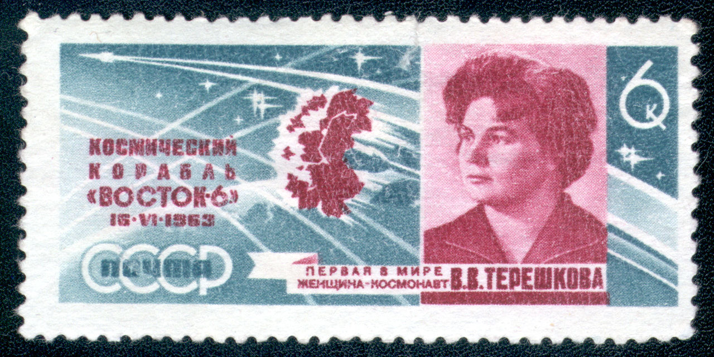

> the iphone-optimized example image, re-encoded as a standard png file.

We can convert it back into an iphone-optimized image by specifying one of the iphone-optimized color formats. The [`premultiplied`](https://kelvin13.github.io/swift-png/PNG/RGBA/premultiplied/) property on the [`PNG.RGBA<T>`](https://kelvin13.github.io/swift-png/PNG/RGBA/) color target converts the pixels to the premultiplied color space. Again, this step is unnecessary if you know the image contains no transparency.

```swift 
let apple:PNG.Data.Rectangular = .init(
    packing: standard.unpack(as: PNG.RGBA<UInt8>.self).map(\.premultiplied), 
    size:    standard.size, 
    layout: .init(format: .bgr8(palette: [], fill: nil, key: nil)))

try apple.compress(path: "\(path)-bgr8.png")
```


> the previous output, re-encoded as an iphone-optimized file. unless you are using safari, your browser most likely cannot display this image. some versions of safari have a bug which reverses the color channels. if you are on an apple platform, you can download this file and view it normally.

The [`premultiplied`](https://kelvin13.github.io/swift-png/PNG/RGBA/premultiplied) and [`straightened`](https://kelvin13.github.io/swift-png/PNG/RGBA/straightened) properties satisfy the condition that `x.premultiplied == x.premultiplied.straightened.premultiplied` for all `x`.

> **warning:** alpha premultiplication is a destructive operation. it is not the case that `x == x.premultiplied.straightened` for all `x`!

## working with metadata 

[`sources`](metadata/)

> ***by the end of this tutorial, you should be able to:***
> - *inspect and edit image metadata*

> ***key terms:***
> - **metadata chunk**

In this tutorial, we will inspect and edit metadata in the following example image.


> *source: [wikimedia commons](https://commons.wikimedia.org/wiki/File:RIAN_archive_348_During_the_siege.jpg)*

On appropriate platforms, we can decompress the image using the [`decompress(path:)`](https://kelvin13.github.io/swift-png/PNG/Data/Rectangular/decompress(path:)/) static method. 

```swift 
import PNG 

let path:String = "examples/metadata/example"

guard var image:PNG.Data.Rectangular = try .decompress(path: "\(path).png")
else 
{
    fatalError("failed to open file '\(path).png'")
}
```

The image metadata lives in a [`PNG.Metadata`](https://kelvin13.github.io/swift-png/PNG/Metadata/) structure, which is stored in the [`metadata`](https://kelvin13.github.io/swift-png/PNG/Data/Rectangular/metadata) property of the image data structure. The metadata structure has the following properties: 

```swift 
var time:PNG.TimeModified? 
var chromaticity:PNG.Chromaticity?
var colorProfile:PNG.ColorProfile?
var colorRendering:PNG.ColorRendering?
var gamma:PNG.Gamma?
var histogram:PNG.Histogram?
var physicalDimensions:PNG.PhysicalDimensions?
var significantBits:PNG.SignificantBits?

var suggestedPalettes:[PNG.SuggestedPalette]
var text:[PNG.Text]
var application:[(type:PNG.Chunk, data:[UInt8])]
```

The individual metadata elements are called **metadata chunks**. Each field of the metadata struct is `nil` or empty (`[]`) if the corresponding metadata chunk is not present in the PNG file. Some metadata chunks — suggested palette chunks, text chunks, and private application data chunks — can appear more than once, which is why those properties are [`Array`](https://developer.apple.com/documentation/swift/array)s instead of [`Optional`](https://developer.apple.com/documentation/swift/optional)s.

The example image has a [`tIME`](https://kelvin13.github.io/swift-png/PNG/Chunk/tIME) chunk, a [`gAMA`](https://kelvin13.github.io/swift-png/PNG/Chunk/gAMA) chunk, and a [`pHYs`](https://kelvin13.github.io/swift-png/PNG/Chunk/pHYs) chunk, and we can pretty-print them using the Swift [`print(...:separator:terminator:)`](https://developer.apple.com/documentation/swift/1541053-print) function. 

```swift 
if let time:PNG.TimeModified = image.metadata.time 
{
    print(time)
}
if let gamma:PNG.Gamma = image.metadata.gamma 
{
    print(gamma)
}
if let physicalDimensions:PNG.PhysicalDimensions = image.metadata.physicalDimensions
{
    print(physicalDimensions)
}
``` 

```
PNG.TimeModified (tIME) 
{
    year        : 2020 
    month       : 12 
    day         : 24 
    hour        : 23 
    minute      : 9 
    second      : 19 
}
PNG.Gamma (gAMA) 
{
    pcm         : 45455 / 100000 
}
PNG.PhysicalDimensions (pHYs) 
{
    density     : (x: 11811, y: 11811) / meter
}
```

Accordingly, we can see that the example image was last saved on December 24th, 2020, at 11:09:19 PM, that it has a gamma of 0.45455, and a physical resolution of 11,811 pixels per meter (300 dpi).

The example image also has several text chunks which contain machine-readable data that [GIMP](https://www.gimp.org/) added to the image when it was first saved. We can pretty-print *all* of the metadata in the image by passing the entire [`PNG.Metadata`](https://kelvin13.github.io/swift-png/PNG/Metadata) structure to the [`print(...:separator:terminator:)`](https://developer.apple.com/documentation/swift/1541053-print) function. For the sake of brevity, we won’t show the output here.

```swift 
print(image.metadata)
```

The [`metadata`](https://kelvin13.github.io/swift-png/PNG/Data/Rectangular/metadata) property is mutable, so we can overwrite metadata fields without having to repack the image pixels. 

```swift 
image.metadata.time = .init(year: 1992, month: 8, day: 3, hour: 0, minute: 0, second: 0)
```

We can save it and read it back to show that the new image now has a different value for its [`tIME`](https://kelvin13.github.io/swift-png/PNG/Chunk/tIME) chunk. 

```swift 
try image.compress(path: "\(path)-newtime.png")

if let time:PNG.TimeModified = 
    (try PNG.Data.Rectangular.decompress(path: "\(path)-newtime.png")).map(\.metadata.time) ?? nil
{
    print(time)
}
```

```
PNG.TimeModified (tIME) 
{
    year        : 1992 
    month       : 8 
    day         : 3 
    hour        : 0 
    minute      : 0 
    second      : 0 
}
```

> **note:** many png viewers ignore the [`tIME`](https://kelvin13.github.io/swift-png/PNG/Chunk/tIME) chunk and display the image modification time stored in the image’s [exif data](https://en.wikipedia.org/wiki/Exif), which we did not modify. the png file format does not have a metadata chunk for exif data, so this information is usually encoded as a base-64 string in a png text chunk. parsing and editing this string is beyond the scope of this tutorial, so we won’t go over it.

## using in-memory images 

[`sources`](in-memory/)

> ***by the end of this tutorial, you should be able to:***
> - *decode a png image from a memory blob*
> - *encode a png image into a memory blob*
> - *implement a custom data source or destination*

> ***key terms:***
> - **bytestream protocol**

Up to this point we have been using the built-in file system API that the library provides on Linux and MacOS platforms. These APIs are built atop of the library’s core data stream APIs, which are available on all Swift platforms. The core library is universally portable because it is written in pure Swift, with no dependencies, even [Foundation](https://developer.apple.com/documentation/foundation). In this tutorial, we will use this lower-level interface to implement reading and writing PNG files in memory.

If you have used *Swift PNG*’s companion library [*Swift JPEG*](https://github.com/kelvin13/jpeg), the interface here is exactly the same. In fact, you can copy-and-paste large swaths of the code from the corresponding [JPEG tutorial](https://github.com/kelvin13/jpeg/tree/master/examples#using-in-memory-images), and it will just work.

Our basic data type modeling a memory blob is incredibly simple; it consists of a Swift array containing the data buffer, and a file position pointer in the form of an integer. Here, we have namespaced it under the libary’s [`System`](https://kelvin13.github.io/swift-png/System/) namespace to parallel the built-in file system APIs.

```swift 
import PNG 

extension System 
{
    struct Blob 
    {
        private(set)
        var data:[UInt8], 
            position:Int 
    }
}
```

There are two **bytestream protocols** a custom data stream type can support: [`PNG.Bytestream.Source`](https://kelvin13.github.io/swift-png/PNG/Bytestream/Source), and [`PNG.Bytestream.Destination`](https://kelvin13.github.io/swift-png/PNG/Bytestream/Destination). The first one enables image decoding, while the second one enables image encoding. We can conform to both with the following implementations:

```swift 
extension System.Blob:PNG.Bytestream.Source, PNG.Bytestream.Destination 
{
    init(_ data:[UInt8]) 
    {
        self.data       = data 
        self.position   = data.startIndex
    }
    
    mutating 
    func read(count:Int) -> [UInt8]? 
    {
        guard self.position + count <= data.endIndex 
        else 
        {
            return nil 
        }
        
        defer 
        {
            self.position += count 
        }
        
        return .init(self.data[self.position ..< self.position + count])
    }
    
    mutating 
    func write(_ bytes:[UInt8]) -> Void? 
    {
        self.data.append(contentsOf: bytes) 
        return ()
    }
}
```

For the sake of tutorial brevity, we are not going to bother bootstrapping the task of obtaining the PNG memory blob in the first place, so we will just use the built-in file system API for this. But we could have gotten the data any other way.

```swift 
let path:String         = "examples/in-memory/example"
guard let data:[UInt8]  = (System.File.Source.open(path: "\(path).png") 
{
    (source:inout System.File.Source) -> [UInt8]? in
    
    guard let count:Int = source.count
    else 
    {
        return nil 
    }
    return source.read(count: count)
} ?? nil)
else 
{
    fatalError("failed to open or read file '\(path).png'")
}

var blob:System.Blob = .init(data)
```


> the example image. 
> 
> *source: [wikimedia commons](https://commons.wikimedia.org/wiki/File:Agence_Rol,_24.4.21,_concours_de_machines_-_BnF.jpg)*

To decode from our `System.Blob` type, we use the [`decompress(stream:)`](https://kelvin13.github.io/swift-png/PNG/Data/Rectangular/decompress(stream:)/) function, which is part of the core library, and does essentially the same thing as the file system-aware [`decompress(path:)`](https://kelvin13.github.io/swift-png/PNG/Data/Rectangular/decompress(path:)/) function. We can then unpack pixels from the returned image data structure as we would in any other situation. 

```swift 
let image:PNG.Data.Rectangular  = try .decompress(stream: &blob)
let rgba:[PNG.RGBA<UInt8>]      = image.unpack(as: PNG.RGBA<UInt8>.self)
```

Just as with the decompression interfaces, the [`compress(path:level:hint:)`](https://kelvin13.github.io/swift-png/PNG/Data/Rectangular/compress(path:level:hint:)/) function has a generic [`compress(stream:level:hint:)`](https://kelvin13.github.io/swift-png/PNG/Data/Rectangular/compress(stream:level:hint:)/) counterpart. Here, we have cleared the blob storage, and written the example image we decoded earlier to it:

```swift 
blob = .init([])
try image.compress(stream: &blob, level: 13)
```

We can save the blob to disk, to verify that the memory blob does indeed contain a valid PNG file.

```swift 
guard let _:Void = (System.File.Destination.open(path: "\(path).png.png")
{
    guard let _:Void = $0.write(blob.data)
    else 
    {
        fatalError("failed to write to file '\(path).png.png'")
    }
}) 
else
{
    fatalError("failed to open file '\(path).png.png'")
} 
```


> the example image, re-encoded to a memory blob, and saved to disk. 

## online decoding 

[`sources`](decode-online/)

> ***by the end of this tutorial, you should be able to:***
> - *use the contextual api to manually manage decoder state*
> - *display partially-downloaded images*
> - *display previews of partially-downloaded interlaced images with overdrawing*
> - *rebind image data to a different image layout*
> - *customize the chunk granularity in emitted png files*

> ***key terms:***
> - **decoder context**
> - **critical chunk** 
> - **ancillary chunk**
> - **chunk granularity**
> - **overdrawing**

Many applications using PNG images transmit them to users over a network. It is often valuable for such applications to be able to display a lower-quality preview of the image before it is fully downloaded onto a user’s device.

In this tutorial, we will simulate an asynchronously-loaded PNG file, and use *Swift PNG*’s contextual decoding API to display partial “snapshots” of the image as portions of the file arrive. As with the [previous tutorial](#using-in-memory-images), if you have used the analogous [*Swift JPEG* API](https://github.com/kelvin13/jpeg/tree/master/examples#online-decoding), the process here should be very familiar. We will also explore ways to make these previews more user-friendly through interlacing and overdrawing.


> the example image. 
> 
> *source: [wikimedia commons](https://commons.wikimedia.org/wiki/File:Africa_and_Europe_from_a_Million_Miles_Away.png)*

To simulate a file being transferred over a network, we are going to modify the blob type from the [previous tutorial](#using-in-memory-images) by adding an integer field available representing the amount of the file we “have” at a given moment.

```swift 
import PNG 

struct Stream  
{
    private(set)
    var data:[UInt8], 
        position:Int, 
        available:Int 
}
```

Each time we try to [`read`](https://kelvin13.github.io/swift-png/PNG/Bytestream/Source/read(count:)/) from this stream, it will either return data from the available portion of the buffer, or it will return `nil` and “download” an additional 4 KB of the file. We also allow for rewinding the current file position to an earlier state.

```swift 
extension Stream:PNG.Bytestream.Source
{
    init(_ data:[UInt8]) 
    {
        self.data       = data 
        self.position   = data.startIndex
        self.available  = data.startIndex
    }
    
    mutating 
    func read(count:Int) -> [UInt8]? 
    {
        guard self.position + count <= data.endIndex 
        else 
        {
            return nil 
        }
        guard self.position + count < self.available 
        else 
        {
            self.available += 4096
            return nil 
        }
        
        defer 
        {
            self.position += count 
        }
        
        return .init(self.data[self.position ..< self.position + count])
    }
    
    mutating 
    func reset(position:Int) 
    {
        precondition(self.data.indices ~= position)
        self.position = position
    }
}
```

For the purposes of this tutorial we again populate our mock data stream using the file system APIs, though we could just as easily imagine the data coming over an actual network.

```swift 
extension Stream 
{
    init(path:String) 
    {
        guard let data:[UInt8]  = (System.File.Source.open(path: path) 
        {
            (source:inout System.File.Source) -> [UInt8]? in
            
            guard let count:Int = source.count
            else 
            {
                return nil 
            }
            return source.read(count: count)
        } ?? nil)
        else 
        {
            fatalError("failed to open or read file '\(path)'")
        }

        self.init(data)
    }
}
```

```swift 
let path:String     = "examples/decode-online/example"

var stream:Stream   = .init(path: "\(path).png")
```

The key to making this work is understanding that if the [`read(count:)`](https://kelvin13.github.io/swift-png/PNG/Bytestream/Source/read(count:)/) call on the stream instance returns `nil`, then one of three library errors will get thrown:

- [`PNG.LexingError.truncatedSignature`](https://kelvin13.github.io/swift-png/PNG/LexingError/truncatedSignature/)
- [`PNG.LexingError.truncatedChunkHeader`](https://kelvin13.github.io/swift-png/PNG/LexingError/truncatedChunkHeader/)
- [`PNG.LexingError.truncatedChunkBody(expected:)`](https://kelvin13.github.io/swift-png/PNG/LexingError/truncatedChunkBody(expected:)/)

These errors get thrown from the library’s lexer functions, which lex PNG chunks out of a raw bytestream. There are two lexer functions. The [`signature()`](https://kelvin13.github.io/swift-png/PNG/Bytestream/Source/signature()/) method lexes the PNG signature bytes from the beginning of a PNG file, and it can `throw` a [`truncatedSignature`](https://kelvin13.github.io/swift-png/PNG/LexingError/truncatedSignature/) error. The [`chunk()`](https://kelvin13.github.io/swift-png/PNG/Bytestream/Source/chunk()/) method lexes a PNG chunk, and it can `throw` a [`truncatedChunkHeader`](https://kelvin13.github.io/swift-png/PNG/LexingError/truncatedChunkHeader) or [`truncatedChunkBody(expected:)`](https://kelvin13.github.io/swift-png/PNG/LexingError/truncatedChunkBody(expected:)/) error. 

```swift 
mutating 
func signature() throws 

mutating
func chunk() throws -> (type:PNG.Chunk, data:[UInt8])
```

A valid PNG file consists of a signature, followed by a sequence of chunks.

The lexer functions are provided as extensions on the [`PNG.Bytestream.Source`](https://kelvin13.github.io/swift-png/PNG/Bytestream/Source/) protocol, so they are available on any conforming data stream type, including our custom `Stream` type.

Normally, the three aforementioned errors would indicate an unexpected end-of-stream. In this case, they just mean that there is not enough data available yet, so the client needs to wait for more of the file to arrive before decoding can proceed. To allow the lexing functions to recover on end-of-stream instead of crashing the application, we wrap them in the following `waitSignature(stream:)` and `waitChunk(stream:)` functions, making sure to reset the file position if end-of-stream is encountered.

```swift 
func waitSignature(stream:inout Stream) throws  
{
    let position:Int = stream.position
    while true 
    {
        do 
        {
            return try stream.signature()
        }
        catch PNG.LexingError.truncatedSignature
        {
            stream.reset(position: position)
            continue 
        }
    }
}
func waitChunk(stream:inout Stream) throws -> (type:PNG.Chunk, data:[UInt8]) 
{
    let position:Int = stream.position
    while true 
    {
        do 
        {
            return try stream.chunk()
        }
        catch PNG.LexingError.truncatedChunkHeader, PNG.LexingError.truncatedChunkBody 
        {
            stream.reset(position: position)
            continue 
        }
    }
}
```

There are other possible [`LexingError`](https://kelvin13.github.io/swift-png/PNG/LexingError/)s that report problems such as invalid signatures or corrupted chunk data, so we only sequester the three end-of-stream errors.

Because we are trying to interact with a decoded image while it is in an incomplete state, we have to take on the responsibility of managing decoder state ourselves. The basic rules that apply here are:

1. The first chunk in a PNG file is an [`IHDR`](https://kelvin13.github.io/swift-png/PNG/Chunk/IHDR) ([`PNG.Header`](https://kelvin13.github.io/swift-png/PNG/Header)) chunk, unless it is an [iphone-optimized image](#using-iphone-optimized-images), in which case the first chunk is a [`CgBI`](https://kelvin13.github.io/swift-png/PNG/Chunk/CgBI) chunk, immediately followed by the [`IHDR`](https://kelvin13.github.io/swift-png/PNG/Chunk/IHDR) chunk.

2. A PNG file can contain, at most, one [`PLTE`](https://kelvin13.github.io/swift-png/PNG/Chunk/PLTE) ([`PNG.Palette`](https://kelvin13.github.io/swift-png/PNG/Palette)), one [`tRNS`](https://kelvin13.github.io/swift-png/PNG/Chunk/tRNS) ([`PNG.Transparency`](https://kelvin13.github.io/swift-png/PNG/Transparency)), and one [`bKGD`](https://kelvin13.github.io/swift-png/PNG/Chunk/bKGD) ([`PNG.Background`](https://kelvin13.github.io/swift-png/PNG/Background)) chunk. If it contains a [`PLTE`](https://kelvin13.github.io/swift-png/PNG/Chunk/PLTE) chunk, it must come before the [`tRNS`](https://kelvin13.github.io/swift-png/PNG/Chunk/tRNS) and [`bKGD`](https://kelvin13.github.io/swift-png/PNG/Chunk/bKGD) chunks, if applicable. 

3. The image data in a PNG file is stored in a series of [`IDAT`](https://kelvin13.github.io/swift-png/PNG/Chunk/IDAT) chunks, which must occur in a single, contiguous sequence, and after any [`PLTE`](https://kelvin13.github.io/swift-png/PNG/Chunk/PLTE), [`tRNS`](https://kelvin13.github.io/swift-png/PNG/Chunk/tRNS), or [`bKGD`](https://kelvin13.github.io/swift-png/PNG/Chunk/bKGD) chunks.

4. The last chunk in a PNG file is an [`IEND`](https://kelvin13.github.io/swift-png/PNG/Chunk/IEND) chunk.

The [`CgBI`](https://kelvin13.github.io/swift-png/PNG/Chunk/CgBI), [`IHDR`](https://kelvin13.github.io/swift-png/PNG/Chunk/IHDR), [`PLTE`](https://kelvin13.github.io/swift-png/PNG/Chunk/PLTE), [`IDAT`](https://kelvin13.github.io/swift-png/PNG/Chunk/IDAT), and [`IEND`](https://kelvin13.github.io/swift-png/PNG/Chunk/IEND) chunks are known as **critical chunks**. The rest of the chunk types are known as **ancillary chunks**. The ancillary chunks can be thought of as “metadata chunks”, though the line between data and metadata isn’t always clear. Notably, *Swift PNG* treats the [`tRNS`](https://kelvin13.github.io/swift-png/PNG/Chunk/tRNS) and [`bKGD`](https://kelvin13.github.io/swift-png/PNG/Chunk/bKGD) chunks as part of the image color format, so our custom decoder implementation should handle them explicitly, along with all of the critical chunks. 

A full list of critical and ancillary chunk types is given below.

| type code     | *Swift PNG* type  | unique | ordering                           | dependencies    |
| ------------- | ----------------- | ------ | ---------------------------------- | --------------- |
| **[`CgBI`](https://kelvin13.github.io/swift-png/PNG/Chunk/CgBI)**    | `Void?`           | yes    | first                              |                 |
| **[`IHDR`](https://kelvin13.github.io/swift-png/PNG/Chunk/IHDR)**    | [`PNG.Header`](https://kelvin13.github.io/swift-png/PNG/Header)      | yes    | first, or immediately after [`CgBI`](https://kelvin13.github.io/swift-png/PNG/Chunk/CgBI) | [`CgBI`](https://kelvin13.github.io/swift-png/PNG/Chunk/CgBI)          |
| **[`PLTE`](https://kelvin13.github.io/swift-png/PNG/Chunk/PLTE)**    | [`PNG.Palette`](https://kelvin13.github.io/swift-png/PNG/Palette)`?`    | yes    | after [`IHDR`](https://kelvin13.github.io/swift-png/PNG/Chunk/IHDR), and before [`IDAT`](https://kelvin13.github.io/swift-png/PNG/Chunk/IDAT)    | [`IHDR`](https://kelvin13.github.io/swift-png/PNG/Chunk/IHDR)          |
| **[`IDAT`](https://kelvin13.github.io/swift-png/PNG/Chunk/IDAT)**    | `[UInt8]`         | no     |                                    | [`IHDR`](https://kelvin13.github.io/swift-png/PNG/Chunk/IHDR), [`PLTE`](https://kelvin13.github.io/swift-png/PNG/Chunk/PLTE), [`tRNS`](https://kelvin13.github.io/swift-png/PNG/Chunk/tRNS), [`bKGD`](https://kelvin13.github.io/swift-png/PNG/Chunk/bKGD) |
| **[`IEND`](https://kelvin13.github.io/swift-png/PNG/Chunk/IEND)**    | `Void`            | yes    | last                               |                 |
||||||
|   [`cHRM`](https://kelvin13.github.io/swift-png/PNG/Chunk/cHRM)      | [`PNG.Chromaticity`](https://kelvin13.github.io/swift-png/PNG/Chromaticity)`?`       | yes    | before [`PLTE`](https://kelvin13.github.io/swift-png/PNG/Chunk/PLTE)                      |                 |
|   [`gAMA`](https://kelvin13.github.io/swift-png/PNG/Chunk/gAMA)      | [`PNG.Gamma`](https://kelvin13.github.io/swift-png/PNG/Gamma)`?`              | yes    | before [`PLTE`](https://kelvin13.github.io/swift-png/PNG/Chunk/PLTE)                      |                 |
|   [`iCCP`](https://kelvin13.github.io/swift-png/PNG/Chunk/iCCP)      | [`PNG.ColorProfile`](https://kelvin13.github.io/swift-png/PNG/ColorProfile)`?`       | yes    | before [`PLTE`](https://kelvin13.github.io/swift-png/PNG/Chunk/PLTE)                      |                 |
|   [`sRGB`](https://kelvin13.github.io/swift-png/PNG/Chunk/sRGB)      | [`PNG.ColorRendering`](https://kelvin13.github.io/swift-png/PNG/ColorRendering)`?`     | yes    | before [`PLTE`](https://kelvin13.github.io/swift-png/PNG/Chunk/PLTE)                      |                 |
|   [`sBIT`](https://kelvin13.github.io/swift-png/PNG/Chunk/sBIT)      | [`PNG.SignificantBits`](https://kelvin13.github.io/swift-png/PNG/SignificantBits)`?`    | yes    | before [`PLTE`](https://kelvin13.github.io/swift-png/PNG/Chunk/PLTE)                      | [`IHDR`](https://kelvin13.github.io/swift-png/PNG/Chunk/IHDR)          |
||||||
|   [`tRNS`](https://kelvin13.github.io/swift-png/PNG/Chunk/tRNS)      | [`PNG.Transparency`](https://kelvin13.github.io/swift-png/PNG/Transparency)`?`       | yes    | after [`PLTE`](https://kelvin13.github.io/swift-png/PNG/Chunk/PLTE), and before [`IDAT`](https://kelvin13.github.io/swift-png/PNG/Chunk/IDAT)    | [`IHDR`](https://kelvin13.github.io/swift-png/PNG/Chunk/IHDR), [`PLTE`](https://kelvin13.github.io/swift-png/PNG/Chunk/PLTE)  |
|   [`bKGD`](https://kelvin13.github.io/swift-png/PNG/Chunk/bKGD)      | [`PNG.Background`](https://kelvin13.github.io/swift-png/PNG/Background)`?`         | yes    | after [`PLTE`](https://kelvin13.github.io/swift-png/PNG/Chunk/PLTE), and before [`IDAT`](https://kelvin13.github.io/swift-png/PNG/Chunk/IDAT)    | [`IHDR`](https://kelvin13.github.io/swift-png/PNG/Chunk/IHDR), [`PLTE`](https://kelvin13.github.io/swift-png/PNG/Chunk/PLTE)  |
|   [`hIST`](https://kelvin13.github.io/swift-png/PNG/Chunk/hIST)      | [`PNG.Histogram`](https://kelvin13.github.io/swift-png/PNG/Histogram)`?`          | yes    | after [`PLTE`](https://kelvin13.github.io/swift-png/PNG/Chunk/PLTE), and before [`IDAT`](https://kelvin13.github.io/swift-png/PNG/Chunk/IDAT)    | [`IHDR`](https://kelvin13.github.io/swift-png/PNG/Chunk/IHDR), [`PLTE`](https://kelvin13.github.io/swift-png/PNG/Chunk/PLTE)  |
||||||
|   [`pHYs`](https://kelvin13.github.io/swift-png/PNG/Chunk/pHYs)      | [`PNG.PhysicalDimensions`](https://kelvin13.github.io/swift-png/PNG/PhysicalDimensions)`?` | yes    | before [`IDAT`](https://kelvin13.github.io/swift-png/PNG/Chunk/IDAT)                      |                 |
|   [`sPLT`](https://kelvin13.github.io/swift-png/PNG/Chunk/sPLT)      | [`PNG.SuggestedPalette`](https://kelvin13.github.io/swift-png/PNG/SuggestedPalette)`?`   | no     | before [`IDAT`](https://kelvin13.github.io/swift-png/PNG/Chunk/IDAT)                      |                 |
||||||
|   [`tIME`](https://kelvin13.github.io/swift-png/PNG/Chunk/tIME)      | [`PNG.TimeModified`](https://kelvin13.github.io/swift-png/PNG/TimeModified)`?`       | yes    |                                    |                 |
|   [`iTXt`](https://kelvin13.github.io/swift-png/PNG/Chunk/iTXt)      | [`PNG.Text`](https://kelvin13.github.io/swift-png/PNG/Text)`?`               | no     |                                    |                 |
|   [`tEXt`](https://kelvin13.github.io/swift-png/PNG/Chunk/tEXt)      | [`PNG.Text`](https://kelvin13.github.io/swift-png/PNG/Text)`?`               | no     |                                    |                 |
|   [`zTXt`](https://kelvin13.github.io/swift-png/PNG/Chunk/zTXt)      | [`PNG.Text`](https://kelvin13.github.io/swift-png/PNG/Text)`?`               | no     |                                    |                 |

If a chunk has dependencies, that means it gets parsed differently depending on the contents of the upstream chunks. It does not mean that the upstream chunks must appear — indeed, in some situations, the upstream chunks must *not* appear. It *does* mean that none of the upstream chunks may appear after the dependent chunk.

> **note:** the full lexing space of a png file can be expressed as a directed graph. if you ignore text chunks and [`sPLT`](https://kelvin13.github.io/swift-png/PNG/Chunk/sPLT) chunks, and collapse sequences of [`IDAT`](https://kelvin13.github.io/swift-png/PNG/Chunk/IDAT) chunks into a single vertex, this graph is also acyclic.

The ordering constraints and chunk dependencies might seem like a lot to keep track of, but they come out naturally in the type signatures of *Swift PNG*’s contextual decoding interfaces, so everything should just click together. The amount of code we have to write is actually quite small.

To do online decoding, we are going to write a function `decodeOnline(stream:overdraw:capture:)` with the following signature: 

```swift 
func decodeOnline(stream:inout Stream, overdraw:Bool, 
    capture:(PNG.Data.Rectangular) throws -> ()) throws 
    -> PNG.Data.Rectangular
```

The `capture` parameter is a delegate that will receive a partially-decoded image each time an image data chunk has been decompressed. The `overdraw` parameter is a switch which we will use later in this tutorial.

The first thing we do is lex the PNG signature bytes from the beginning of the file. 

```swift 
{
    try waitSignature(stream: &stream)
```

The next step is to parse the PNG header, and the preceeding [`CgBI`](https://kelvin13.github.io/swift-png/PNG/Chunk/CgBI) chunk, if present. The following code reads at least one chunk (and at most two chunks) from the beginning of the PNG file using the `waitChunk(stream:)` function. If the first chunk is a [`CgBI`](https://kelvin13.github.io/swift-png/PNG/Chunk/CgBI) chunk, the image is an iphone-optimized image, and we move on to the next chunk. Otherwise we mark the image as non-iphone-optimized, and do not advance the chunk position. We then check that the current chunk is an [`IHDR`](https://kelvin13.github.io/swift-png/PNG/Chunk/IHDR) chunk, and use the [`PNG.Header.init(parsing:standard:)`](https://kelvin13.github.io/swift-png/PNG/Header/init(parsing:standard:)/) initializer to parse the chunk data. ([`CgBI`](https://kelvin13.github.io/swift-png/PNG/Chunk/CgBI) chunks also contain data, but it isn’t relevant for us, so we do not parse them.)

```swift 
    let (standard, header):(PNG.Standard, PNG.Header) = try
    {
        var chunk:(type:PNG.Chunk, data:[UInt8]) = try waitChunk(stream: &stream)
        let standard:PNG.Standard
        switch chunk.type
        {
        case .CgBI:
            standard    = .ios
            chunk       = try waitChunk(stream: &stream)
        default:
            standard    = .common
        }
        switch chunk.type 
        {
        case .IHDR:
            return (standard, try .init(parsing: chunk.data, standard: standard))
        default:
            fatalError("missing image header")
        }
    }()
```

> **note:** the parsing interfaces in [*swift jpeg*](https://github.com/kelvin13/jpeg) are spelled as static `parse(_:...)` constructors. in *swift png*, these have been provided as `init(parsing:...)` initializers to better conform to swift api conventions.

The next step is to process all the chunks up to, but not including, the first [`IDAT`](https://kelvin13.github.io/swift-png/PNG/Chunk/IDAT) chunk. The goal is to be able to construct a **decoder context** ([`PNG.Context`](https://kelvin13.github.io/swift-png/PNG/Context)) by the time we reach the image data, using any [`PLTE`](https://kelvin13.github.io/swift-png/PNG/Chunk/PLTE), [`bKGD`](https://kelvin13.github.io/swift-png/PNG/Chunk/bKGD), or [`tRNS`](https://kelvin13.github.io/swift-png/PNG/Chunk/tRNS) chunks we have encountered in the meantime.

There are a great many ways to spell this loop. Here, we have written it with a single-use closure that returns a [`Context`](https://kelvin13.github.io/swift-png/PNG/Context) structure upon encountering the first [`IDAT`](https://kelvin13.github.io/swift-png/PNG/Chunk/IDAT) chunk. This reduces the amount of [`Optional<T>`](https://developer.apple.com/documentation/swift/optional)s we have to deal with. A competent Swift developer should be able to translate it into their preferred pattern.

We declare variables to hold a palette ([`PNG.Palette`](https://kelvin13.github.io/swift-png/PNG/Palette)`?`), background ([`PNG.Background`](https://kelvin13.github.io/swift-png/PNG/Background)`?`), and transparency ([`PNG.Transparency`](https://kelvin13.github.io/swift-png/PNG/Transparency)`?`) structure. A [`PNG.Metadata`](https://kelvin13.github.io/swift-png/PNG/Metadata) structure tracks all other chunk types.

```swift 
    var chunk:(type:PNG.Chunk, data:[UInt8]) = try waitChunk(stream: &stream)

    var context:PNG.Context = try 
    {
        var palette:PNG.Palette?
        var background:PNG.Background?, 
            transparency:PNG.Transparency?
        var metadata:PNG.Metadata = .init()
        while true 
        {
            switch chunk.type 
            {
```

If we encounter a [`PLTE`](https://kelvin13.github.io/swift-png/PNG/Chunk/PLTE) chunk, we parse it with the [`PNG.Palette.init(parsing:pixel:)`](https://kelvin13.github.io/swift-png/PNG/Palette/init(parsing:pixel:)/) initializer. Since palette chunks have a dependency on the header chunk, this initializer takes a [`PNG.Format.Pixel`](https://kelvin13.github.io/swift-png/PNG/Format/Pixel) parameter.

For any other (allowed) chunk type besides [`IDAT`](https://kelvin13.github.io/swift-png/PNG/Chunk/IDAT) we delegate it to the metadata structure through its [`push(ancillary:pixel:palette:background:transparency:)`](https://kelvin13.github.io/swift-png/PNG/Metadata/push(ancillary:pixel:palette:background:transparency:)/) method. This method parses the chunk using the appropriate parsing function, and stores it internally, or in its two `inout` parameters, if applicable. It also enforces all relevant chunk ordering constraints.

> **note:** the [`Metadata`](https://kelvin13.github.io/swift-png/PNG/Metadata/) type does not handle palette chunks, because [`PLTE`](https://kelvin13.github.io/swift-png/PNG/Chunk/PLTE) is a critical chunk type. it also does not track background or transparency chunks internally, since this information will ultimately live in the image color format, so storing it in the image metadata would be redundant.

Finally, once we encounter an [`IDAT`](https://kelvin13.github.io/swift-png/PNG/Chunk/IDAT) chunk, we construct the decoder context using everything we have parsed so far. The [`PNG.Context.init(standard:header:palette:background:transparency:metadata:uninitialized:)`](https://kelvin13.github.io/swift-png/PNG/Context/init(standard:header:palette:background:transparency:metadata:uninitialized:)/) initializer is failable. It returns `nil` if an image with an indexed color format is missing a palette. (The opposite problem — an image with a grayscale or grayscale-alpha color format containing a palette that shouldn’t be there — would have gotten caught by the [`PNG.Palette.init(parsing:pixel:)`](https://kelvin13.github.io/swift-png/PNG/Palette/init(parsing:pixel:)/) initializer.) 

The `uninitialized` parameter specifies whether the image buffer in the decoder context gets cleared or not. It’s not uncommon for Swift to allocate new image buffers right on top of recently-deallocated image buffers, so a partially-decoded image might contain pieces of a previously decoded image. When doing non-progressive decoding, this doesn’t matter, but it can look weird for the progressive use case, so we have set this parameter to `false`.

We return from the closure before advancing to the next chunk.

```swift
            case .PLTE:
                guard   palette             == nil, 
                        background          == nil, 
                        transparency        == nil
                else 
                {
                    fatalError("invalid chunk ordering")
                }
                palette = try .init(parsing: chunk.data, pixel: header.pixel)
            
            case .IDAT:
                guard let context:PNG.Context = PNG.Context.init(
                    standard:       standard, 
                    header:         header, 
                    palette:        palette, 
                    background:     background, 
                    transparency:   transparency, 
                    metadata:       metadata, 
                    uninitialized:  false)
                else 
                {
                    fatalError("missing palette")
                }
                return context
                
            case .IHDR, .IEND:
                fatalError("unexpected chunk")
            
            default:
                try metadata.push(ancillary: chunk, pixel: header.pixel, 
                    palette:        palette, 
                    background:     &background, 
                    transparency:   &transparency)
            }
            
            chunk = try waitChunk(stream: &stream)
        }
    }()
```

The image decoding takes place in the next phase of the loop. The [`push(data:overdraw:)`](https://kelvin13.github.io/swift-png/PNG/Context/push(data:overdraw:)/) method on the decoder context does this for each [`IDAT`](https://kelvin13.github.io/swift-png/PNG/Chunk/IDAT) chunk. This is also the usage point of the `overdraw` parameter provided to the `decodeOnline(stream:overdraw:capture:)` function. We’ll see later what it does. For now, assume it has been set to `false`. 

After decompressing an image data chunk, we feed the image state, which is available through the [`image`](https://kelvin13.github.io/swift-png/PNG/Context/image/) property on the decoder context, to the `capture` delegate.

```swift 
    while chunk.type == .IDAT  
    {
        try context.push(data: chunk.data, overdraw: overdraw)
        
        try capture(context.image)
        
        chunk = try waitChunk(stream: &stream)
    }
```

In the last phase of the loop, we process all the trailing metadata chunks by passing them to the [`push(ancillary:)`](https://kelvin13.github.io/swift-png/PNG/Context/push(ancillary:)/) method on the decoder context. This method is a lot like the [`push(ancillary:pixel:palette:background:transparency:)`](https://kelvin13.github.io/swift-png/PNG/Metadata/push(ancillary:pixel:palette:background:transparency:)/) method on a [`PNG.Metadata`](https://kelvin13.github.io/swift-png/PNG/Metadata/) structure, except it only accepts chunk types that are allowed to appear after the image data. We halt upon encountering the [`IEND`](https://kelvin13.github.io/swift-png/PNG/Chunk/IEND) chunk.

```swift 
    while true 
    {
        try context.push(ancillary: chunk)
        guard chunk.type != .IEND 
        else 
        {
            return context.image 
        }
        chunk = try stream.chunk()
    }
} 
```

> **note:** you can pass an [`IEND`](https://kelvin13.github.io/swift-png/PNG/Chunk/IEND) chunk to the [`push(ancillary:)`](https://kelvin13.github.io/swift-png/PNG/Context/push(ancillary:)/) method, as we have done above, even though [`IEND`](https://kelvin13.github.io/swift-png/PNG/Chunk/IEND) is a critical chunk type. this makes the decoder context check that the compressed image data stream has been properly terminated.

We can invoke `decodeOnline(stream:overdraw:capture:)` on the stream structure we created earlier, saving each partially-decoded image snapshot to a separate PNG file. The pixel-unpacking call in the middle of the delegate function doesn’t do anything; it’s just there to demonstrate that the snapshots are normal [`PNG.Data.Rectangular`](https://kelvin13.github.io/swift-png/PNG/Data/Rectangular) instances that we can treat like any other image data instance.

```swift 
var counter:Int                 = 0
let image:PNG.Data.Rectangular  = try decodeOnline(stream: &stream, overdraw: false)
{
    (snapshot:PNG.Data.Rectangular) in 
    
    let _:[PNG.RGBA<UInt8>] = snapshot.unpack(as: PNG.RGBA<UInt8>.self)
    
    try snapshot.compress(path: "\(path)-\(counter).png")
    counter += 1
}
```

| [`IDAT`](https://kelvin13.github.io/swift-png/PNG/Chunk/IDAT) chunks | image snapshot |
| ---:| ---------------------------------------------------:|
|   1 | 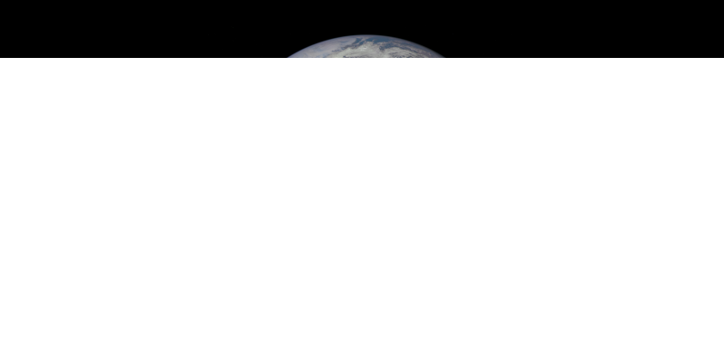  |
|   2 |   |
|   3 | 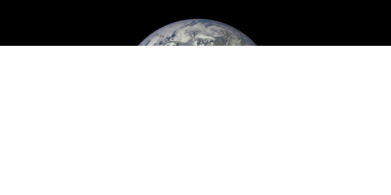  |
|   4 |   |
|   5 | 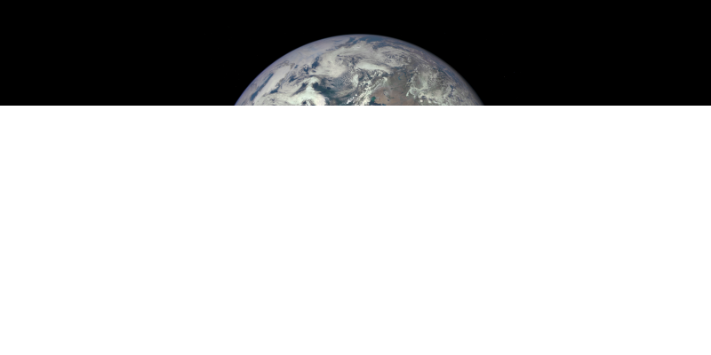  |
|   6 | 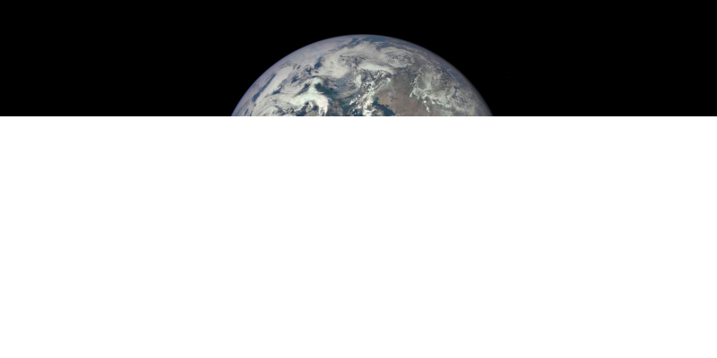  |
|   7 | 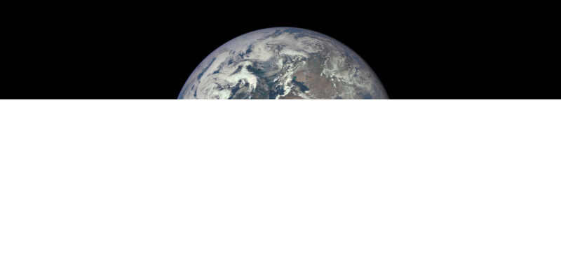  |
|   8 | 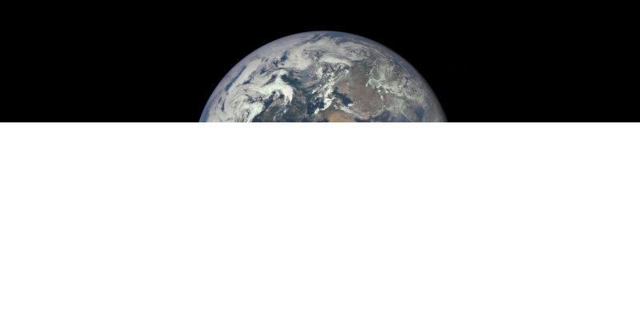  |
|   9 | 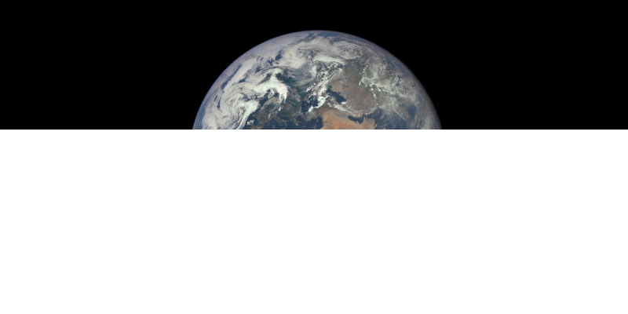  |
|  10 |   |
|  11 | 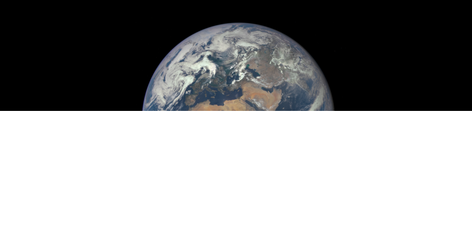 |

Our example image was a non-interlaced image, so it gets decoded as a sequence of scanlines from top-to-bottom.

We can make the previews more useful by preprocessing the image into an interlaced layout. (In a real use case, you would do this on the server, before sending it to client applications.) One way to do this is to unpack and repack the image pixels to a new image layout. A faster way to do it is to use the [`bindStorage(to:)`](https://kelvin13.github.io/swift-png/PNG/Data/Rectangular/bindStorage(to:)/) method on the image data instance, which provides a safe interface for changing image layouts without unnecessary repacking operations. This method requires that both image layouts have the same color format enumeration case, though not necessarily the same values for `fill` or `key`. Furthermore, if the color format is an indexed format, the new image palette must have the same number of entries as the old palette.

When emitting the preprocessed file, we have manually set the **chunk granularity** to 2<sup>12</sup> bytes, which is much smaller than the default of 2<sup>15</sup> bytes. The purpose of this is to make the encoder emit smaller [`IDAT`](https://kelvin13.github.io/swift-png/PNG/Chunk/IDAT) chunks, so that we can observe a larger number of intermediate snapshots.

```swift 
let layout:PNG.Layout = .init(format: image.layout.format, interlaced: true)
let progressive:PNG.Data.Rectangular = image.bindStorage(to: layout)

try progressive.compress(path: "\(path)-progressive.png", hint: 1 << 12)
```

We can invoke `decodeOnline(stream:overdraw:capture:)` on the interlaced image as follows. 

```swift
stream                      = .init(path: "\(path)-progressive.png")
counter                     = 0
let _:PNG.Data.Rectangular  = try decodeOnline(stream: &stream, overdraw: false)
{
    (snapshot:PNG.Data.Rectangular) in 
    
    try snapshot.compress(path: "\(path)-progressive-\(counter).png")
    counter += 1
}
```

| [`IDAT`](https://kelvin13.github.io/swift-png/PNG/Chunk/IDAT) chunks | image snapshot |
| ---:| ---------------------------------------------------:|
|   1 | 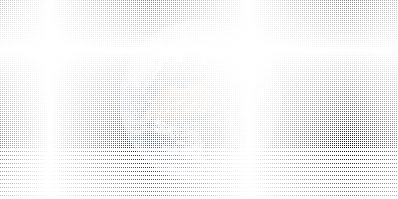  |
|   2 | 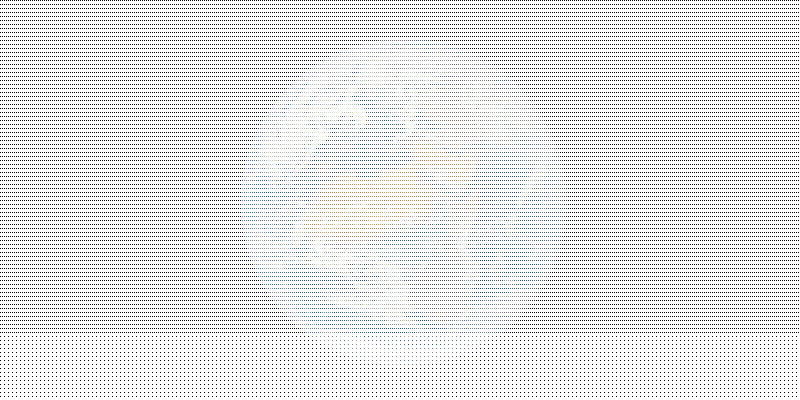  |
|   3 | 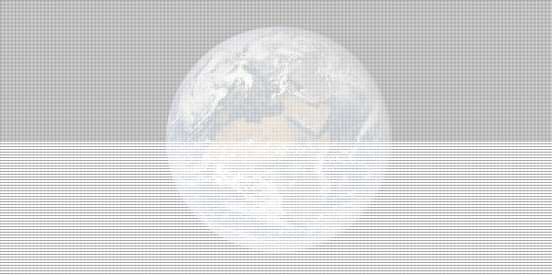  |
|   4 | 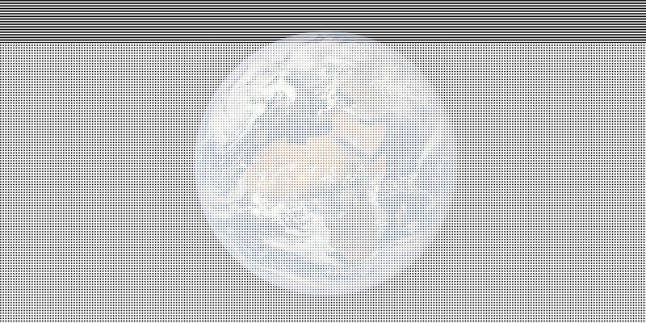  |
|   5 | 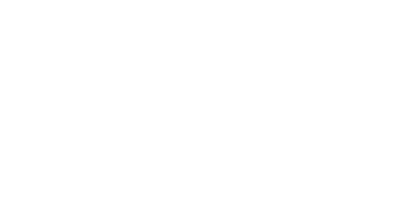  |
|   6 | 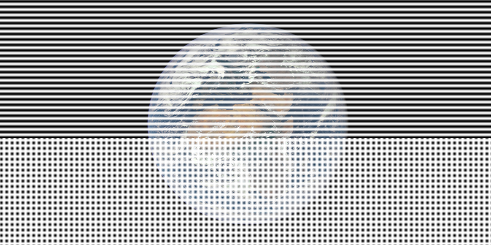  |
|   7 | 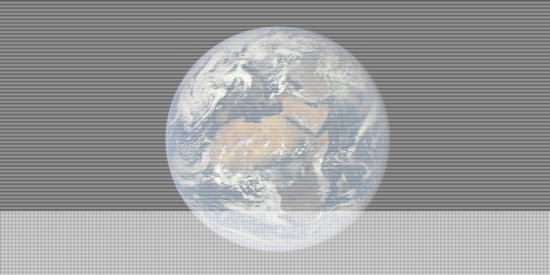  |
|   8 |   |
|   9 | 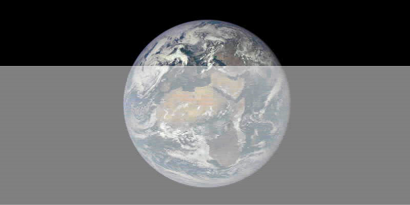  |
|  10 |   |
|  11 | 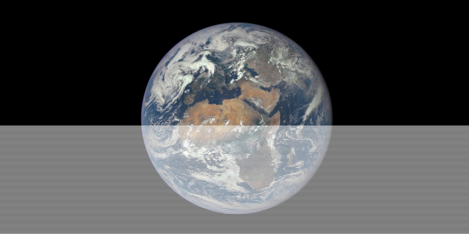 |
|  12 |  |

If we enable **overdrawing**, *Swift PNG* will pre-fill missing pixels with values from nearby pixels that are currently available. The term *overdrawing* comes from the fact that these pre-filled pixels will be overwritten when their actual contents become available. We can enable overdrawing by setting the `overdraw` parameter to `true`. 

```swift 
stream.reset(position: 0)

counter                     = 0
let _:PNG.Data.Rectangular  = try decodeOnline(stream: &stream, overdraw: true)
{
    (snapshot:PNG.Data.Rectangular) in 
    
    try snapshot.compress(path: "\(path)-progressive-overdrawn-\(counter).png")
    counter += 1
}
```

> **warning:** overdrawing does not eliminate the need to initialize the image buffer. however, every pixel in the image buffer will be written to by the end of the first [adam7 scan](https://en.wikipedia.org/wiki/Adam7_algorithm), which often fits easily into the first [`IDAT`](https://kelvin13.github.io/swift-png/PNG/Chunk/IDAT) chunk. this makes it significantly less likely that you will observe uninitialized pixels.

When overdrawing is enabled, the intermediate snapshots look somewhat more user-friendly than they do without it.

| [`IDAT`](https://kelvin13.github.io/swift-png/PNG/Chunk/IDAT) chunks | image snapshot |
| ---:| ---------------------------------------------------:|
|   1 | 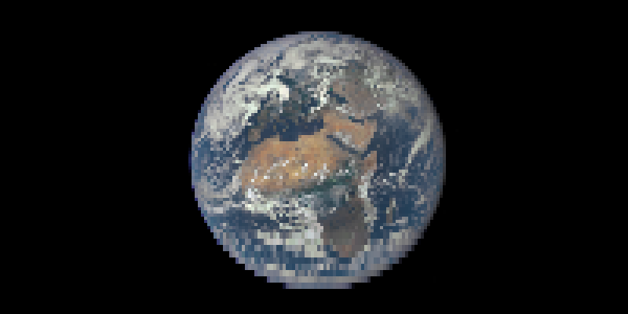  |
|   2 |   |
|   3 |   |
|   4 |   |
|   5 |   |
|   6 |   |
|   7 |   |
|   8 |   |
|   9 |   |
|  10 |   |
|  11 |  |
|  12 |  |

Overdrawing has no effect if the image is not interlaced.

## custom color targets 

[`sources`](custom-color/)

> ***by the end of this tutorial, you should be able to:***
> - *understand and use the library’s convolution and deconvolution helper functions*
> - *implement pixel packing and unpacking for a custom HSVA color target*
> - *apply chroma keys from applicable color formats*

> ***key terms:***
> - **pixel kernel**
> - **convolution**
> - **deconvolution**
> - **atom type** 
> - **intensity type**

As we have already seen, *Swift PNG*’s pixel packing and unpacking interfaces are generic over the library protocol [`PNG.Color`](https://kelvin13.github.io/swift-png/PNG/Color). The built-in color targets [`PNG.VA<T>`](https://kelvin13.github.io/swift-png/PNG/VA) and [`PNG.RGBA<T>`](https://kelvin13.github.io/swift-png/PNG/RGBA) both conform to it. In this tutorial, we will implement a custom color target, `HSVA`, which uses the [hue-saturation-value color model](https://en.wikipedia.org/wiki/HSL_and_HSV).

At this point, it is important to reiterate the difference between color formats and color targets. A color format is the internal representation that pixels are stored as in a PNG file. A color target is an interpretation of those pixels that we obtain by unpacking pixels from an image data instance. 

If you have used [*Swift JPEG*](https://github.com/kelvin13/jpeg), that library has the concept of a *color format type*, which can also be customized. This is because JPEG is an *open standard*, meaning that users can encode images with a user-defined internal representation. Thus, JPEG is actually a family of file formats, rather than a single standard. PNG is a *closed standard*, so *Swift PNG* does not allow you to customize the color format. 

> **note:** strictly speaking, png is also a family of file formats, with two color format types — the standard set of color formats, and the iphone-optimized color formats. however, the png specification provides no means of defining custom color formats within its headers (thus, the need for the [`CgBI`](https://kelvin13.github.io/swift-png/PNG/Chunk/CgBI) chunk), so for ease-of-use, *swift png* merges both png color format types into a single library-defined color format type.

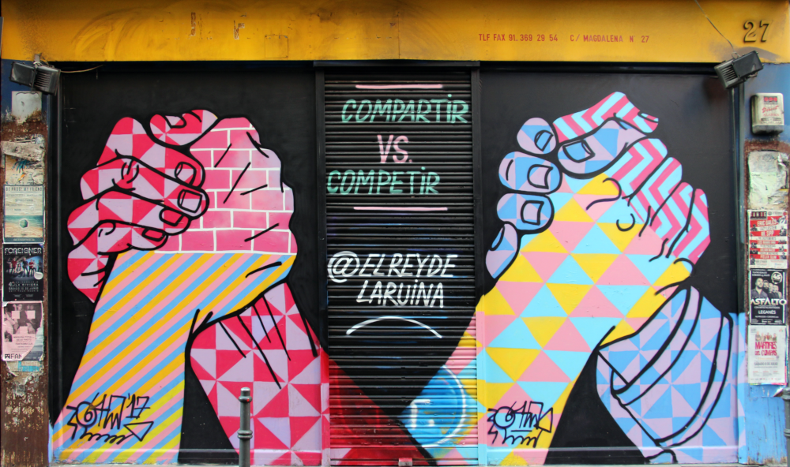

> the example image. 
>
> *source: [wikimedia commons](https://commons.wikimedia.org/wiki/File:Madrid_%2836178965285%29.jpg)*

We begin by defining the `HSVA` type. For simplicity, we won’t make it generic like [`PNG.VA<T>`](https://kelvin13.github.io/swift-png/PNG/VA) or [`PNG.RGBA<T>`](https://kelvin13.github.io/swift-png/PNG/RGBA). It will have a fixed width of 64 bits, with 32 bits for the hue component, 16 bits for the saturation component, and 8 bits each for the value and alpha components. We define the range of the hue component to be `0 ... 393222`, and the range of the other components to be the entire range of their integer storage types. (This means only nineteen of the 32 hue bits will be inhabited.)

```swift 
import PNG 

struct HSVA 
{
    var h:UInt32 
    var s:UInt16 
    var v:UInt8 
    var a:UInt8 
    
    init(h:UInt32, s:UInt16, v:UInt8, a:UInt8)
    {
        self.h = h 
        self.s = s 
        self.v = v 
        self.a = a
    }
```

We define the following conversion function, which initializes an HSVA color from RGBA samples. The conversion formula is unimportant, so it’s fine if you don’t understand exactly how it works.

```swift 
    init(r:UInt8, g:UInt8, b:UInt8, a:UInt8) 
    {
        let sorted:(min:UInt8, mid:UInt8, max:UInt8) 
        let sector:UInt32
        switch (r < g, g < b, r < b) 
        {
        case (true , true , _    ): sorted = (r, g, b); sector = 3
        case (false, true , true ): sorted = (g, r, b); sector = 4
        case (false, true , false): sorted = (g, b, r); sector = 5
        case (true , false, true ): sorted = (r, b, g); sector = 2
        case (true , false, false): sorted = (b, r, g); sector = 1
        case (false, false, _    ): sorted = (b, g, r); sector = 0
        }
        let d:UInt32 = .init(sorted.max - sorted.min)
        if d > 0 
        {
            let f:UInt32 = .init(sorted.mid - sorted.min) << 16 / d + 1, 
                r:UInt32 = sector & 1 == 0 ? f : 65537 - f
            
            self.h = 65537 * sector + r
            self.s = .init((d << 16 - 1) / .init(sorted.max))
        }
        else 
        {
            self.h = 0 
            self.s = 0
        }
        
        self.v = sorted.max 
        self.a = a
    }
```

We also define the HSVA-to-RGBA conversion, using [`PNG.RGBA<UInt8>`](https://kelvin13.github.io/swift-png/PNG/RGBA) as the return type. Again, the details of the conversion formula are unimportant. 

```swift 
    var rgba:PNG.RGBA<UInt8> 
    {
        guard self.s > 0, self.v > 0 
        else 
        {
            return .init(self.v, self.v, self.v, self.a)
        }
        
        let (sector, r):(UInt32, UInt32) = 
            self.h.quotientAndRemainder(dividingBy: 65537)
        let f:UInt32 = sector & 1 == 0 ? r : 65537 - r
        let d:UInt32 = (.init(self.s) * .init(self.v)) >> 16 + 1
        
        let x:UInt8 = self.v, 
            y:UInt8 = x - .init(d),
            z:UInt8 = .init((f * d) >> 16) + y
        
        switch sector 
        {
        case 0: return .init(x, z, y, self.a)
        case 1: return .init(z, x, y, self.a)
        case 2: return .init(y, x, z, self.a)
        case 3: return .init(y, z, x, self.a)
        case 4: return .init(z, y, x, self.a)
        case 5: return .init(x, y, z, self.a)
        default: fatalError("unreachable")
        }
    }
}
```

Now that we have a working HSVA implementation, we need to conform it to the [`PNG.Color`](https://kelvin13.github.io/swift-png/PNG/Color) protocol so we can use it as a color target. To do this, we need to fulfill the following requirements: 

```swift 
protocol PNG.Color 
{
    associatedtype Aggregate 
    
    static 
    func unpack(_ interleaved:[UInt8], of format:PNG.Format, 
        deindexer:([(r:UInt8, g:UInt8, b:UInt8, a:UInt8)]) -> (Int) -> Aggregate) 
        -> [Self]
    static 
    func pack(_ pixels:[Self], as format:PNG.Format, 
        indexer:([(r:UInt8, g:UInt8, b:UInt8, a:UInt8)]) -> (Aggregate) -> Int) 
        -> [UInt8] 
        
    static 
    func unpack(_ interleaved:[UInt8], of format:PNG.Format) -> [Self]
    static 
    func pack(_ pixels:[Self], as format:PNG.Format) -> [UInt8] 
}
```

For certain associated [`Aggregate`](https://kelvin13.github.io/swift-png/PNG/Color/Aggregate) types, the library provides default implementations for [`unpack(_:of:)`](https://kelvin13.github.io/swift-png/PNG/Color/unpack(_:of:)/) and [`pack(_:as:)`](https://kelvin13.github.io/swift-png/PNG/Color/pack(_:as:)/), which have behaviors detailed in the [indexed color tutorial](#using-indexed-images). In such cases, we only need to implement [`unpack(_:of:deindexer:)`](https://kelvin13.github.io/swift-png/PNG/Color/unpack(_:of:deindexer:)/) and [`pack(_:as:indexer:)`](https://kelvin13.github.io/swift-png/PNG/Color/pack(_:as:indexer:)/). The specific [`Aggregate`](https://kelvin13.github.io/swift-png/PNG/Color/Aggregate) types are 

- `(UInt8, UInt8)`, and 
- `(UInt8, UInt8, UInt8, UInt8)`.

In the [indexed color tutorial](#using-indexed-images), we saw how they were used by the [`PNG.VA<T>`](https://kelvin13.github.io/swift-png/PNG/VA) and [`PNG.RGBA<T>`](https://kelvin13.github.io/swift-png/PNG/RGBA) color targets. (The scalar color targets also use their own [`Aggregate`](https://kelvin13.github.io/swift-png/PNG/Color/Aggregate) type, [`UInt8`](https://developer.apple.com/documentation/swift/uint8), though this does not go through the [`PNG.Color`](https://kelvin13.github.io/swift-png/PNG/Color) protocol.)

The core idea of a color target is the **pixel kernel**. Pixel kernels convert groups of image data samples into instances of a color target, and vice-versa. In *Swift PNG*, the application of a pixel kernel to an image data buffer is called a **convolution**, and the inverse operation is called a **deconvolution**. The simplest deconvolution is to flatten an array of RGBA pixels to an array of [*r*, *g*, *b*, *a*, *r*, *g*, *b*, *a*, …] samples, and the simplest convolution is to group the elements of such an array into an array of RGBA pixels. Conceptually, this is a Swift [`flatMap(_:)`](https://developer.apple.com/documentation/swift/sequence/2905332-flatmap), and whatever you would call the opposite of a flatmap, respectively. We are allowed to do arbitrary computations in the pixel kernels, which is why we call it a (de)convolution, and not just a flatmap.

Let’s tackle the unpacking operation first. *Swift PNG* provides a set of helper functions to reduce the amount of boilerplate you have to write.

```swift 
extension PNG 
{
    static 
    func convolve<A, T, C>(_ buffer:[UInt8], dereference:(Int) -> A,
        kernel:(T) -> C)
        -> [C]
        where A:FixedWidthInteger & UnsignedInteger, T:FixedWidthInteger & UnsignedInteger

    static 
    func convolve<A, T, C>(_ buffer:[UInt8], dereference:(Int) -> (A, A),
        kernel:((T, T)) -> C)
        -> [C]
        where A:FixedWidthInteger & UnsignedInteger, T:FixedWidthInteger & UnsignedInteger

    static 
    func convolve<A, T, C>(_ buffer:[UInt8], dereference:(Int) -> (A, A, A),
        kernel:((T, T, T)) -> C)
        -> [C]
        where A:FixedWidthInteger & UnsignedInteger, T:FixedWidthInteger & UnsignedInteger

    static 
    func convolve<A, T, C>(_ buffer:[UInt8], dereference:(Int) -> (A, A, A, A),
        kernel:((T, T, T, T)) -> C)
        -> [C]
        where A:FixedWidthInteger & UnsignedInteger, T:FixedWidthInteger & UnsignedInteger

    static 
    func convolve<A, T, C>(_ buffer:[UInt8], of _:A.Type, depth:Int, 
        kernel:(T, A) -> C)
        -> [C]
        where A:FixedWidthInteger & UnsignedInteger, T:FixedWidthInteger & UnsignedInteger

    static 
    func convolve<A, T, C>(_ buffer:[UInt8], of _:A.Type, depth:Int, 
        kernel:((T, T)) -> C)
        -> [C]
        where A:FixedWidthInteger & UnsignedInteger, T:FixedWidthInteger & UnsignedInteger

    static 
    func convolve<A, T, C>(_ buffer:[UInt8], of _:A.Type, depth:Int, 
        kernel:((T, T, T), (A, A, A)) -> C)
        -> [C]
        where A:FixedWidthInteger & UnsignedInteger, T:FixedWidthInteger & UnsignedInteger

    static 
    func convolve<A, T, C>(_ buffer:[UInt8], of _:A.Type, depth:Int, 
        kernel:((T, T, T, T)) -> C)
        -> [C]
        where A:FixedWidthInteger & UnsignedInteger, T:FixedWidthInteger & UnsignedInteger
}
```

The first four convolution functions are meant to be used with indexed color formats, and the remaining four are meant to be used with non-indexed color formats. To understand how they work, let’s first go over what the generic parameters `A`, `T`, and `C` mean.

- The `A` type is the **atom type**. (The `A` stands for ***a***tom.) Atom types are closely related to color formats. For images with a color depth of 16, the appropriate atom type is [`UInt16`](https://developer.apple.com/documentation/swift/uint16). Otherwise, it is [`UInt8`](https://developer.apple.com/documentation/swift/uint8). In the image data storage buffer, which has a type of `[UInt8]`, `UInt16` atoms are stored in big-endian order. 
 
    Atoms are unscaled samples. For example, in a [`v4(fill:key:)`](https://kelvin13.github.io/swift-png/PNG/Format/v4(fill:key:)/) image, which has a color depth of 4, the [`UInt8`](https://developer.apple.com/documentation/swift/uint8) atoms can take on values in the range `0 ... 15`, with the remaining states unused.

- The `T` type is the **intensity type**. (The `T` stands for in***t***ensity, or ***t***arget, whatever floats your boat.) Intensity types are closely related to color targets. Oftentimes, the intensity type is simply the component type of the color target. For example, for the built-in [`PNG.RGBA<T>`](https://kelvin13.github.io/swift-png/PNG/RGBA) color target, its generic parameter and the intensity type are the same `T`. Of course, this isn’t always the case, notably, with our custom `HSVA` type, which has heterogenous components.

    As the name suggests, intensity values are scaled samples. The entire range of an intensity type is always inhabited. For example, in a [`v4(fill:key:)`](https://kelvin13.github.io/swift-png/PNG/Format/v4(fill:key:)/) image, an atom with the value `15` would become a [`UInt8`](https://developer.apple.com/documentation/swift/uint8) intensity with the value `255`. If the intensity type was [`UInt32`](https://developer.apple.com/documentation/swift/uint32) instead, the same atom would generate an intensity value of `4294967295` ([`UInt32.max`](https://developer.apple.com/documentation/swift/uint32/1540555-max)). 
 
    The use of intensity types in *Swift PNG* means that you don’t have to worry about normalizing samples when implementing custom color targets.
 
- Finally, the `C` type is the color target type. (Guess what the `C` stands for.) If you want to unpack a [`va16(fill:)`](https://kelvin13.github.io/swift-png/PNG/Format/va16(fill:)/) image to an array of [`PNG.RGBA<UInt8>`](https://kelvin13.github.io/swift-png/PNG/RGBA) pixels, the atom type would be [`UInt16`](https://developer.apple.com/documentation/swift/uint16), the intensity type would be [`UInt8`](https://developer.apple.com/documentation/swift/uint8), and the color target type would of course be [`PNG.RGBA<UInt8>`](https://kelvin13.github.io/swift-png/PNG/RGBA). Indeed, this is exactly what the built-in [`PNG.RGBA<T>`](https://kelvin13.github.io/swift-png/PNG/RGBA) color target does.

The four non-indexed convolution functions perform the following operations: 

1. Load (big-endian) atoms from the given data buffer. 
2. Convert the atoms to the intensity type, and scale them to fill the range of the intensity type, according to the given color depth. 
3. Feed the intensities, and in certain cases, the original atoms as well, to the given pixel kernel, and get pixel instances in return.

The reason why some of the pixel kernels receive the original atoms in addition to the intensity values is because their associated color formats (namely, the grayscale, RGB, and BGR formats) require us to do chroma key comparisons, which must be performed in the original atom type.

The four indexed convolution functions do basically the same thing, except they obtain the atoms from the given `dereference` function, which in turn gets its [`Int`](https://developer.apple.com/documentation/swift/int) index argument from the given data buffer. Generally, you would expect it to get the atoms from the image palette. They are meant to be used with the [`Aggregate`](https://kelvin13.github.io/swift-png/PNG/Color/Aggregate) types `A`, `(A, A)`, `(A, A, A)`, or `(A, A, A, A)`, respectively. The indexed convolution functions assume the image color depth is the same as the bit width of the atom type, which is why they don’t ask you to supply a color depth argument. None of them pass the original atoms to their pixel kernels, since indexed color formats don’t use chroma keys.

Now, let’s write the implementation for the unpacking function. 

First, we set the associated [`Aggregate`](https://kelvin13.github.io/swift-png/PNG/Color/Aggregate) type to `(UInt8, UInt8, UInt8, UInt8)`. This means that we expect the deindexing function to return four atoms, since we want to use all four components of the RGBA palette entries to compute the HSVA outputs. (This also means that the library will give us a default `deindexer` implementation for free.)

```swift 
extension HSVA:PNG.Color 
{
    typealias Aggregate = (UInt8, UInt8, UInt8, UInt8)
    
    static 
    func unpack(_ interleaved:[UInt8], of format:PNG.Format, 
        deindexer:([(r:UInt8, g:UInt8, b:UInt8, a:UInt8)]) -> (Int) -> Aggregate) 
        -> [Self] 
```

We can handle all of the indexed color formats in one `switch` case. We assume that the `dereference` function returns RGBA samples in the `(UInt8, UInt8, UInt8, UInt8)` aggregate, and we forward them to `HSVA.init(r:g:b:a:)`. (If you don’t understand how to get the `dereference` function from `deindexer`, read the [indexed color tutorial](#using-indexed-images).)

```swift 
    {
        let depth:Int = format.pixel.depth 
        switch format 
        {
        case    .indexed1(palette: let palette, fill: _), 
                .indexed2(palette: let palette, fill: _), 
                .indexed4(palette: let palette, fill: _), 
                .indexed8(palette: let palette, fill: _):
            return PNG.convolve(interleaved, dereference: deindexer(palette)) 
            {
                (c:(UInt8, UInt8, UInt8, UInt8)) in 
                .init(r: c.0, g: c.1, b: c.2, a: c.3)
            }
```

For grayscale color formats without a chroma key, we assign the grayscale sample to the value channel of the HSVA output, set the hue and saturation to zero, and the alpha to full opacity. We need a separate case for the [`v16(fill:key:)`](https://kelvin13.github.io/swift-png/PNG/Format/v16(fill:key:)/) color format, since its atom type is [`UInt16`](https://developer.apple.com/documentation/swift/uint16) and not [`UInt8`](https://developer.apple.com/documentation/swift/uint8).

```swift 
        case    .v1(fill: _, key: nil),
                .v2(fill: _, key: nil),
                .v4(fill: _, key: nil),
                .v8(fill: _, key: nil):
            return PNG.convolve(interleaved, of: UInt8.self, depth: depth) 
            {
                (v:UInt8, _) in 
                .init(h: 0, s: 0, v: v, a: .max)
            }
        case    .v16(fill: _, key: nil):
            return PNG.convolve(interleaved, of: UInt16.self, depth: depth) 
            {
                (v:UInt8, _) in 
                .init(h: 0, s: 0, v: v, a: .max)
            }
```

For the grayscale formats with a chroma key, we do the same thing, except we clear the alpha if the original grayscale atom matches the chroma key. 

```swift 
        case    .v1(fill: _, key: let key?),
                .v2(fill: _, key: let key?),
                .v4(fill: _, key: let key?),
                .v8(fill: _, key: let key?):
            return PNG.convolve(interleaved, of: UInt8.self, depth: depth)
            {
                (v:UInt8, k:UInt8 ) in 
                .init(h: 0, s: 0, v: v, a: k == key ? .min : .max)
            }
        case    .v16(fill: _, key: let key?):
            return PNG.convolve(interleaved, of: UInt16.self, depth: depth) 
            {
                (v:UInt8, k:UInt16) in 
                .init(h: 0, s: 0, v: v, a: k == key ? .min : .max)
            }
```

The rest of the cases are quite boilerplatey, and therefore should be incredibly straightforward. 

```swift 
        case    .va8(fill: _):
            return PNG.convolve(interleaved, of: UInt8.self, depth: depth)
            {
                (c:(UInt8, UInt8)) in 
                .init(h: 0, s: 0, v: c.0, a: c.1)
            }
        case    .va16(fill: _):
            return PNG.convolve(interleaved, of: UInt16.self, depth: depth)
            {
                (c:(UInt8, UInt8)) in 
                .init(h: 0, s: 0, v: c.0, a: c.1)
            }

        case    .bgr8(palette: _, fill: _, key: nil):
            return PNG.convolve(interleaved, of: UInt8.self, depth: depth)
            {
                (c:(UInt8, UInt8, UInt8), _) in 
                .init(r: c.2, g: c.1, b: c.0, a: .max)
            }
        case    .bgr8(palette: _, fill: _, key: let key?):
            return PNG.convolve(interleaved, of: UInt8.self, depth: depth)
            {
                (c:(UInt8, UInt8, UInt8), k:(UInt8,  UInt8,  UInt8 )) in 
                .init(r: c.2, g: c.1, b: c.0, a: k == key ? .min : .max)
            }

        case    .rgb8(palette: _, fill: _, key: nil):
            return PNG.convolve(interleaved, of: UInt8.self, depth: depth)
            {
                (c:(UInt8, UInt8, UInt8), _) in 
                .init(r: c.0, g: c.1, b: c.2, a: .max)
            }
        case    .rgb16(palette: _, fill: _, key: nil):
            return PNG.convolve(interleaved, of: UInt16.self, depth: depth)
            {
                (c:(UInt8, UInt8, UInt8), _) in 
                .init(r: c.0, g: c.1, b: c.2, a: .max)
            }
        case    .rgb8(palette: _, fill: _, key: let key?):
            return PNG.convolve(interleaved, of: UInt8.self, depth: depth)
            {
                (c:(UInt8, UInt8, UInt8), k:(UInt8,  UInt8,  UInt8 )) in 
                .init(r: c.0, g: c.1, b: c.2, a: k == key ? .min : .max)
            }
        case    .rgb16(palette: _, fill: _, key: let key?):
            return PNG.convolve(interleaved, of: UInt16.self, depth: depth)
            {
                (c:(UInt8, UInt8, UInt8), k:(UInt16, UInt16, UInt16)) in 
                .init(r: c.0, g: c.1, b: c.2, a: k == key ? .min : .max)
            }

        case    .bgra8(palette: _, fill: _):
            return PNG.convolve(interleaved, of: UInt8.self, depth: depth)
            {
                (c:(UInt8, UInt8, UInt8, UInt8)) in 
                .init(r: c.2, g: c.1, b: c.0, a: c.3)
            }

        case    .rgba8(palette: _, fill: _):
            return PNG.convolve(interleaved, of: UInt8.self, depth: depth)
            {
                (c:(UInt8, UInt8, UInt8, UInt8)) in 
                .init(r: c.0, g: c.1, b: c.2, a: c.3)
            }
        case    .rgba16(palette: _, fill: _):
            return PNG.convolve(interleaved, of: UInt16.self, depth: depth)
            {
                (c:(UInt8, UInt8, UInt8, UInt8)) in 
                .init(r: c.0, g: c.1, b: c.2, a: c.3)
            }
        }
    }
```

If you understood how we implemented the unpacking function, then the packing function should be easy to write too. Mirroring the convolution functions, *Swift PNG* provides eight deconvolution helper functions. The generic parameters have the exact same meanings as they did before.

```swift 
extension PNG 
{
    static 
    func deconvolve<A, T, C>(_ pixels:[C], reference:(A) -> Int,
        kernel:(C) -> T)
        -> [UInt8]
        where A:FixedWidthInteger & UnsignedInteger, T:FixedWidthInteger & UnsignedInteger
    
    static 
    func deconvolve<A, T, C>(_ pixels:[C], reference:((A, A)) -> Int,
        kernel:(C) -> (T, T))
        -> [UInt8]
        where A:FixedWidthInteger & UnsignedInteger, T:FixedWidthInteger & UnsignedInteger
    
    static 
    func deconvolve<A, T, C>(_ pixels:[C], reference:((A, A, A)) -> Int,
        kernel:(C) -> (T, T, T))
        -> [UInt8]
        where A:FixedWidthInteger & UnsignedInteger, T:FixedWidthInteger & UnsignedInteger
    
    static 
    func deconvolve<A, T, C>(_ pixels:[C], reference:((A, A, A, A)) -> Int,
        kernel:(C) -> (T, T, T, T))
        -> [UInt8]
        where A:FixedWidthInteger & UnsignedInteger, T:FixedWidthInteger & UnsignedInteger

    static 
    func deconvolve<A, T, C>(_ pixels:[C], as _:A.Type, depth:Int, 
        kernel:(C) -> T)
        -> [UInt8]
        where A:FixedWidthInteger & UnsignedInteger, T:FixedWidthInteger & UnsignedInteger
    
    static 
    func deconvolve<A, T, C>(_ pixels:[C], as _:A.Type, depth:Int, 
        kernel:(C) -> (T, T))
        -> [UInt8]
        where A:FixedWidthInteger & UnsignedInteger, T:FixedWidthInteger & UnsignedInteger
    
    static 
    func deconvolve<A, T, C>(_ pixels:[C], as _:A.Type, depth:Int, 
        kernel:(C) -> (T, T, T))
        -> [UInt8]
        where A:FixedWidthInteger & UnsignedInteger, T:FixedWidthInteger & UnsignedInteger

    static 
    func deconvolve<A, T, C>(_ pixels:[C], as _:A.Type, depth:Int, 
        kernel:(C) -> (T, T, T, T))
        -> [UInt8]
        where A:FixedWidthInteger & UnsignedInteger, T:FixedWidthInteger & UnsignedInteger
}
```

The four non-indexed deconvolution functions perform the following operations: 

1. Feed the pixel instances from the given pixel array to the given pixel kernel, and get intensity tuples (or a scalar) in return.
2. Convert the intensities to the atom type, and scale them to the range specified by the given color depth.
3. Store the atoms in the returned data buffer (as big-endian integers).

The main difference is that none of the deconvolution kernels interact with the generated atoms, since chroma keys aren’t relevant to pixel packing. This is because any chroma key-based transparency would have already been baked into the pixel array when it was first unpacked from the image data instance.

The four indexed deconvolution functions have essentially the same relationship to the non-indexed deconvolution functions as the indexed convolution functions do to the non-indexed convolution functions.

The implementation of the packing function is straightforward. When necessary, we have used the `rgba` property we defined on the `HSVA` type to perform the HSVA-to-RGBA conversion. Note that we have explicitly written the return types in the pixel kernels since, at the time of writing, the Swift compiler seems to have some issues with type inferencing across module boundaries.

```swift 
    static 
    func pack(_ pixels:[Self], as format:PNG.Format, 
        indexer:([(r:UInt8, g:UInt8, b:UInt8, a:UInt8)]) -> (Aggregate) -> Int) 
        -> [UInt8] 
    {
        let depth:Int = format.pixel.depth 
        switch format 
        {
        case    .indexed1(palette: let palette, fill: _), 
                .indexed2(palette: let palette, fill: _), 
                .indexed4(palette: let palette, fill: _), 
                .indexed8(palette: let palette, fill: _):
            return PNG.deconvolve(pixels, reference: indexer(palette)) 
            {
                (c:Self) -> (UInt8, UInt8, UInt8, UInt8) in 
                let rgba:PNG.RGBA<UInt8> = c.rgba 
                return (rgba.r, rgba.g, rgba.b, c.a)
            }
                
        case    .v1(fill: _, key: _),
                .v2(fill: _, key: _),
                .v4(fill: _, key: _),
                .v8(fill: _, key: _):
            return PNG.deconvolve(pixels, as: UInt8.self,  depth: depth, kernel: \.v) 
        case    .v16(fill: _, key: _):
            return PNG.deconvolve(pixels, as: UInt16.self, depth: depth, kernel: \.v)

        case    .va8(fill: _):
            return PNG.deconvolve(pixels, as: UInt8.self, depth: depth)
            {
                (c:Self) -> (UInt8, UInt8) in 
                return (c.v, c.a)
            }
        case    .va16(fill: _):
            return PNG.deconvolve(pixels, as: UInt16.self, depth: depth)
            {
                (c:Self) -> (UInt8, UInt8) in 
                return (c.v, c.a)
            }
        
        case    .bgr8(palette: _, fill: _, key: _):
            return PNG.deconvolve(pixels, as: UInt8.self, depth: depth)
            {
                (c:Self) -> (UInt8, UInt8, UInt8) in 
                let rgba:PNG.RGBA<UInt8> = c.rgba 
                return (rgba.b, rgba.g, rgba.r)
            }

        case    .rgb8(palette: _, fill: _, key: _):
            return PNG.deconvolve(pixels, as: UInt8.self, depth: depth)
            {
                (c:Self) -> (UInt8, UInt8, UInt8) in 
                let rgba:PNG.RGBA<UInt8> = c.rgba 
                return (rgba.r, rgba.g, rgba.b)
            }
        case    .rgb16(palette: _, fill: _, key: _):
            return PNG.deconvolve(pixels, as: UInt16.self, depth: depth)
            {
                (c:Self) -> (UInt8, UInt8, UInt8) in 
                let rgba:PNG.RGBA<UInt8> = c.rgba 
                return (rgba.r, rgba.g, rgba.b)
            }
        
        case    .bgra8(palette: _, fill: _):
            return PNG.deconvolve(pixels, as: UInt8.self, depth: depth)
            {
                (c:Self) -> (UInt8, UInt8, UInt8, UInt8) in 
                let rgba:PNG.RGBA<UInt8> = c.rgba 
                return (rgba.b, rgba.g, rgba.r, c.a)
            }
        
        case    .rgba8(palette: _, fill: _):
            return PNG.deconvolve(pixels, as: UInt8.self, depth: depth)
            {
                (c:Self) -> (UInt8, UInt8, UInt8, UInt8) in 
                let rgba:PNG.RGBA<UInt8> = c.rgba 
                return (rgba.r, rgba.g, rgba.b, c.a)
            }
        case    .rgba16(palette: _, fill: _):
            return PNG.deconvolve(pixels, as: UInt16.self, depth: depth)
            {
                (c:Self) -> (UInt8, UInt8, UInt8, UInt8) in 
                let rgba:PNG.RGBA<UInt8> = c.rgba 
                return (rgba.r, rgba.g, rgba.b, c.a)
            }
        }
    }
}
```

Now, we can put our custom `HSVA` color target to work. 

```swift 
let path:String = "examples/custom-color/example"
guard let image:PNG.Data.Rectangular = try .decompress(path: "\(path).png")
else 
{
    fatalError("failed to open file '\(path).png'")
}

let hsva:[HSVA] = image.unpack(as: HSVA.self)
```

We can visualize the hue, saturation, and value channels as follows: 

```swift 
let hue:PNG.Data.Rectangular = .init(
    packing: hsva.map{ HSVA.init(h: $0.h, s: .max / 2, v: .max, a: $0.a) }, 
    size: image.size, layout: image.layout, metadata: image.metadata) 
try hue.compress(path: "\(path)-hue.png")
```

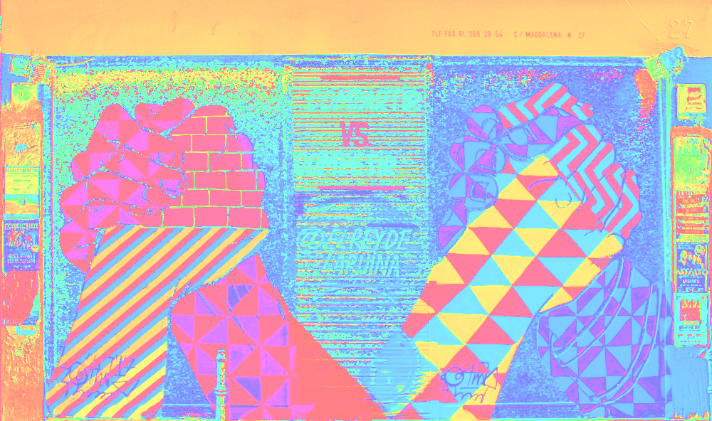

> a visualization of the example image hue.

```swift
let saturation:PNG.Data.Rectangular = .init(
    packing: hsva.map{ HSVA.init(h: 370000, s: $0.s, v: .max, a: $0.a) }, 
    size: image.size, layout: image.layout, metadata: image.metadata) 
try saturation.compress(path: "\(path)-saturation.png")
```


> a visualization of the example image saturation.

```swift
let value:PNG.Data.Rectangular = .init(
    packing: hsva.map{ HSVA.init(h: 0, s: 0, v: $0.v, a: $0.a) }, 
    size: image.size, layout: image.layout, metadata: image.metadata) 
try value.compress(path: "\(path)-value.png")
```


> a visualization of the example image value.

We can test our pixel packing implementation by re-encoding the HSVA image. 

```swift 
let new:PNG.Data.Rectangular = .init(packing: hsva, 
    size: image.size, layout: image.layout, metadata: image.metadata)
try new.compress(path: "\(path).png.png")
```


> the example image, re-encoded from the previously-obtained hsva representation.
