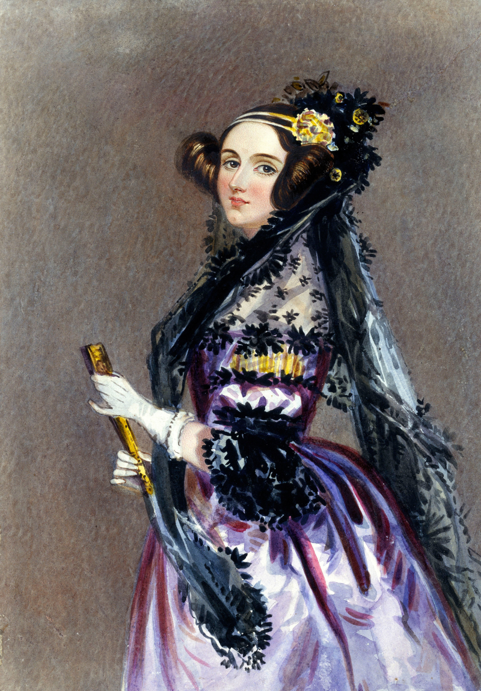
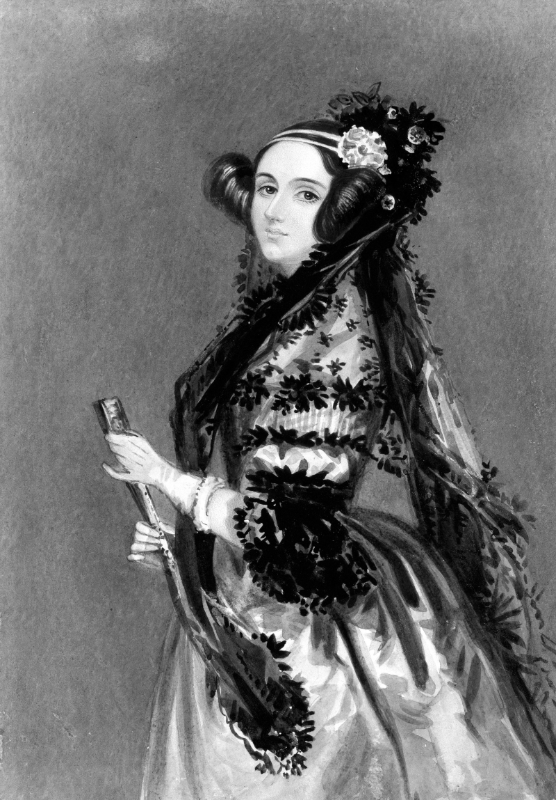
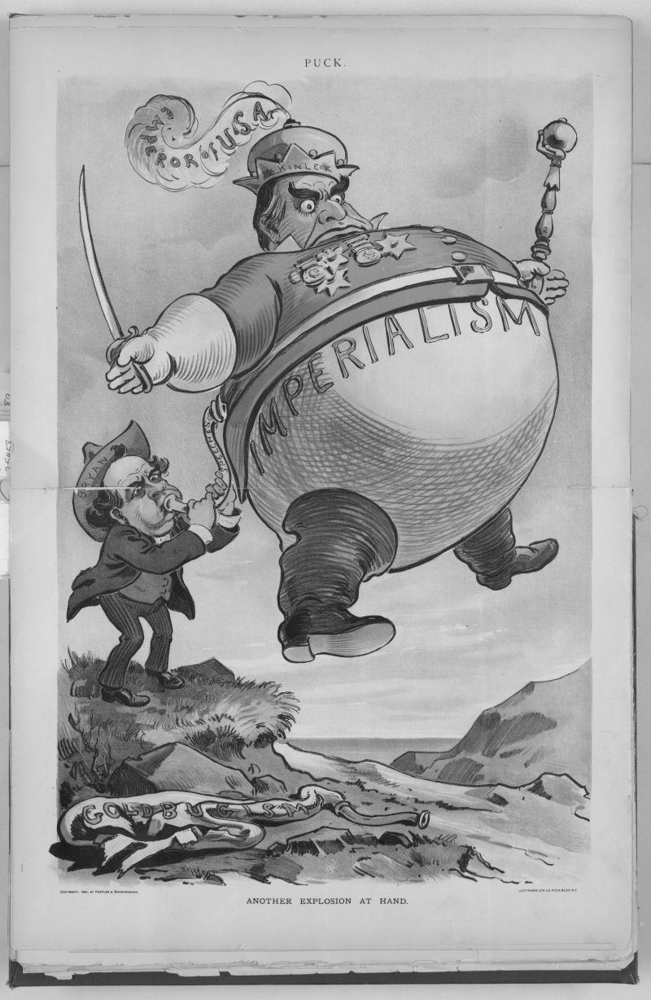

# swift png tutorials 

*jump to:*

1. [basic decoding](#basic-decoding) ([sources](decode-basic/))
2. [basic encoding](#basic-encoding) ([sources](encode-basic/))
2. [using indexed images](#using-indexed-images) ([sources](indexed/))

## basic decoding 

[`sources`](decode-basic/)

> ***by the end of this tutorial, you should be able to:***
> - *decompress a png file to its rectangular image representation*
> - *unpack rectangular image data to the built-in rgba, grayscale-alpha, and scalar color targets*

> ***key terms:***
> - **color target**

On platforms with built-in file system support (MacOS, Linux), decoding a PNG file to a pixel array takes just two function calls.

```swift 
import PNG 

let path:String = "examples/decode-basic/ada-lovelace-1840.png"

guard let image:PNG.Data.Rectangular = try .decompress(path: path)
else 
{
    fatalError("failed to open file '\(path)'")
}

let rgba:[PNG.RGBA<UInt8>] = image.unpack(as: PNG.RGBA<UInt8>.self)
```



> example image, decoded to an rgba data file, and re-encoded as a png (for display purposes).
> 
> *source: [wikimedia commons](https://commons.wikimedia.org/wiki/File:Ada_Lovelace_portrait.jpg)*

The element type of the output array, `PNG.RGBA<UInt8>`, is called a **color target**. The pixels in the array are arranged in row-major order. The pixel in the top-left corner of the image is the first element of the array.

We could also have unpacked the image pixels to the `PNG.VA<UInt8>` built-in color target, which produces an identically-shaped array of grayscale-alpha pixels.

```swift 
let va:[PNG.VA<UInt8>] = image.unpack(as: PNG.VA<UInt8>.self)
```


> the same example image, decoded to an grayscale-alpha data file, and re-encoded as a png.

The `unpack(as:)` method is [non-mutating](https://docs.swift.org/swift-book/LanguageGuide/Methods.html#ID239), so you can unpack the same image to multiple color targets without having to re-decode the file each time.

The `unpack(as:)` method also has an overload which allows you to unpack an image into scalar grayscale samples.

```swift 
let v:[UInt8] = image.unpack(as: UInt8.self)
```



> the same example image, decoded to an grayscale data file, and re-encoded as a png. it looks the same as the grayscale-alpha output because the original image has no transparent pixels.

The two `unpack(as:)` methods support all Swift integer types that conform to [`FixedWidthInteger`](https://developer.apple.com/documentation/swift/fixedwidthinteger)`&`[`UnsignedInteger`](https://developer.apple.com/documentation/swift/unsignedinteger). They have generic specializations for [`UInt8`](https://developer.apple.com/documentation/swift/uint8), [`UInt16`](https://developer.apple.com/documentation/swift/uint16), [`UInt32`](https://developer.apple.com/documentation/swift/uint32), [`UInt64`](https://developer.apple.com/documentation/swift/uint64), and [`UInt`](https://developer.apple.com/documentation/swift/uint). 

If you unpack an image to an integer type `T` with a bit width different from the bit depth of the original image, the samples will be scaled to fill the range `T.min ... T.max`. The scaling is done arithmetically, so if you unpack an 8-bit image to a [`UInt16`](https://developer.apple.com/documentation/swift/uint16)-based color target, then samples with the value `255` will become `65535`, not `65280`.

> **warning:** the built-in grayscale color targets do not compute luminance for rgb- and rgba-type images. they simply use the red component as the gray value, and discard the green and blue components. to perform more sophisticated pixel unpacking, [define a custom pixel kernel](#custom-color-targets).

## basic encoding 

[`sources`](encode-basic/)

> ***by the end of this tutorial, you should be able to:***
> - *define a png image layout*
> - *understand the relationship between color formats and color targets*
> - *create a rectangular image data instance from a pixel array*
> - *compress images at different compression levels*

> ***key terms:***
> - **image layout** 
> - **interlacing** 
> - **color format** 
> - **color depth** 
> - **bit depth**
> - **compression level**

This tutorial will assume you have the image you want to encode stored as an array of pixels. In the [example code](encode-basic/main.swift) for this tutorial, we have loaded it from a raw `.rgba` data file using the library’s file system APIs. (As previously mentioned, these APIs are only available on MacOS and Linux.)

```swift 
import PNG

let path:String         = "examples/encode-basic/another-explosion-at-hand", 
    size:(x:Int, y:Int) = (800, 1228)
guard let rgba:[PNG.RGBA<UInt8>] = (System.File.Source.open(path: "\(path).rgba")
{
    guard let data:[UInt8] = $0.read(count: 4 * size.x * size.y)
    else 
    {
        fatalError("failed to read from file '\(path).rgba'")
    }

    return (0 ..< size.x * size.y).map 
    {
        (i:Int) -> PNG.RGBA<UInt8> in
        .init(data[4 * i], data[4 * i + 1], data[4 * i + 2], data[4 * i + 3])
    }
}) 
else
{
    fatalError("failed to open file '\(path).rgba'")
}
```

The first step to encoding a PNG file is to define an **image layout**. An image layout specifies everything about a PNG image that is not strictly “metadata” or specific to the image content. Here, we have defined an 8-bit RGB layout, as well as an 8-bit grayscale layout which we will use later.

```swift 
let layout:(rgb:PNG.Layout, v:PNG.Layout) = 
(
    rgb:    .init(format: .rgb8(palette: [], fill: nil, key: nil)),
    v:      .init(format:   .v8(             fill: nil, key: nil))
)
```

The signature of the `PNG.Layout` initializer is given below: 

```swift 
init(format:PNG.Format, interlaced:Bool = false) 
```

The `format` parameter specifies the **color format** of the layout. A color format is the internal representation that a PNG file uses to store image data. You can encode any color target to any color format, though some combinations can result in information loss. For example, the alpha channel of the `PNG.RGBA<UInt8>` pixel array will be lost when encoding in the 8-bit RGB format.

We can enable **interlacing** by setting the `interlaced` parameter to `true`. [Interlacing](https://en.wikipedia.org/wiki/Adam7_algorithm) is an alternative way of storing the image data within the PNG file’s internal representation. This parameter is `false` by default. There is rarely a good reason to enable it, and it usually hurts the compression ratio, so we have omitted it in this example.

*Swift PNG* supports all fifteen standard PNG color formats, plus two formats from Apple’s PNG extensions. The **bit depth** refers to the bit width of the samples in each pixel. The **color depth** refers to the bit width of the color channels in each pixel. The bit depth is different from the color depth for the indexed color formats, because the pixel samples are indices referencing 8-bit palette colors.

|          enumeration case             |    color model    | bit depth | color depth | standard  | 
| ------------------------------------- | ----------------- | --------- | ----------- | --------- |
| `PNG.Format.v1(fill:key:)`            | grayscale         | 1         | 1           | core      |
| `PNG.Format.v2(fill:key:)`            | grayscale         | 2         | 2           | core      |
| `PNG.Format.v4(fill:key:)`            | grayscale         | 4         | 4           | core      |
| `PNG.Format.v8(fill:key:)`            | grayscale         | 8         | 8           | core      |
| `PNG.Format.v16(fill:key:)`           | grayscale         | 16        | 16          | core      |
||||||
| `PNG.Format.va8(fill:)`               | grayscale-alpha   | 8         | 8           | core      |
| `PNG.Format.va16(fill:)`              | grayscale-alpha   | 16        | 16          | core      |
||||||
| `PNG.Format.indexed1(palette:fill:)`  | indexed           | 1         | 8           | core      |
| `PNG.Format.indexed2(palette:fill:)`  | indexed           | 2         | 8           | core      |
| `PNG.Format.indexed4(palette:fill:)`  | indexed           | 4         | 8           | core      |
| `PNG.Format.indexed8(palette:fill:)`  | indexed           | 8         | 8           | core      | 
||||||
| `PNG.Format.bgr8(palette:fill:key:)`  | BGR               | 8         | 8           | apple     |
| `PNG.Format.rgb8(palette:fill:key:)`  | RGB               | 8         | 8           | core      |
| `PNG.Format.rgb16(palette:fill:key:)` | RGB               | 16        | 16          | core      |
||||||
| `PNG.Format.bgra8(palette:fill:)`     | BGRA              | 8         | 8           | apple     |
| `PNG.Format.rgba8(palette:fill:)`     | RGBA              | 8         | 8           | core      |
| `PNG.Format.rgba16(palette:fill:)`    | RGBA              | 16        | 16          | core      |

The `fill` field specifies a solid background color which some PNG viewers use to display the image. Formats that lack a full alpha channel also have a `key` field, which specifies a chroma key. Most PNG viewers use this chroma key to display transparency for such images. The type of the `fill` and `key` fields varies depending on the color format. For example, they are `(r:UInt8, g:UInt8, b:UInt8)` tuples in the `rgb8(palette:fill:key:)` format, and [`Int`](https://developer.apple.com/documentation/swift/int) indices in the `indexed8(palette:fill:)` format. 

Most PNG viewers ignore the `fill` field, and a few ignore the `key` field as well. It is common to leave both fields as `nil` to disable this functionality.

The non-grayscale color formats include a `palette` field. Setting it to the empty array `[]` is analogous to setting `fill` or `key` to `nil`. For the indexed color formats, a non-empty `palette` is mandatory. For the other formats, it is optional (meaning it can be set to `[]`), and furthermore, ignored by almost all PNG clients, since it only specifies a suggested quantization for the image.

To create a rectangular image data instance, use the `init(packing:size:layout:metadata:)` initializer. This initializer is the inverse of the `unpack(as:)` method used in the [basic decoding](#basic-decoding) tutorial. Needless to say, the length of the pixel array must equal `size.x * size.y`. The `metadata` argument has a default value, which is an empty metadata record.

```swift 
let image:PNG.Data.Rectangular  = .init(packing: rgba, size: size, layout: layout.rgb)
```

On platforms with built-in file system support, we can compress it to a file using the `compress(path:level)` method. The `level` argument specifies the **compression level**. It should be in the range `0 ... 13`, where `13` is the most aggressive setting. Setting `level` to a value less than `0` is the same as setting it to `0`. Likewise, setting it to a value greater than `13` is the same as setting it to `13`.

Compression level `9` is roughly equivalent to *libpng*’s maximum compression setting in terms of compression ratio and encoding speed. The higher levels (`10` through `13`) are very computationally expensive, so you should only use them if you really need to optimize for file size. You can find experimental comparisons between *Swift PNG* and *libpng*’s compression settings on [this page](../benchmarks).

```swift 
try image.compress(path: "\(path)-color-rgb.png", level: 9)
```


> example image, encoded by *swift png* in the 8-bit RGB color format.
> 
> *source: [wikimedia commons](https://commons.wikimedia.org/wiki/File:Another_explosion_at_hand_-_Keppler._LCCN2010651330.jpg)*

We can compress the same image to different files, and at different compression levels, without having to repack the pixel data. 

```swift 
for level:Int in [0, 4, 8, 13]
{
    try image.compress(path: "\(path)-color-rgb@\(level).png", level: level)
}
```

If we inspect the emitted PNG files, we can verify that the higher compression settings result in smaller images. 

| compression level | file size     | 
| ----------------- | ------------- |
| 0                 | 1,762,033 B   |
| 4                 | 1,743,114 B   |
| 8                 | 1,712,486 B   |
| 9                 | 1,696,536 B   |
| 13                | 1,689,166 B   |

We can also encode the same pixel data using the grayscale layout we defined earlier.

```swift 
let image:PNG.Data.Rectangular  = .init(packing: rgba, size: size, layout: layout.v)
try image.compress(path: "\(path)-color-v.png", level: 9)
```

The built-in `PNG.RGBA` color target will discard the green, blue, and alpha channels when encoding to a grayscale format.


> example image, encoded by *swift png* in the 8-bit grayscale color format.

Like the `unpack(as:)` method, the `init(packing:size:layout:metadata:)` initializer is generic and can take an array of any color target. It also has an overload which takes an array of scalars. To demonstrate this use case, we will compute the luminance of our example image (using a standard formula), and store it as a `[UInt8]` array. 

```swift 
let luminance:[UInt8] = rgba.map 
{
    let r:Double = .init($0.r), 
        g:Double = .init($0.g),
        b:Double = .init($0.b)
    let l:Double = (0.299 * r * r + 0.587 * g * g + 0.114 * b * b).squareRoot()
    return .init(max(0, min(l.rounded(), 255)))
}
```

We can encode it to a file just as we did with the array of `PNG.RGBA<UInt8>` colors:

```swift 
let image:PNG.Data.Rectangular  = .init(packing: luminance, size: size, layout: layout.v)
try image.compress(path: "\(path)-luminance-v.png", level: 9)
```


> computed luminance of the example image, encoded by *swift png* in the 8-bit grayscale color format. the output image is 590.6 kb in size.

Observe that it looks different from the previous output, since we used information from all three color channels to compute the grayscale values.

We could also have encoded it using an RGB color format, which produces a visually identical image. 

```swift 
let image:PNG.Data.Rectangular  = .init(packing: luminance, size: size, layout: layout.rgb)
try image.compress(path: "\(path)-luminance-rgb.png", level: 9)
```



> computed luminance of the example image, encoded by *swift png* in the 8-bit RGB color format. the output image is 880.4 kb in size.

The resulting file is much larger than the one encoded in the grayscale format, since it contains two redundant color channels. So there’s usually not a good reason to save a grayscale image in an non-grayscale color format.

## using indexed images 

[`sources`](indexed/)

> ***by the end of this tutorial, you should be able to:***
> - *define a color palette*
> - *encode an image from an index array*
> - *decode an image to an index array*
> - *use custom indexing and deindexing functions*

> ***key terms:***
> - **image palette** 
> - **indexing function** 
> - **deindexing function** 

In this tutorial, we will use *Swift PNG*’s indexing APIs to colorize the following grayscale image:


> example image, which is an 8-bit grayscale png.
> 
> *source: [wikimedia commons](https://commons.wikimedia.org/wiki/File:20081206_Alexandros_Grigoropoulos_december_2008_riots_Sina_Street_Athens_Greece.jpg)*

We already saw in the [basic decoding](#decode-basic) tutorial how to read grayscale samples from an input PNG. 

```swift 
import PNG

let path:String = "examples/indexing/example"

guard let image:PNG.Data.Rectangular = try .decompress(path: "\(path).png")
else 
{
    fatalError("failed to open file '\(path).png'")
}

let v:[UInt8] = image.unpack(as: UInt8.self)
```

What we want to do is map the grayscale [`UInt8`](https://developer.apple.com/documentation/swift/uint8) values to some color gradient, where gray value `0` gets the color at the bottom of the gradient, and gray value `255` gets the color at the top of the gradient. We will do this by creating a new, indexed image where the gray values in the original image are the indices in the new image, and where each index references a gradient value stored in the **image palette**.

We define a simple, six-stop gradient function with the following code. It generates a gradient that is black at the bottom, red in the middle, and yellow at the top.

```swift 
func lerp(_ a:(r:Double, g:Double, b:Double), _ b:(r:Double, g:Double, b:Double), t:Double) 
    -> (r:Double, g:Double, b:Double) 
{
    (
        a.r * (1.0 - t) + b.r * t,
        a.g * (1.0 - t) + b.g * t,
        a.b * (1.0 - t) + b.b * t
    )
}
func gradient<T>(_ x:T) -> (r:UInt8, g:UInt8, b:UInt8, a:UInt8) 
    where T:FixedWidthInteger
{
    let stops:
    (
        (r:Double, g:Double, b:Double), 
        (r:Double, g:Double, b:Double), 
        (r:Double, g:Double, b:Double), 
        (r:Double, g:Double, b:Double), 
        (r:Double, g:Double, b:Double), 
        (r:Double, g:Double, b:Double)
    ) 
    = 
    (
        (0.0, 0.0, 0.0), 
        (0.1, 0.1, 0.1), 
        (1.0, 0.2, 0.3), 
        (1.0, 0.3, 0.2),
        (1.0, 0.4, 0.3),
        (1.0, 0.8, 0.4)
    )
    let t:Double = (.init(x) - .init(T.min)) / (.init(T.max) - .init(T.min))
    let y:(r:Double, g:Double, b:Double) 
    switch t 
    {
    case         ..<0.0:    y = stops.0
    case    0.0 ..< 0.2:    y = lerp(stops.0, stops.1, t: (t      ) / 0.2)
    case    0.2 ..< 0.4:    y = lerp(stops.1, stops.2, t: (t - 0.2) / 0.2)
    case    0.4 ..< 0.6:    y = lerp(stops.2, stops.3, t: (t - 0.4) / 0.2)
    case    0.6 ..< 0.8:    y = lerp(stops.3, stops.4, t: (t - 0.6) / 0.2)
    case    0.8...     :    y = lerp(stops.4, stops.5, t: (t - 0.8) / 0.2)
    default            :    y = stops.5
    }
    return 
        (
        r: .init(max(0, min(y.r * 255, 255))),
        g: .init(max(0, min(y.g * 255, 255))),
        b: .init(max(0, min(y.b * 255, 255))),
        a: .max
        )
}
```

Of course, we can’t encode a gradient function directly in a PNG file, since PNG viewers can’t execute Swift code. So we have to tabularize it as a 256-element array. 

```swift 
let gradient:[(r:UInt8, g:UInt8, b:UInt8, a:UInt8)] = 
    (UInt8.min ... UInt8.max).map(gradient(_:))
```

The gradient function doesn’t really have anything to do with *Swift PNG*, so if you want, you can copy-and-paste the following array literal instead: 

<details>
<summary><em>Click to show gradient array literal</em></summary>

```swift 
let gradient:[(r:UInt8, g:UInt8, b:UInt8, a:UInt8)] =
[
    (r: 0, g: 0, b: 0, a: 255),
    (r: 0, g: 0, b: 0, a: 255),
    (r: 1, g: 1, b: 1, a: 255),
    (r: 1, g: 1, b: 1, a: 255),
    (r: 2, g: 2, b: 2, a: 255),
    (r: 2, g: 2, b: 2, a: 255),
    (r: 3, g: 3, b: 3, a: 255),
    (r: 3, g: 3, b: 3, a: 255),
    (r: 4, g: 4, b: 4, a: 255),
    (r: 4, g: 4, b: 4, a: 255),
    (r: 5, g: 5, b: 5, a: 255),
    (r: 5, g: 5, b: 5, a: 255),
    (r: 6, g: 6, b: 6, a: 255),
    (r: 6, g: 6, b: 6, a: 255),
    (r: 7, g: 7, b: 7, a: 255),
    (r: 7, g: 7, b: 7, a: 255),
    (r: 8, g: 8, b: 8, a: 255),
    (r: 8, g: 8, b: 8, a: 255),
    (r: 9, g: 9, b: 9, a: 255),
    (r: 9, g: 9, b: 9, a: 255),
    (r: 10, g: 10, b: 10, a: 255),
    (r: 10, g: 10, b: 10, a: 255),
    (r: 11, g: 11, b: 11, a: 255),
    (r: 11, g: 11, b: 11, a: 255),
    (r: 12, g: 12, b: 12, a: 255),
    (r: 12, g: 12, b: 12, a: 255),
    (r: 13, g: 13, b: 13, a: 255),
    (r: 13, g: 13, b: 13, a: 255),
    (r: 14, g: 14, b: 14, a: 255),
    (r: 14, g: 14, b: 14, a: 255),
    (r: 14, g: 14, b: 14, a: 255),
    (r: 15, g: 15, b: 15, a: 255),
    (r: 16, g: 16, b: 16, a: 255),
    (r: 16, g: 16, b: 16, a: 255),
    (r: 17, g: 17, b: 17, a: 255),
    (r: 17, g: 17, b: 17, a: 255),
    (r: 18, g: 18, b: 18, a: 255),
    (r: 18, g: 18, b: 18, a: 255),
    (r: 19, g: 19, b: 19, a: 255),
    (r: 19, g: 19, b: 19, a: 255),
    (r: 20, g: 20, b: 20, a: 255),
    (r: 20, g: 20, b: 20, a: 255),
    (r: 21, g: 21, b: 21, a: 255),
    (r: 21, g: 21, b: 21, a: 255),
    (r: 22, g: 22, b: 22, a: 255),
    (r: 22, g: 22, b: 22, a: 255),
    (r: 23, g: 23, b: 23, a: 255),
    (r: 23, g: 23, b: 23, a: 255),
    (r: 24, g: 24, b: 24, a: 255),
    (r: 24, g: 24, b: 24, a: 255),
    (r: 25, g: 25, b: 25, a: 255),
    (r: 25, g: 25, b: 25, a: 255),
    (r: 29, g: 26, b: 26, a: 255),
    (r: 34, g: 26, b: 27, a: 255),
    (r: 38, g: 27, b: 28, a: 255),
    (r: 43, g: 27, b: 29, a: 255),
    (r: 47, g: 28, b: 30, a: 255),
    (r: 52, g: 28, b: 31, a: 255),
    (r: 56, g: 29, b: 32, a: 255),
    (r: 61, g: 29, b: 33, a: 255),
    (r: 65, g: 30, b: 34, a: 255),
    (r: 70, g: 30, b: 35, a: 255),
    (r: 74, g: 31, b: 36, a: 255),
    (r: 79, g: 31, b: 37, a: 255),
    (r: 83, g: 32, b: 38, a: 255),
    (r: 88, g: 32, b: 39, a: 255),
    (r: 93, g: 33, b: 40, a: 255),
    (r: 97, g: 33, b: 41, a: 255),
    (r: 101, g: 34, b: 42, a: 255),
    (r: 106, g: 34, b: 43, a: 255),
    (r: 111, g: 35, b: 44, a: 255),
    (r: 115, g: 35, b: 45, a: 255),
    (r: 119, g: 36, b: 46, a: 255),
    (r: 124, g: 36, b: 47, a: 255),
    (r: 129, g: 37, b: 48, a: 255),
    (r: 133, g: 37, b: 49, a: 255),
    (r: 138, g: 38, b: 50, a: 255),
    (r: 142, g: 38, b: 51, a: 255),
    (r: 147, g: 39, b: 52, a: 255),
    (r: 151, g: 39, b: 53, a: 255),
    (r: 155, g: 40, b: 54, a: 255),
    (r: 160, g: 40, b: 55, a: 255),
    (r: 165, g: 41, b: 56, a: 255),
    (r: 169, g: 41, b: 57, a: 255),
    (r: 173, g: 42, b: 58, a: 255),
    (r: 178, g: 42, b: 59, a: 255),
    (r: 183, g: 43, b: 60, a: 255),
    (r: 187, g: 43, b: 61, a: 255),
    (r: 191, g: 44, b: 62, a: 255),
    (r: 196, g: 44, b: 63, a: 255),
    (r: 201, g: 45, b: 64, a: 255),
    (r: 205, g: 45, b: 65, a: 255),
    (r: 210, g: 46, b: 66, a: 255),
    (r: 214, g: 46, b: 67, a: 255),
    (r: 219, g: 47, b: 68, a: 255),
    (r: 223, g: 47, b: 69, a: 255),
    (r: 227, g: 48, b: 70, a: 255),
    (r: 232, g: 48, b: 71, a: 255),
    (r: 237, g: 49, b: 72, a: 255),
    (r: 241, g: 49, b: 73, a: 255),
    (r: 245, g: 50, b: 74, a: 255),
    (r: 250, g: 50, b: 75, a: 255),
    (r: 255, g: 51, b: 76, a: 255),
    (r: 255, g: 51, b: 76, a: 255),
    (r: 255, g: 52, b: 75, a: 255),
    (r: 255, g: 52, b: 75, a: 255),
    (r: 255, g: 53, b: 74, a: 255),
    (r: 255, g: 53, b: 74, a: 255),
    (r: 255, g: 54, b: 73, a: 255),
    (r: 255, g: 54, b: 73, a: 255),
    (r: 255, g: 55, b: 72, a: 255),
    (r: 255, g: 55, b: 72, a: 255),
    (r: 255, g: 56, b: 71, a: 255),
    (r: 255, g: 56, b: 71, a: 255),
    (r: 255, g: 57, b: 70, a: 255),
    (r: 255, g: 57, b: 70, a: 255),
    (r: 255, g: 57, b: 69, a: 255),
    (r: 255, g: 58, b: 69, a: 255),
    (r: 255, g: 59, b: 68, a: 255),
    (r: 255, g: 59, b: 68, a: 255),
    (r: 255, g: 60, b: 67, a: 255),
    (r: 255, g: 60, b: 67, a: 255),
    (r: 255, g: 61, b: 66, a: 255),
    (r: 255, g: 61, b: 66, a: 255),
    (r: 255, g: 62, b: 65, a: 255),
    (r: 255, g: 62, b: 65, a: 255),
    (r: 255, g: 63, b: 64, a: 255),
    (r: 255, g: 63, b: 64, a: 255),
    (r: 255, g: 64, b: 63, a: 255),
    (r: 255, g: 64, b: 63, a: 255),
    (r: 255, g: 65, b: 62, a: 255),
    (r: 255, g: 65, b: 62, a: 255),
    (r: 255, g: 66, b: 61, a: 255),
    (r: 255, g: 66, b: 60, a: 255),
    (r: 255, g: 67, b: 60, a: 255),
    (r: 255, g: 67, b: 60, a: 255),
    (r: 255, g: 68, b: 59, a: 255),
    (r: 255, g: 68, b: 59, a: 255),
    (r: 255, g: 69, b: 58, a: 255),
    (r: 255, g: 69, b: 58, a: 255),
    (r: 255, g: 70, b: 57, a: 255),
    (r: 255, g: 70, b: 56, a: 255),
    (r: 255, g: 71, b: 56, a: 255),
    (r: 255, g: 71, b: 56, a: 255),
    (r: 255, g: 72, b: 55, a: 255),
    (r: 255, g: 72, b: 55, a: 255),
    (r: 255, g: 73, b: 54, a: 255),
    (r: 255, g: 73, b: 54, a: 255),
    (r: 255, g: 74, b: 53, a: 255),
    (r: 255, g: 74, b: 52, a: 255),
    (r: 255, g: 75, b: 52, a: 255),
    (r: 255, g: 75, b: 52, a: 255),
    (r: 255, g: 76, b: 51, a: 255),
    (r: 255, g: 76, b: 51, a: 255),
    (r: 255, g: 77, b: 51, a: 255),
    (r: 255, g: 77, b: 52, a: 255),
    (r: 255, g: 78, b: 52, a: 255),
    (r: 255, g: 78, b: 53, a: 255),
    (r: 255, g: 79, b: 53, a: 255),
    (r: 255, g: 79, b: 54, a: 255),
    (r: 255, g: 80, b: 54, a: 255),
    (r: 255, g: 80, b: 55, a: 255),
    (r: 255, g: 81, b: 55, a: 255),
    (r: 255, g: 81, b: 56, a: 255),
    (r: 255, g: 82, b: 56, a: 255),
    (r: 255, g: 82, b: 57, a: 255),
    (r: 255, g: 83, b: 57, a: 255),
    (r: 255, g: 83, b: 58, a: 255),
    (r: 255, g: 84, b: 58, a: 255),
    (r: 255, g: 84, b: 59, a: 255),
    (r: 255, g: 85, b: 59, a: 255),
    (r: 255, g: 85, b: 60, a: 255),
    (r: 255, g: 86, b: 60, a: 255),
    (r: 255, g: 86, b: 61, a: 255),
    (r: 255, g: 87, b: 61, a: 255),
    (r: 255, g: 87, b: 62, a: 255),
    (r: 255, g: 88, b: 62, a: 255),
    (r: 255, g: 88, b: 63, a: 255),
    (r: 255, g: 89, b: 63, a: 255),
    (r: 255, g: 89, b: 64, a: 255),
    (r: 255, g: 90, b: 64, a: 255),
    (r: 255, g: 90, b: 65, a: 255),
    (r: 255, g: 91, b: 65, a: 255),
    (r: 255, g: 91, b: 66, a: 255),
    (r: 255, g: 92, b: 66, a: 255),
    (r: 255, g: 92, b: 67, a: 255),
    (r: 255, g: 93, b: 67, a: 255),
    (r: 255, g: 93, b: 68, a: 255),
    (r: 255, g: 94, b: 68, a: 255),
    (r: 255, g: 94, b: 69, a: 255),
    (r: 255, g: 95, b: 69, a: 255),
    (r: 255, g: 95, b: 70, a: 255),
    (r: 255, g: 96, b: 70, a: 255),
    (r: 255, g: 96, b: 71, a: 255),
    (r: 255, g: 97, b: 71, a: 255),
    (r: 255, g: 97, b: 72, a: 255),
    (r: 255, g: 98, b: 72, a: 255),
    (r: 255, g: 98, b: 73, a: 255),
    (r: 255, g: 99, b: 73, a: 255),
    (r: 255, g: 99, b: 74, a: 255),
    (r: 255, g: 100, b: 74, a: 255),
    (r: 255, g: 100, b: 75, a: 255),
    (r: 255, g: 101, b: 75, a: 255),
    (r: 255, g: 101, b: 76, a: 255),
    (r: 255, g: 102, b: 76, a: 255),
    (r: 255, g: 104, b: 77, a: 255),
    (r: 255, g: 105, b: 77, a: 255),
    (r: 255, g: 107, b: 77, a: 255),
    (r: 255, g: 109, b: 78, a: 255),
    (r: 255, g: 111, b: 78, a: 255),
    (r: 255, g: 113, b: 79, a: 255),
    (r: 255, g: 115, b: 79, a: 255),
    (r: 255, g: 118, b: 80, a: 255),
    (r: 255, g: 120, b: 81, a: 255),
    (r: 255, g: 121, b: 81, a: 255),
    (r: 255, g: 123, b: 81, a: 255),
    (r: 255, g: 125, b: 82, a: 255),
    (r: 255, g: 127, b: 82, a: 255),
    (r: 255, g: 129, b: 83, a: 255),
    (r: 255, g: 131, b: 83, a: 255),
    (r: 255, g: 134, b: 84, a: 255),
    (r: 255, g: 136, b: 85, a: 255),
    (r: 255, g: 138, b: 85, a: 255),
    (r: 255, g: 139, b: 85, a: 255),
    (r: 255, g: 141, b: 86, a: 255),
    (r: 255, g: 143, b: 86, a: 255),
    (r: 255, g: 145, b: 87, a: 255),
    (r: 255, g: 147, b: 87, a: 255),
    (r: 255, g: 150, b: 88, a: 255),
    (r: 255, g: 152, b: 89, a: 255),
    (r: 255, g: 154, b: 89, a: 255),
    (r: 255, g: 155, b: 89, a: 255),
    (r: 255, g: 157, b: 90, a: 255),
    (r: 255, g: 159, b: 90, a: 255),
    (r: 255, g: 161, b: 91, a: 255),
    (r: 255, g: 163, b: 91, a: 255),
    (r: 255, g: 166, b: 92, a: 255),
    (r: 255, g: 168, b: 93, a: 255),
    (r: 255, g: 170, b: 93, a: 255),
    (r: 255, g: 171, b: 93, a: 255),
    (r: 255, g: 173, b: 94, a: 255),
    (r: 255, g: 175, b: 94, a: 255),
    (r: 255, g: 177, b: 95, a: 255),
    (r: 255, g: 179, b: 95, a: 255),
    (r: 255, g: 182, b: 96, a: 255),
    (r: 255, g: 184, b: 97, a: 255),
    (r: 255, g: 186, b: 97, a: 255),
    (r: 255, g: 187, b: 97, a: 255),
    (r: 255, g: 189, b: 98, a: 255),
    (r: 255, g: 191, b: 98, a: 255),
    (r: 255, g: 193, b: 99, a: 255),
    (r: 255, g: 195, b: 99, a: 255),
    (r: 255, g: 198, b: 100, a: 255),
    (r: 255, g: 200, b: 101, a: 255),
    (r: 255, g: 202, b: 101, a: 255),
    (r: 255, g: 203, b: 101, a: 255),
]
```

</details>


We can visualize the gradient using the same APIs we used in the [basic encoding](#basic-encoding) tutorial.

```swift 
let swatch:[PNG.RGBA<UInt8>] = (0 ..< 16).flatMap 
{
    _ -> [PNG.RGBA<UInt8>] in 
    (0 ..< 256).map 
    {
        let (r, g, b, a):(UInt8, UInt8, UInt8, UInt8) = gradient[$0]
        return .init(r, g, b, a)
    }
}
let visualization:PNG.Data.Rectangular = .init(packing: swatch, size: (256, 16), 
    layout: .init(format: .rgb8(palette: [], fill: nil, key: nil)))
try visualization.compress(path: "examples/indexing/gradient-visualization.png")
```


> visualization of the generated gradient.

We can create an indexed image by defining an indexed layout, and passing the grayscale samples we obtained earlier to one of the pixel-packing APIs. The `init(packing:size:layout:metadata:)` initializer will treat the grayscale samples as pixel colors, not indices, and will try to match the pixel colors to entries in the given palette. This is not what we want, so we need to use a variant of that function, `init(packing:size:layout:metadata:indexer:)`, and pass it a custom **indexing function**.

```swift 
let indexed:PNG.Data.Rectangular = .init(packing: v, size: image.size, 
    layout:  .init(format: .indexed8(palette: gradient, fill: nil)), 
    metadata: image.metadata)
{
    _ in Int.init(_:)
}
```

The best way to understand the indexing function is to compare it with the behavior of the `init(packing:size:layout:metadata)` initializer. Calling that initializer is equivalent to calling `init(packing:size:layout:metadata:indexer:)` with the following indexing function.

```swift 
{
    (palette:[(r:UInt8, g:UInt8, b:UInt8, a:UInt8)]) -> (UInt8) -> Int in 
    
    let lookup:[(r:UInt8, g:UInt8, b:UInt8, a:UInt8): Int] = 
        .init(uniqueKeysWithValues: zip(palette, palette.indices))
    return { (v:UInt8) -> Int in lookup[(v, v, v, .max), default: 0] }
}
```

> **note:** at the time of writing, the above code does not compile due to a [current bug](https://github.com/apple/swift/pull/28833) in the compiler.

Its type is `([(r:UInt8, g:UInt8, b:UInt8, a:UInt8)]) -> (UInt8) -> Int`. This construct can be a little confusing, especially if you aren’t familiar with functional programming, so let’s walk through it.

The *outer function* is a [pure function](https://en.wikipedia.org/wiki/Pure_function) that takes a palette argument of type `[(r:UInt8, g:UInt8, b:UInt8, a:UInt8)]`. This palette comes from the `palette` field of the image’s color format, if the format is one of the indexed color formats. (If the image layout has a non-indexed color format, the indexing function never gets invoked in the first place.) 

The default implementation of the outer function then constructs a dictionary mapping the palette entries to their array indices, using [`init(uniqueKeysWithValues:)`](https://developer.apple.com/documentation/swift/dictionary/3127165-init). 

The return value of the outer function is an *inner function* of type `(UInt8) -> Int`. As its signature suggests, the inner function takes an argument of type [`UInt8`](https://developer.apple.com/documentation/swift/uint8), and returns an [`Int`](https://developer.apple.com/documentation/swift/int) index. The [`UInt8`](https://developer.apple.com/documentation/swift/uint8) is a grayscale sample from the given pixel array. The inner function is not generic. If you pass a `[UInt16]` array to the packing initializer, the 16-bit grayscale samples will get rescaled to the range of a [`UInt8`](https://developer.apple.com/documentation/swift/uint8) before getting passed to the inner function.

Its default implementation [encloses](https://en.wikipedia.org/wiki/Closure_%28computer_programming%29) the dictionary variable, and uses it to look up the palette index of the function’s grayscale sample argument, expanded to RGBA form. If there is no matching palette entry, it returns index `0`. As you might expect, this can be inefficient for some use cases (though not terribly so), so the custom indexing APIs are useful if you want to perform index manipulation without re-indexing the entire image.

Depending on the color target, the inner function may take a tuple argument instead of a scalar. For the `PNG.VA<T>` color target, the inner function recieves `(UInt8, UInt8)` tuples. For the `PNG.RGBA<T>` color target, it receives `(UInt8, UInt8, UInt8, UInt8)` tuples. (The return type is always [`Int`](https://developer.apple.com/documentation/swift/int).)

Let’s go back to the custom indexing function: 

```swift 
{
    _ in Int.init(_:)
}
```

Since we just want to convert the grayscale samples directly to index values, we don’t need the palette parameter, so we discard it with the `_` binding. We then return the [`Int.init(_:)`](https://developer.apple.com/documentation/swift/int/2885075-init) initializer, which casts the grayscale samples to [`Int`](https://developer.apple.com/documentation/swift/int)s. The Swift type inferencer will specialize it to the desired type `(UInt8) -> Int`.

On appropriate platforms, we can encode the image to a file with the `compress(path:level:)` method. (The `level` argument has a default value of `9`.) 

```swift 
try indexed.compress(path: "\(path)-indexed.png")
```


> example image, colorized as an indexed png.

To read back the index values from the indexed image, we can use a custom **deindexing function**. 

```swift 
let indices:[UInt8] = indexed.unpack(as: UInt8.self) 
{
    _ in UInt8.init(_:)
}
```

For the scalar pixel packing API, deindexing functions have the type `([(r:UInt8, g:UInt8, b:UInt8, a:UInt8)]) -> (Int) -> UInt8`. Its return type, `(Int) -> UInt8` is exactly the opposite of that of an indexing function. Its default behavior is equivalent to the following implementation, which should be self-explanatory.

```swift 
{
    (palette:[(r:UInt8, g:UInt8, b:UInt8, a:UInt8)]) -> (Int) -> UInt8 in 
    {
        (i:Int) -> UInt8 in palette[i].r
    }
}
```

> **warning:** do not unpack indices to a color target that is not [`UInt8`](https://developer.apple.com/documentation/swift/uint8). if you unpack them to a target of a different bit width, such as [`UInt16`](https://developer.apple.com/documentation/swift/uint16), the indices will get rescaled to fill the range of that integer type.

We can verify that the indices we read back with our custom deindexing function are identical to the grayscale samples we originally passed to the packing initializer.

```swift 
print(indices == v)
``` 

```bash
true
```
