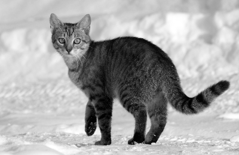
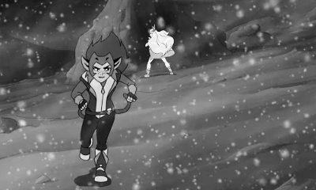
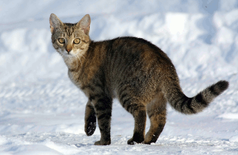
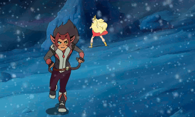

# improving deflate compression ratios

Version 4 of Swift *PNG* features a native Swift implementation of the *deflate* and *inflate* algorithms, as described in the [rfc-1951](https://tools.ietf.org/html/rfc1951). *Deflate* implementations can vary widely in quality, with some implementations producing far better-optimized (higher compression ratio) output streams than others. So, just as it is important to ensure Swift *PNG*’s *inflate* procedure [is as fast as that of the *zlib* C library](../low-level-swift-optimization.md), it is also important to ensure Swift *PNG*’s *deflate* output is as optimal as *zlib*’s. This readme documents some comparisons between Swift *PNG* and *libpng*/*zlib*, as well as choices of compression parameters in the framework at the time of writing.

## comparisons with *libpng*/*zlib*

All baseline images were saved in [GIMP](https://www.gimp.org/) at the maximum compression setting (*zlib* mode 9), with no interlacing and no metadata chunks.

| Test image | Baseline | Swift *PNG* | Ratio |
| ---------- | -------- | ----------- | ----------------------------- |
| `v-grayscale-photographic`                       | 59.0 KB  | 58.9 KB  | **0.9983** |
| `v-grayscale-nonphotographic`                 | 50.3 KB  | 49.6 KB  | **0.9861** |
| `rgb-grayscale-photographic`                   | 91.2 KB  | 155.9 KB | **1.7094** |
| `rgb-grayscale-nonphotographic`             | 80.1 KB  | 129.6 KB | **1.6180** |
| `rgb-color-photographic`                           | 168.9 KB | 173.7 KB | **1.0284** |
| `rgb-color-nonphotographic`                     | 126.7 KB | 130.3 KB | **1.0284** |
| `palette-grayscale-photographic`           | 80.6 KB  | 59.7 KB  | **0.7407** |
| `palette-grayscale-nonphotographic`     | 61.1 KB  | 45.8 KB  | **0.7496** |
| `palette-color-photographic`                   | 64.7 KB  | 60.6 KB  | **0.9366** |
| `palette-color-nonphotographic`             | 43.2 KB  | 45.4 KB  | **1.0509** |

Most images compress about the same. Some images (monochrome indexed) compress much better, some images (monochrome RGB), much worse. We’ll explore in the following sections why that is the case. Suffice to say, there is no such thing as [universal compression](http://mattmahoney.net/dc/dce.html), so most choices we make that improve the compression ratio for some inputs will degrade it for other inputs. Indeed, the only reason PNG compression works in the first place is that there are certain assumptions you can make about what an image (any image) *is*. These assumptions can get pretty technical but they always boil down to some variation of “this picture is not random noise, by virtue of the fact that the picture is interesting enough for someone to bother displaying it in the first place.” 

Casual readers should be aware that **total PNG optimization**, or losslessly reducing a PNG image to the smallest possible file without heed to computation time, is a [*hard* problem](http://optipng.sourceforge.net/pngtech/optipng.html). The gap between good and bad compressors in the context of PNG codecs is miniscule, often measured in fractions of a percentage point. It is always possible to optimize a PNG compressor for a particular (and arbitrary) class of images, but such a compressor would no longer be a PNG codec since it would only be effective for that subset of the input space. It follows that a good PNG codec should not produce excellent compression for some inputs and awful compression for others, but acceptable compression for all inputs. This is, of course, an ideal, and all real-world PNG codecs, including Swift *PNG*, inevitably end up privileging some types of inputs at the expense of others. 

A PNG crusher (a program that optimize PNG files for size) is not the same thing as a PNG codec, even if both types of programs share similar goals, and are occasionally advertised as if they were the other. Most PNG crushers are actually higher-level applications that repeatedly invoke a PNG codec (such as *libpng*, or conceivably, Swift *PNG*) with many different settings. The best PNG crushers wrap multiple PNG codecs, running them all on a given input image, and returning the smallest output. 

A (real) PNG crusher will always outperform any PNG codec, because it keeps the best output from its constituent PNG codecs, while discarding the rest. (This is why you should never be impressed if a PNG crusher claims to produce smaller files than a popular PNG codec!) This is also why PNG crushers are much slower than PNG codecs, because they recompress images over and over again from start to finish. The difference between a PNG codec and a PNG crusher is then essentially a difference of foresight versus hindsight. A well-optimized PNG codec uses a hueristic to predict the best compression strategy to use on a particular input image, while a PNG crusher determines the best compression strategy by actually doing the image compression.

PNG codec optimization is then really not about implementing perfectly optimal search algorithms. There are simply too many possibilities to explore, even with algorithmic reductions. Rather, it is about determining the impact of varying certain compression parameters (*coding*, in information theory), and formulating accurate predictions for which compression parameters will work best with certain image inputs (*modeling*, in information theory).

## sources of compression

PNG files are smaller than their raw pixel-array equivalents for three main reasons:

1. **filtering**, which makes pixel data more compressible,
2. **run-length coding**, which collapses repeated sequences in the filtered data, and
3. **entropy coding**, which replaces common run-length/literal tokens with shorter representations, and uncommon run-length/literal tokens with longer representations.

Each of these three compressive processes come with a lot of parameters, far more than could be realistically minimized through an exhaustive search. Worse, since they are applied on top of each other, the behavior of one process can influence the effectiveness of the subsequent processes. For example, filtering usually makes run-length coding more effective. (In Swift *PNG*, we also leverage it to make the entropy-coding more effective.) Run-length coding usually makes entropy coding *less* effective (since it increases the entropy of the data), but the data savings from the run-length coding itself usually outweighs the impact it has on the entropy coding.

Swift *PNG* uses several techniques to improve its average-case compression ratio, each of which acts on a different stage of the PNG compression pipeline:

1. **filter selection** (choosing a filter that results in the most compressible string), 
2. **match subsidies** (encouraging the run-length coder to emit more compressible run-length sequences), and 
3. **entropic partitioning** (dividing the entropy-coded bitstream such that each partition can benefit from a more specialized probability model.)
