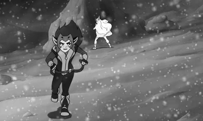
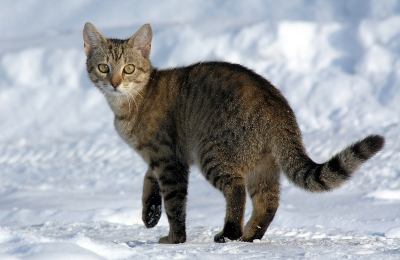
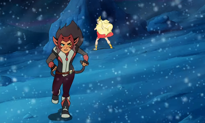
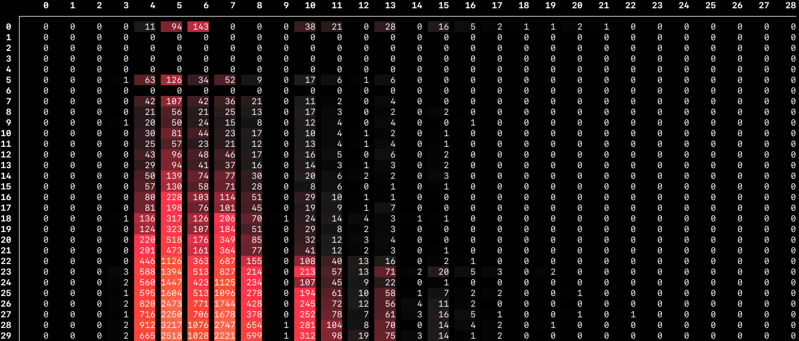
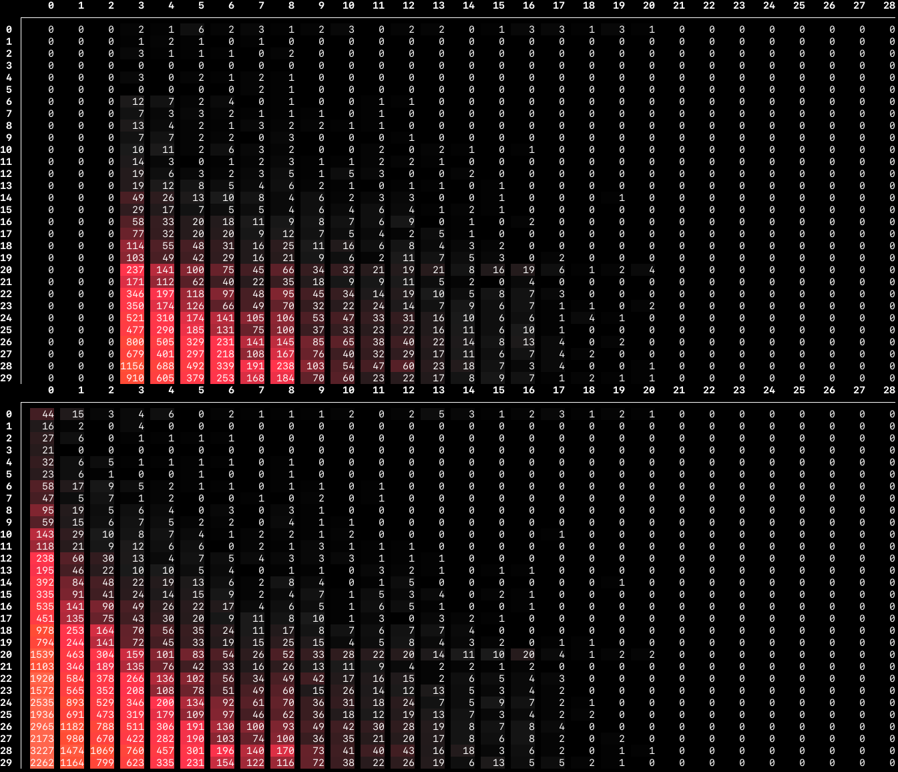
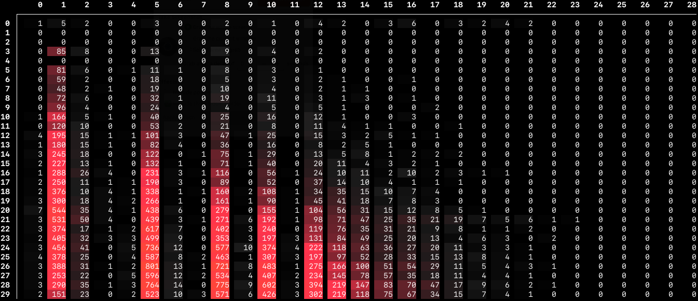

# improving *deflate* compression ratios

Version 4 of Swift *PNG* features a native Swift implementation of the *DEFLATE* and *INFLATE* algorithms, as described in the [rfc-1951](https://tools.ietf.org/html/rfc1951). *DEFLATE* implementations can vary widely in quality, with some implementations producing far better-optimized (higher compression ratio) output streams than others. So, just as it is important to ensure Swift *PNG*’s *INFLATE* procedure [is as fast as that of the *zlib* C library](../low-level-swift-optimization.md), it is also important to ensure Swift *PNG*’s *DEFLATE* output is as optimal as *zlib*’s. This readme documents some comparisons between Swift *PNG* and *libpng*/*zlib*, as well as choices of compression parameters in the framework at the time of writing.

## i. methodology 

### i.i. test images 

All of Swift *PNG*’s compression benchmarks run on the following 28 test images. They depict essentially the same subject, in photographic and non-photographic forms, and in different PNG color formats in order to be representative of how PNGs are used in the real world. Because casual PNG users do stupid things (from the perspective of 𝒸𝑜𝓂𝓅𝓇𝑒𝓈𝓈𝒾𝑜𝓃 𝑒𝓃𝑔𝒾𝓃𝑒𝑒𝓇𝓈, who are \~never\~ stupid) like save a monochrome image in RGB(A) format, the test suite includes representation for those use cases as well. None of the images have transparent alpha, as PNG images with varying alpha are rare. (Most transparent PNGs such as logos, test overlays, etc., have alpha that comes in regions of either full or zero opacity, which has the same compression characteristics as fully opaque alpha.)

All baseline images were saved in [GIMP 2.10](https://www.gimp.org/) at the maximum compression setting (*zlib* mode 9), with no interlacing and no ancillary chunks.

| Test image | Color format | Size |
| ---------- | ------------ | ---- |
| `v8-monochrome-photographic.png`          <br/>              | `v8`       |  59,743 B | 
| `v8-monochrome-nonphotographic.png`       <br/>           | `v8`       |  48,191 B | 
| `v16-monochrome-photographic.png`         <br/>             | `v16`      | 176,236 B | 
| `v16-monochrome-nonphotographic.png`      <br/>          | `v16`      | 123,371 B | 
|   |   |   |
| `va8-monochrome-photographic.png`         <br/>             | `va8`      |  76,280 B | 
| `va8-monochrome-nonphotographic.png`      <br/>          | `va8`      |  60,478 B | 
| `va16-monochrome-photographic.png`        <br/>            | `va16`     | 209,902 B | 
| `va16-monochrome-nonphotographic.png`     <br/>         | `va16`     | 143,935 B | 
|   |   |   |
| `indexed8-monochrome-photographic.png`    <br/>        | `indexed8` |  82,014 B | 
| `indexed8-color-photographic.png`         <br/>             | `indexed8` |  65,487 B | 
| `indexed8-monochrome-nonphotographic.png` <br/>     | `indexed8` |  62,888 B | 
| `indexed8-color-nonphotographic.png`      <br/>          | `indexed8` |  43,496 B | 
|   |   |   |
| `rgb8-monochrome-photographic.png`        <br/>            | `rgb8`     |  92,023 B | 
| `rgb8-color-photographic.png`             <br/>                 | `rgb8`     | 174,298 B | 
| `rgb8-monochrome-nonphotographic.png`     <br/>         | `rgb8`     |  76,636 B | 
| `rgb8-color-nonphotographic.png`          <br/>              | `rgb8`     | 130,595 B | 
| `rgb16-monochrome-photographic.png`       <br/>           | `rgb16`    | 379,113 B | 
| `rgb16-color-photographic.png`            <br/>                | `rgb16`    | 477,784 B | 
| `rgb16-monochrome-nonphotographic.png`    <br/>        | `rgb16`    | 244,077 B | 
| `rgb16-color-nonphotographic.png`         <br/>             | `rgb16`    | 365,253 B | 
|   |   |   |
| `rgba8-monochrome-photographic.png`       <br/>           | `rgba8`    | 101,521 B | 
| `rgba8-color-photographic.png`            <br/>                | `rgba8`    | 196,537 B | 
| `rgba8-monochrome-nonphotographic.png`    <br/>        | `rgba8`    |  84,098 B | 
| `rgba8-color-nonphotographic.png`         <br/>             | `rgba8`    | 147,023 B | 
| `rgba16-monochrome-photographic.png`      <br/>          | `rgba16`   | 414,526 B | 
| `rgba16-color-photographic.png`           <br/>               | `rgba16`   | 518,368 B | 
| `rgba16-monochrome-nonphotographic.png`   <br/>       | `rgba16`   | 143,935 B | 
| `rgba16-color-nonphotographic.png`        <br/>            | `rgba16`   | 394,493 B | 

### i.ii. benchmarks

The compression benchmarks come in their own package target, `compression-test`. The repository’s [CI](https://github.com/kelvin13/swift-png/actions?query=workflow%3Abuild) builds and runs them, though it doesn’t really care about the output. The test binary can run all of the test cases, a subset of the test cases, or a single test case.

```bash
# run all test cases 
./compression-test 
# run a subset of test cases 
./compression-test rgb8 
# run one test case
./compression-test rgb8:rgb8-color-photographic.png 
```

The `compression-test` product is most useful when Swift *PNG* is built with one of several inspection features enabled. To enable inspection, pass one of the following compiler build flags:

1. `DUMP_FILTERED_SCANLINES`
2. `DUMP_LZ77_TERMS`
3. `DUMP_LZ77_BLOCKS`
4. `DUMP_LZ77_SYMBOL_HISTOGRAM`

> To pass a build flag with the Swift Package Manager, use `-Xswiftc -D`. For example, to build with scanline dumping enabled, pass `-Xswiftc -DDUMP_FILTERED_SCANLINES` to the Swift compiler. 

#### `DUMP_FILTERED_SCANLINES`

Makes the decoder print out each image scanline before defiltering.

#### `DUMP_LZ77_TERMS`

Makes the decoder print out each *DEFLATE* term (either a literal value or a string reference) as it decompresses the *DEFLATE* stream.

#### `DUMP_LZ77_BLOCKS`

Makes the decoder print out information about each *DEFLATE* block, and aggregate statistics for the entire *DEFLATE* stream, including: 

* the average entropy-coding efficiency of the literal terms in the stream,
* a histogram of composite lengths of the string reference terms in the stream, and 
* a two-dimensional histogram of the run length decades and distance decades of the string reference terms in the stream.

It also makes the encoder print out its decision-making process when determining optimal *DEFLATE* block boundaries.

#### `DUMP_LZ77_SYMBOL_HISTOGRAM`

The same as `DUMP_LZ77_BLOCKS`, except it only prints out the two-dimensional symbol histogram. The histograms look like this:



The *x*-axis is binned by **run-length decade**. Decade zero corresponds to a match length of 3 bytes. Decade 28 corresponds to a match length of 258 bytes. 

The *y*-axis is binned by **distance decade**. Decade zero corresponds to an offset of 1 byte. Decade 29 corresponds to an offset of anywhere from 24,577 to 32,768 bytes, refined by extra bits. You can find the full table of run-length and distance decades on page 12 of the [rfc-1951](https://tools.ietf.org/html/rfc1951).

The symbol histograms are a useful visual indicator for how a particular LZ77 implementation behaves, how well it is modeling its input, and how efficiently the phrases it emits will be compressed by the huffman coder.

In general:

* More red/orange is better than less, because that means the run-length coder is collapsing many phrases. (As opposed to emitting literals.)

* The upper-right corner is good, because these correspond to long matches that take few bits to encode.

* The lower-left corner is bad, because these correspond to short matches that take many bits to encode.

* A few high-frequency bins are better than many low-frequency bins, because this reduces the entropy of the emitted terms, making the subsequent huffman coding more effective.

## ii. naïve implementation

I based this implementation on the recommendations of the original PNG and *DEFLATE* specifications. For filter selection, it uses a heuristic that minimizes the **sum of absolute values** of the filtered scanline, when interpreted as an array of signed `Int8`s. It performs non-greedy LZ77 compression with a backtracking limit of 1 byte. (LZ77 dictionaries have the [*suffix property*](https://scholar.acadiau.ca/islandora/object/theses:625), so you only need to backtrack once to find obscured matches.) For entropic partitioning, it emits *DEFLATE* blocks at fixed intervals of 32K *DEFLATE* terms each.

To summarize:

| Filter selection | LZ77 algorithm | LZ77 matches | Entropic partitioning |
| --------- | -------------- | ------- | ----- |
| Absolute value | Non-greedy | All allowed | Fixed-length blocks |

The sizes of the Swift *PNG* output images under this implementation are given below, along with comparisons with the baseline *libpng*/*zlib* output. A ratio smaller than 1.0 means Swift *PNG* performed better than *libpng*/*zlib*, a ratio greater than 1.0 means Swift *PNG* performed worse.

| Image                                 | Baseline      | Swift *PNG* | Ratio      |
| ------------------------------------- | ------------- | ----------- | ---------- |
| `v8-monochrome-photographic`          | 58.3428 KB    | 67.5820 KB  | **1.1584** |
| `v8-monochrome-nonphotographic`       | 47.0615 KB    | 55.0781 KB  | **1.1703** |
| `v16-monochrome-photographic`         | 172.1055 KB   | 174.1816 KB | **1.0121** |
| `v16-monochrome-nonphotographic`      | 120.4795 KB   | 124.1289 KB | **1.0303** |
|   |   |   |   |
| `va8-monochrome-photographic`         | 74.4922 KB    | 76.1494 KB  | **1.0222** |
| `va8-monochrome-nonphotographic`      | 59.0605 KB    | 61.1836 KB  | **1.0359** |
| `va16-monochrome-photographic`        | 204.9824 KB   | 224.7461 KB | **1.0964** |
| `va16-monochrome-nonphotographic`     | 140.5615 KB   | 151.7354 KB | **1.0795** |
|   |   |   |   |
| `indexed8-monochrome-photographic`    | 80.0918 KB    | 68.3145 KB  | **0.8530** |
| `indexed8-color-photographic`         | 63.9521 KB    | 69.0635 KB  | **1.0799** |
| `indexed8-monochrome-nonphotographic` | 61.4141 KB    | 53.5146 KB  | **0.8714** |
| `indexed8-color-nonphotographic`      | 42.4766 KB    | 49.9082 KB  | **1.1750** |
|   |   |   |   |
| `rgb8-monochrome-photographic`        | 89.8662 KB    | 112.0762 KB | **1.2471** |
| `rgb8-color-photographic`             | 170.2129 KB   | 185.9717 KB | **1.0926** |
| `rgb8-monochrome-nonphotographic`     | 74.8398 KB    | 86.0947 KB  | **1.1504** |
| `rgb8-color-nonphotographic`          | 127.5342 KB   | 144.8594 KB | **1.1358** |
| `rgb16-monochrome-photographic`       | 370.2275 KB   | 231.3008 KB | **0.6248** |
| `rgb16-color-photographic`            | 466.5859 KB   | 465.0820 KB | **0.9968** |
| `rgb16-monochrome-nonphotographic`    | 238.3564 KB   | 167.3770 KB | **0.7022** |
| `rgb16-color-nonphotographic`         | 356.6924 KB   | 364.1064 KB | **1.0208** |
|   |   |   |   |
| `rgba8-monochrome-photographic`       | 99.1416 KB    | 85.8105 KB  | **0.8655** |
| `rgba8-color-photographic`            | 191.9307 KB   | 208.3604 KB | **1.0856** |
| `rgba8-monochrome-nonphotographic`    | 82.1270 KB    | 70.3916 KB  | **0.8571** |
| `rgba8-color-nonphotographic`         | 143.5771 KB   | 159.9580 KB | **1.1141** |
| `rgba16-monochrome-photographic`      | 404.8105 KB   | 323.8984 KB | **0.8001** |
| `rgba16-color-photographic`           | 506.2188 KB   | 522.0029 KB | **1.0312** |
| `rgba16-monochrome-nonphotographic`   | 140.5615 KB   | 151.7354 KB | **1.0795** |
| `rgba16-color-nonphotographic`        | 385.2471 KB   | 404.5283 KB | **1.0500** |

Most of the test images compress slightly worse than the baseline. (It would be very weird if a naïve implementation produced *better* output than the baseline.) A few of them — namely the indexed images and some of the monochrome images that were saved in an RGB or RGBA format — compress much better than the baseline. We’ll see later why that happened.

## iii. improvement: better filter heuristics 

The filter selection heuristic is the only part of the compression pipeline that is under the control of the PNG codec if it does not also implement its own *DEFLATE*. So it’s a common starting point for improving PNG compression. 

### iii.i. minimum intervals

Versions 2 through 3.02 of Swift *PNG* used a heuristic called the **minimum intervals** selector. It minimizes the number of byte changes in the filtered scanline, so it prefers data that looks like `[5, 5, 5, 5, 5, 5, 6, 6, 6, 6]`, whereas the absolute values selector would prefer data that looks like `[0, 1, 0, 1, 0, 1, 1, 0, 1, 0]`. It’s not really an improvement over the absolute values selector, but for reference, the benchmark results for this filter selector are given below (in the collapsible section):

<details>
<summary><em>Click to expand</em></summary>
  
| Filter selection | LZ77 algorithm | LZ77 matches | Entropic partitioning |
| --------- | -------------- | ------- | ----- |
| Intervals | Non-greedy | All allowed | Fixed-length blocks |

| Image                                 | Baseline      | Swift *PNG*   | Ratio      |
| ------------------------------------- | ------------- | ------------- | ---------- |
| `v8-monochrome-photographic`          | 58.3428 KB    | 74.3691 KB    | **1.2747** |
| `v8-monochrome-nonphotographic`       | 47.0615 KB    | 63.5762 KB    | **1.3509** |
| `v16-monochrome-photographic`         | 172.1055 KB   | 172.8584 KB   | **1.0044** |
| `v16-monochrome-nonphotographic`      | 120.4795 KB   | 121.7344 KB   | **1.0104** |
|   |   |   |   |
| `va8-monochrome-photographic`         | 74.4922 KB    | 76.9248 KB    | **1.0327** |
| `va8-monochrome-nonphotographic`      | 59.0605 KB    | 61.3496 KB    | **1.0388** |
| `va16-monochrome-photographic`        | 204.9824 KB   | 223.3369 KB   | **1.0895** |
| `va16-monochrome-nonphotographic`     | 140.5615 KB   | 147.2939 KB   | **1.0479** |
|   |   |   |   |
| `indexed8-monochrome-photographic`    | 80.0918 KB    | 75.0986 KB    | **0.9377** |
| `indexed8-color-photographic`         | 63.9521 KB    | 66.5498 KB    | **1.0406** |
| `indexed8-monochrome-nonphotographic` | 61.4141 KB    | 62.6807 KB    | **1.0206** |
| `indexed8-color-nonphotographic`      | 42.4766 KB    | 45.5898 KB    | **1.0733** |
|   |   |   |   |
| `rgb8-monochrome-photographic`        | 89.8662 KB    | 119.0811 KB   | **1.3251** |
| `rgb8-color-photographic`             | 170.2129 KB   | 185.5430 KB   | **1.0901** |
| `rgb8-monochrome-nonphotographic`     | 74.8398 KB    | 96.4775 KB    | **1.2891** |
| `rgb8-color-nonphotographic`          | 127.5342 KB   | 145.6641 KB   | **1.1422** |
| `rgb16-monochrome-photographic`       | 370.2275 KB   | 228.5674 KB   | **0.6174** |
| `rgb16-color-photographic`            | 466.5859 KB   | 451.0078 KB   | **0.9666** |
| `rgb16-monochrome-nonphotographic`    | 238.3564 KB   | 160.9482 KB   | **0.6752** |
| `rgb16-color-nonphotographic`         | 356.6924 KB   | 360.0156 KB   | **1.0093** |
|   |   |   |   |
| `rgba8-monochrome-photographic`       | 99.1416 KB    | 87.2051 KB    | **0.8796** |
| `rgba8-color-photographic`            | 191.9307 KB   | 209.5791 KB   | **1.0920** |
| `rgba8-monochrome-nonphotographic`    | 82.1270 KB    | 70.7471 KB    | **0.8614** |
| `rgba8-color-nonphotographic`         | 143.5771 KB   | 160.1768 KB   | **1.1156** |
| `rgba16-monochrome-photographic`      | 404.8105 KB   | 318.9385 KB   | **0.7879** |
| `rgba16-color-photographic`           | 506.2188 KB   | 506.1338 KB   | **0.9998** |
| `rgba16-monochrome-nonphotographic`   | 140.5615 KB   | 147.2939 KB   | **1.0479** |
| `rgba16-color-nonphotographic`        | 385.2471 KB   | 399.4443 KB   | **1.0369** |

</details>

### iii.ii. squared frequencies

One alternative filter heuristic does seem to be an improvement over the absolute values selector: the **squared frequencies** selector. The squared frequencies selector maximizes the sum of the squared frequencies of each byte value in the filtered data. So it prefers data that looks like `[5, 6, 5, 5, 6, 5, 6, 6, 5, 6]` over data that looks like `[0, 0, 0, 1, 1, 1, 2, 2, 2, 2]`. (Which the previous two heuristics would prefer.)

The squared frequencies selector works by reducing the entropy of the filtered data, making its huffman encoding more efficient. For most input images, it has little to no impact, but it does seem to perform a little better for non-photographic PNGs, and a little worse for photographic PNGs. Since the more common use-case for PNG is for non-photographic data (most people prefer JPEG for photographic data), this is an acceptable tradeoff.

| Filter selection | LZ77 algorithm | LZ77 matches | Entropic partitioning |
| --------- | -------------- | ------- | ----- |
| Squared frequencies | Non-greedy | All allowed | Fixed-length blocks |

| Image                                 | Baseline      | Swift *PNG*   | Ratio      |
| ------------------------------------- | ------------- | ------------- | ---------- |
| `v8-monochrome-photographic`          | 58.3428 KB    | 67.9697 KB    | **1.1650** |
| `v8-monochrome-nonphotographic`       | 47.0615 KB    | 55.0615 KB    | **1.1700** |
| `v16-monochrome-photographic`         | 172.1055 KB   | 173.8086 KB   | **1.0099** |
| `v16-monochrome-nonphotographic`      | 120.4795 KB   | 123.3574 KB   | **1.0239** |
|   |   |   |   |
| `va8-monochrome-photographic`         | 74.4922 KB    | 76.7412 KB    | **1.0302** |
| `va8-monochrome-nonphotographic`      | 59.0605 KB    | 61.2178 KB    | **1.0365** |
| `va16-monochrome-photographic`        | 204.9824 KB   | 224.8350 KB   | **1.0968** |
| `va16-monochrome-nonphotographic`     | 140.5615 KB   | 150.3066 KB   | **1.0693** |
|   |   |   |   |
| `indexed8-monochrome-photographic`    | 80.0918 KB    | 68.7061 KB    | **0.8578** |
| `indexed8-color-photographic`         | 63.9521 KB    | 67.9199 KB    | **1.0620** |
| `indexed8-monochrome-nonphotographic` | 61.4141 KB    | 53.4941 KB    | **0.8710** |
| `indexed8-color-nonphotographic`      | 42.4766 KB    | 49.1191 KB    | **1.1564** |
|   |   |   |   |
| `rgb8-monochrome-photographic`        | 89.8662 KB    | 112.1992 KB   | **1.2485** |
| `rgb8-color-photographic`             | 170.2129 KB   | 188.2383 KB   | **1.1059** |
| `rgb8-monochrome-nonphotographic`     | 74.8398 KB    | 85.9590 KB    | **1.1486** |
| `rgb8-color-nonphotographic`          | 127.5342 KB   | 144.8555 KB   | **1.1358** |
| `rgb16-monochrome-photographic`       | 370.2275 KB   | 231.5352 KB   | **0.6254** |
| `rgb16-color-photographic`            | 466.5859 KB   | 463.0098 KB   | **0.9923** |
| `rgb16-monochrome-nonphotographic`    | 238.3564 KB   | 166.0303 KB   | **0.6966** |
| `rgb16-color-nonphotographic`         | 356.6924 KB   | 362.9736 KB   | **1.0176** |
|   |   |   |   |
| `rgba8-monochrome-photographic`       | 99.1416 KB    | 86.8799 KB    | **0.8763** |
| `rgba8-color-photographic`            | 191.9307 KB   | 212.1475 KB   | **1.1053** |
| `rgba8-monochrome-nonphotographic`    | 82.1270 KB    | 70.4961 KB    | **0.8584** |
| `rgba8-color-nonphotographic`         | 143.5771 KB   | 159.9473 KB   | **1.1140** |
| `rgba16-monochrome-photographic`      | 404.8105 KB   | 322.1221 KB   | **0.7957** |
| `rgba16-color-photographic`           | 506.2188 KB   | 517.6357 KB   | **1.0226** |
| `rgba16-monochrome-nonphotographic`   | 140.5615 KB   | 150.3066 KB   | **1.0693** |
| `rgba16-color-nonphotographic`        | 385.2471 KB   | 403.0332 KB   | **1.0462** |

## iv. improvement: better LZ77 matching 

### iv.i. match thresholds 

Many of the test images are still compressing 5 to 15 percent worse than the baseline. When examining the symbol histograms of the original and recompressed images, we can see that the string matches Swift *PNG* is emitting are very different from the matches that *zlib* is emitting.

In the screenshot below, the upper histogram is from one of the original test images (`rgb8-color-nonphotographic`), and the lower histogram is from the recompressed version.

<p align="center">

</p>



> Symbol histogram for the test image `rgb8-color-nonphotographic.png` when compressed with *libpng*/*zlib* (top) and Swift *PNG* (bottom).

You can see that Swift *PNG* is finding many more matches than *zlib* is, but most of these matches are short matches located at distant offsets. These matches are relatively expensive to encode, and are raising the overall entropy of the *DEFLATE* stream, so they are not really helping to compress the image.

*zlib* on the other hand is discarding all matches of length less than 6. (Decade 3 corresponds to a length of 6, which is why all the previous columns are empty.) This is because *libpng* has *zlib* configured to use the [`Z_FILTERED`](http://www.zlib.net/manual.html) search strategy, which only accepts matches of length 6 or longer.

Getting Swift *PNG* to impose this condition improves the compression for almost all the test images to the point where they compress about as well as they do under *libpng*/*zlib*.

| Filter selection    | LZ77 algorithm | LZ77 matches    | Entropic partitioning |
| ------------------- | -------------- | --------------- | --------------------- |
| Squared frequencies | Non-greedy     | Fixed threshold | Fixed-length blocks   |

| Image                                 | Baseline      | Swift *PNG*   | Ratio      |
| ------------------------------------- | ------------- | ------------- | ---------- |
| `v8-monochrome-photographic`          | 58.3428 KB    | 59.0596 KB    | **1.0123** |
| `v8-monochrome-nonphotographic`       | 47.0615 KB    | 47.6113 KB    | **1.0117** |
| `v16-monochrome-photographic`         | 172.1055 KB   | 170.9189 KB   | **0.9931** |
| `v16-monochrome-nonphotographic`      | 120.4795 KB   | 119.8350 KB   | **0.9947** |
|   |   |   |   |
| `va8-monochrome-photographic`         | 74.4922 KB    | 75.7832 KB    | **1.0173** |
| `va8-monochrome-nonphotographic`      | 59.0605 KB    | 59.6426 KB    | **1.0099** |
| `va16-monochrome-photographic`        | 204.9824 KB   | 203.8994 KB   | **0.9947** |
| `va16-monochrome-nonphotographic`     | 140.5615 KB   | 139.4336 KB   | **0.9920** |
|   |   |   |   |
| `indexed8-monochrome-photographic`    | 80.0918 KB    | 59.7979 KB    | **0.7466** |
| `indexed8-color-photographic`         | 63.9521 KB    | 60.9141 KB    | **0.9525** |
| `indexed8-monochrome-nonphotographic` | 61.4141 KB    | 46.3262 KB    | **0.7543** |
| `indexed8-color-nonphotographic`      | 42.4766 KB    | 45.0293 KB    | **1.0601** |
|   |   |   |   |
| `rgb8-monochrome-photographic`        | 89.8662 KB    | 99.6055 KB    | **1.1084** |
| `rgb8-color-photographic`             | 170.2129 KB   | 172.7793 KB   | **1.0151** |
| `rgb8-monochrome-nonphotographic`     | 74.8398 KB    | 82.6133 KB    | **1.1039** |
| `rgb8-color-nonphotographic`          | 127.5342 KB   | 129.7510 KB   | **1.0174** |
| `rgb16-monochrome-photographic`       | 370.2275 KB   | 348.8486 KB   | **0.9423** |
| `rgb16-color-photographic`            | 466.5859 KB   | 464.2285 KB   | **0.9949** |
| `rgb16-monochrome-nonphotographic`    | 238.3564 KB   | 230.6641 KB   | **0.9677** |
| `rgb16-color-nonphotographic`         | 356.6924 KB   | 356.3252 KB   | **0.9990** |
|   |   |   |   |
| `rgba8-monochrome-photographic`       | 99.1416 KB    | 101.2959 KB   | **1.0217** |
| `rgba8-color-photographic`            | 191.9307 KB   | 196.9961 KB   | **1.0264** |
| `rgba8-monochrome-nonphotographic`    | 82.1270 KB    | 81.8916 KB    | **0.9971** |
| `rgba8-color-nonphotographic`         | 143.5771 KB   | 146.5264 KB   | **1.0205** |
| `rgba16-monochrome-photographic`      | 404.8105 KB   | 399.9033 KB   | **0.9879** |
| `rgba16-color-photographic`           | 506.2188 KB   | 502.5908 KB   | **0.9928** |
| `rgba16-monochrome-nonphotographic`   | 140.5615 KB   | 139.4336 KB   | **0.9920** |
| `rgba16-color-nonphotographic`        | 385.2471 KB   | 385.1064 KB   | **0.9996** |

### iv.ii. internal matches

While most of the worst-case inputs have converged towards a ratio of 1.0, so have some of the best-case inputs. Notably, the monochrome RGB and RGBA images (some of which were previously outperforming the baseline by over 38 percent!) are now compressing about the same as the baseline. This is because certain monochrome RGB and RGBA byte patterns tend to produce lots of highly-efficient matches that get discarded by the match threshold. Many of these are **internal matches** (matches with a distance less than 3), which are very efficient to encode.

| Color format | Compression pattern |
| ------------ | ------------------- |
| RGB16  | `(A B) (A B) (A B)       → (A) (B) match(offset: -2, count: 4)` |
| RGBA16 | `(A B) (A B) (A B) (C C) → (A) (B) match(offset: -2, count: 4) (C) (C)` |

If you look at the histograms for the monochrome RGB16 images, you can see that there are a vast number of matches of length 4 and distance 2, especially compared to the adjacent cells. Because these matches are all concentrated in a single bin, they are cheap to encode, but the match threshold condition, not knowing any better, is discarding them all.


> Symbol histograms for the test image `rgb16-monochrome-photographic.png`, compressed using *libpng*/*zlib* (top), and Swift *PNG* with the match length threshold turned off (bottom). The bin for decade (1, 1) in the second histogram has overflowed, so it is displaying “9999”. The second compressed image is less than two-thirds the size of the first image!
>
> A similar effect happens in the monochrome RGBA16 images, but it is far less pronounced.

### iv.iii. harmonic matches 

A similar but unrelated phenomenon called **harmonic matching** takes place when compressing RGB and RGBA images, as well as some VA images. While internal matches are references to a sequence within the same logical pixel, harmonic matches are references to entire, preceeding pixels.

Harmonic matches occur because PNG filters have a set [delay](http://www.libpng.org/pub/png/spec/1.2/PNG-Filters.html) determined by the logical stride of the image pixels. For an 8-bit RGB image, this delay is three bytes long. For a 16-bit RGBA image, the filter delay is eight bytes long. The filter delay tends to create repetitions in the filtered data at integer multiples of the delay length. We can think of this length as the natural wavelength of the PNG image, which creates clusters of matches at certain lengths and offsets. 

| Color format  | Wavelength    | Length decades        | Distance decades  |
| ------------- | ------------- | --------------------- | ----------------- |
| V16           | 2 B           | —                     | 1, 3, 4, 5, …     |
| VA8           | 2 B           | —                     | 1, 3, 4, 5, …     |
| VA16          | 4 B           | 1, 5, 8, 10, 12, …    | 3, 5, 6, 7, 8<sup>†</sup>, … |
| RGB8          | 3 B           | 0, 3, 6, 8, 10, …     | 2, 4, 6<sup>†</sup>, 8<sup>†</sup>, … |
| RGB16         | 6 B           | 3, 8, 11, 13, 14, …   | 4, 6, 8, 10<sup>†</sup>, … |
| RGBA8         | 4 B           | 1, 5, 8, 10, 12, …    | 3, 5, 6, 7, 8<sup>†</sup>, … |
| RGBA16        | 8 B           | 5, 10, 13, 15, …      | 5, 7, 8, 9, 10<sup>†</sup>, … |

> † Additional decades from signal aliasing.

You can observe these spectral patterns in the symbol histograms. For example, you can see in the histograms from the last subsection that the column for length decade 3 contains many more matches than either of the adjacent columns. It is no coincidence that length decade 3 corresponds to a match length of 6 bytes, which is the natural wavelength of a 16-bit RGB image. In fact, you can observe secondary peaks in the columns for length decades 8, 11, and 13. These decades contain matches of length 12, 18, and 24, respectively, all of which are integer multiples of 6. Harmonic banding also happens along the vertical (match offset) axis — you can observe a disproportionately high match density in rows 4, 6, and 8, which correspond to offsets of 6, 12, and 18 and 24 (both in decade 8). [Signal aliasing](https://en.wikipedia.org/wiki/Aliasing) creates additional striations in distance decades 10, 12, 14, 16, and so forth.

The following symbol histogram contains a very pronounced example of harmonic banding. It was created from an 8-bit RGBA image, which has a natural wavelength of four bytes. The striations gradually blend together in the higher length decades (horizontal axis) because they encode increasingly larger ranges of length values. The same effect happens in the higher distance decades (vertical axis), but here, the 1-byte staggering from the filter code at the beginning of each scanline also contributes to spectral broadening.



> A symbol histogram from the test image `rgba8-monochrome-nonphotographic.png`, compressed by Swift *PNG*, with match thresholding turned off. The histogram from the same image compressed with *libpng*/*zlib* does not contain the same striations, which is why the Swift *PNG* version is so much smaller (ratio = 0.8584).

Harmonic matches are easiest to see in monochrome RGB/RGBA images, but they also occur in full-color images. Match lengths generally don’t fall on integer multiples of the image wavelength, since full-color images lack the repeated samples that monochrome images have, but match offsets still tend towards those frequencies, since PNG scanline filtering is still reducing the entropy in those frequencies.


> A symbol histogram from the test image `rgb8-color-nonphotographic.png`, compressed by Swift *PNG*, with match thresholding turned off. It has visible harmonic banding in the vertical (distance) direction, but not the horizontal (length) direction.

## v. improvement: better LZ77 algorithm 

With only a few exceptions, all of the test images compress to within 102 percent of the baseline with the improved algorithm in the last section. The two outliers are the 8-bit RGB monochrome images, which are still compressing about 10 percent worse than the baseline. By looking at their symbol histograms, we can see why that’s happening:


> Symbol histograms for the test image `rgb8-monochrome-photographic.png` when compressed with *libpng*/*zlib* (top) and Swift *PNG* with match thresholding turned on (bottom). The bottom image is almost 11 percent larger than the top image.

The original *libpng*/*zlib*-encoded image shows strong harmonic banding, while the Swift *PNG*-compressed image shows very weak banding along the match length axis. (Both images have pretty good distance banding.) This indicates that the image that generated the upper histogram has less entropy in its *DEFLATE* terms, which explains why it compresses much better than the second image.

The opposite effect is happening in the images that compress *better* under Swift *PNG* than under *libpng*/*zlib*:


> Symbol histograms for the test image `rgb16-monochrome-photographic.png` when compressed with *libpng*/*zlib* (top) and Swift *PNG* with match thresholding turned on (bottom). The bottom image is about 5.8 percent smaller than the top image.

For images like these, Swift *PNG* is actually doing a better job concentrating match lengths into harmonic bands than *libpng*/*zlib* is, and accordingly, the Swift *PNG*-compressed image is significantly (by compression engineering standards) smaller than the baseline — almost 6 percent smaller! From all this, we can infer that harmonic banding is very important to PNG compression.

### v.i. greedy algorithm

One remedy for the under-harmonized images is simple but counterintuitive — turn off all non-greedy matching, and fall back to a greedy LZ77 algorithm. This makes all of the monochrome RGB and RGBA images converge towards the baseline.

| Filter selection    | LZ77 algorithm | LZ77 matches    | Entropic partitioning |
| ------------------- | -------------- | --------------- | --------------------- |
| Squared frequencies | Greedy         | Fixed threshold | Fixed-length blocks   |

| Image                                 | Baseline      | Swift *PNG*   | Ratio      |
| ------------------------------------- | ------------- | ------------- | ---------- |
| `v8-monochrome-photographic`          | 58.3428 KB    | 58.9941 KB    | **1.0112** |
| `v8-monochrome-nonphotographic`       | 47.0615 KB    | 47.4023 KB    | **1.0072** |
| `v16-monochrome-photographic`         | 172.1055 KB   | 170.9229 KB   | **0.9931** |
| `v16-monochrome-nonphotographic`      | 120.4795 KB   | 119.5029 KB   | **0.9919** |
|   |   |   |   |
| `va8-monochrome-photographic`         | 74.4922 KB    | 75.6885 KB    | **1.0161** |
| `va8-monochrome-nonphotographic`      | 59.0605 KB    | 59.5732 KB    | **1.0087** |
| `va16-monochrome-photographic`        | 204.9824 KB   | 204.2549 KB   | **0.9965** |
| `va16-monochrome-nonphotographic`     | 140.5615 KB   | 139.6055 KB   | **0.9932** |
|   |   |   |   |
| `indexed8-monochrome-photographic`    | 80.0918 KB    | 59.7285 KB    | **0.7458** |
| `indexed8-color-photographic`         | 63.9521 KB    | 60.7666 KB    | **0.9502** |
| `indexed8-monochrome-nonphotographic` | 61.4141 KB    | 46.0547 KB    | **0.7499** |
| `indexed8-color-nonphotographic`      | 42.4766 KB    | 44.8301 KB    | **1.0554** |
|   |   |   |   |
| `rgb8-monochrome-photographic`        | 89.8662 KB    | 91.0195 KB    | **1.0128** |
| `rgb8-color-photographic`             | 170.2129 KB   | 172.2695 KB   | **1.0121** |
| `rgb8-monochrome-nonphotographic`     | 74.8398 KB    | 74.5615 KB    | **0.9963** |
| `rgb8-color-nonphotographic`          | 127.5342 KB   | 128.2813 KB   | **1.0059** |
| `rgb16-monochrome-photographic`       | 370.2275 KB   | 367.9482 KB   | **0.9938** |
| `rgb16-color-photographic`            | 466.5859 KB   | 463.7461 KB   | **0.9939** |
| `rgb16-monochrome-nonphotographic`    | 238.3564 KB   | 234.8965 KB   | **0.9855** |
| `rgb16-color-nonphotographic`         | 356.6924 KB   | 355.7207 KB   | **0.9973** |
|   |   |   |   |
| `rgba8-monochrome-photographic`       | 99.1416 KB    | 101.2041 KB   | **1.0208** |
| `rgba8-color-photographic`            | 191.9307 KB   | 196.0762 KB   | **1.0216** |
| `rgba8-monochrome-nonphotographic`    | 82.1270 KB    | 81.8359 KB    | **0.9965** |
| `rgba8-color-nonphotographic`         | 143.5771 KB   | 144.9404 KB   | **1.0095** |
| `rgba16-monochrome-photographic`      | 404.8105 KB   | 400.8096 KB   | **0.9901** |
| `rgba16-color-photographic`           | 506.2188 KB   | 501.6387 KB   | **0.9910** |
| `rgba16-monochrome-nonphotographic`   | 140.5615 KB   | 139.6055 KB   | **0.9932** |
| `rgba16-color-nonphotographic`        | 385.2471 KB   | 383.8066 KB   | **0.9963** |

### v.ii. semi-greedy algorithms 

One possibility for a more sophisticated LZ77 algorithm is to allow greedy matching, but only if the match length does not fall on a harmonic decade. In theory, this should encourage the algorithm to both collapse more literals and concentrate match lengths into fewer length decades. In practice, this is exactly what happens — matches migrate from the non-harmonic decades into harmonic decades, and length decade 3 (matches of length 6) gains additional matches from the non-greedy search that the greedy search would not have found. For RGB images, length decade 3 is also a harmonic decade, resulting in even more match concentration. But, for reasons that remain unclear, this doesn’t meaningfully improve overall compression, even for RGB images, and sometimes worsens it slightly.

### v.iii. lazy algorithms 

Another possible algorithmic improvement is to enable lazy LZ77 matching. Lazy matching is similar to non-greedy matching, but it works from the beginning of the match candidate instead of the end. In other words, before accepting a match candidate, it first checks to see if there is a better match starting one byte later. Non-greedy matching either detects additional matched phrases, or transfers matched bytes from earlier matches to later matches. (The second case has absolutely no effect on the surrounding context.) Lazy matching, on the other hand, makes the matches you already have longer. The following diagram contains an illustration of this effect:

```
                                      greedy matching 
                                            |
[ 1 : 2 : 3 : 4 : 2 : 3 : 4 : 5 : 6 : 7 : 8 | 1 : 2 : 3 : 4 : 5 : 6 : 7 : 8 ]
 ~~~~~~~~~~~~~~~             ~~~~~~~~~~~~~~~^~~~~~~~~~~~~~~~ ~~~~~~~~~~~~~~
     match 0                     match 1    |    match 0         match 1
```
```
                                  non-greedy matching 
                                            |
[ 1 : 2 : 3 : 4 : 2 : 3 : 4 : 5 : 6 : 7 : 8 | 1 : 2 : 3 : 4 : 5 : 6 : 7 : 8 ]
 ~~~~~~~~~~~~            ~~~~~~~~~~~~~~~~~~~^~~~~~~~~~~~ ~~~~~~~~~~~~~~~~~~~
   match 0                     match 1      |  match 0         match 1
```
```
                                        lazy matching 
                                            |
[ 1 : 2 : 3 : 4 : 2 : 3 : 4 : 5 : 6 : 7 : 8 | 1 : 2 : 3 : 4 : 5 : 6 : 7 : 8 ]
                 ~~~~~~~~~~~~~~~~~~~~~~~~~~~^    ~~~~~~~~~~~~~~~~~~~~~~~~~~~
                           match 0          |              match 0 
```

Enabling lazy matching consistently improves PNG compression, though the amount of savings is small.

| Filter selection    | LZ77 algorithm | LZ77 matches    | Entropic partitioning |
| ------------------- | -------------- | --------------- | --------------------- |
| Squared frequencies | Lazy           | Fixed threshold | Fixed-length blocks   |

| Image                                 | Baseline      | Swift *PNG*   | Ratio      |
| ------------------------------------- | ------------- | ------------- | ---------- |
| `v8-monochrome-photographic`          | 58.3428 KB    | 58.9102 KB    | **1.0097** |
| `v8-monochrome-nonphotographic`       | 47.0615 KB    | 47.0195 KB    | **0.9991** |
| `v16-monochrome-photographic`         | 172.1055 KB   | 170.8994 KB   | **0.9930** |
| `v16-monochrome-nonphotographic`      | 120.4795 KB   | 119.1670 KB   | **0.9891** |
|   |   |   |   |
| `va8-monochrome-photographic`         | 74.4922 KB    | 74.9863 KB    | **1.0066** |
| `va8-monochrome-nonphotographic`      | 59.0605 KB    | 58.7490 KB    | **0.9947** |
| `va16-monochrome-photographic`        | 204.9824 KB   | 204.0293 KB   | **0.9954** |
| `va16-monochrome-nonphotographic`     | 140.5615 KB   | 138.6230 KB   | **0.9862** |
|   |   |   |   |
| `indexed8-monochrome-photographic`    | 80.0918 KB    | 59.6553 KB    | **0.7448** |
| `indexed8-color-photographic`         | 63.9521 KB    | 60.5732 KB    | **0.9472** |
| `indexed8-monochrome-nonphotographic` | 61.4141 KB    | 45.5830 KB    | **0.7422** |
| `indexed8-color-nonphotographic`      | 42.4766 KB    | 44.3965 KB    | **1.0452** |
|   |   |   |   |
| `rgb8-monochrome-photographic`        | 89.8662 KB    | 90.9697 KB    | **1.0123** |
| `rgb8-color-photographic`             | 170.2129 KB   | 171.7510 KB   | **1.0090** |
| `rgb8-monochrome-nonphotographic`     | 74.8398 KB    | 74.4990 KB    | **0.9954** |
| `rgb8-color-nonphotographic`          | 127.5342 KB   | 127.2197 KB   | **0.9975** |
| `rgb16-monochrome-photographic`       | 370.2275 KB   | 367.5605 KB   | **0.9928** |
| `rgb16-color-photographic`            | 466.5859 KB   | 463.4297 KB   | **0.9932** |
| `rgb16-monochrome-nonphotographic`    | 238.3564 KB   | 233.9277 KB   | **0.9814** |
| `rgb16-color-nonphotographic`         | 356.6924 KB   | 354.6943 KB   | **0.9944** |
|   |   |   |   |
| `rgba8-monochrome-photographic`       | 99.1416 KB    | 101.1934 KB   | **1.0207** |
| `rgba8-color-photographic`            | 191.9307 KB   | 194.8711 KB   | **1.0153** |
| `rgba8-monochrome-nonphotographic`    | 82.1270 KB    | 81.8193 KB    | **0.9963** |
| `rgba8-color-nonphotographic`         | 143.5771 KB   | 143.1582 KB   | **0.9971** |
| `rgba16-monochrome-photographic`      | 404.8105 KB   | 400.6865 KB   | **0.9898** |
| `rgba16-color-photographic`           | 506.2188 KB   | 501.0459 KB   | **0.9898** |
| `rgba16-monochrome-nonphotographic`   | 140.5615 KB   | 138.6230 KB   | **0.9862** |
| `rgba16-color-nonphotographic`        | 385.2471 KB   | 382.2695 KB   | **0.9923** |

## vi. improvement: better entropic partitioning 

One last thing we can try is see if Swift *PNG* can be a little more intelligent when it comes to determining *DEFLATE* block boundaries. Ideally, it would choose boundaries such that each block’s probability model (huffman tree) is specialized for its contents. For example, if you have data that looks like `[0, 1, 0, 1, 1, 0, 2, 3, 3, 2]`, it would compress better with two specialized huffman trees coding the subarrays `[0, 1, 0, 1, 1, 0]` and `[2, 3, 3, 2]` than with a single generic huffman tree coding the entire array. By itself, this concept suggests that the optimal partitioning for any input array is a sequence of subarrays each containing a single unique value. (For the previous example, that would be `[0], [1], [0], [1, 1], [0], [2], [3, 3], [2]`.) But storing the huffman trees themselves at the beginning of each *DEFLATE* block also has a size cost, so partitions become less efficient the smaller they get.

We can state the problem \~formally\~ like this:

Given an input array *A*, find a contiguous sequence of index ranges *i*<sub>0</sub>,&nbsp;…&nbsp;,&nbsp;*i*<sub>*k*&nbsp;–&nbsp;1</sub> where 

* *i*<sub>0</sub>&nbsp;=&nbsp;*A*`.startIndex`, 
* *i*<sub>*k*&nbsp;–&nbsp;1</sub>&nbsp;=&nbsp;*A*`.endIndex`,
* *i*<sub>*j*</sub>&nbsp;<&nbsp;*i*<sub>*j*&nbsp;+&nbsp;1</sub>, 
  
and which minimizes

Σ (Dynamic(Tree(*i*<sub>*j*</sub>, *i*<sub>*j*&nbsp;+&nbsp;1</sub>)) + Encode(*i*<sub>*j*</sub>, *i*<sub>*j*&nbsp;+&nbsp;1</sub>, Tree(*i*<sub>*j*</sub>, *i*<sub>*j*&nbsp;+&nbsp;1</sub>))) for *j* in 0,&nbsp;…&nbsp;,&nbsp;*k*&nbsp;–&nbsp;2&nbsp;, 

where Tree(\_:\_:) returns an optimal huffman tree for the array slice of *A* given by its arguments, Dynamic(\_:) returns the size of its huffman tree argument when encoded as a dynamic *DEFLATE* block header, and Encode(\_:\_:\_:) returns the size of the entropy-coded bitstream given an array slice and a huffman tree.

This problem has a dynamic programming solution that runs in *O*(*n*<sup>3</sup>) time (and *O*(*n*<sup>2</sup>) space), but the constant factor for the cubic term is so tiny — the cost of a single integer comparison — that it’s completely overshadowed by the quadratic term, which comes from computing the symbol frequencies and huffman tree for each interval. (Both are constant-time operations.)

This optimization is computationally feasible because *n* doesn’t have to be the number of bytes in the input — it can be some smaller number of atoms determined by a partition granularity *g* of your choice. For example, you can cut *n* by a factor of 256 by only considering block boundaries that fall on multiples of 256. Finer-grained searches make the partitioning more efficient, but below a granularity of *g*&nbsp;≈&nbsp;2<sup>10</sup> symbols there is no noticeable improvement in compression. 

Because this algorithm is still super-linear, it also makes sense to impose a maximum partition size *h*, where *h* is much bigger than (and ideally a multiple of) *g*. This means we do entropic partitioning by first dividing the *DEFLATE* terms into fixed-size segments of size *h*, and then running the *O*(*h*<sup>2</sup>/*g*<sup>2</sup>)-ish algorithm on each segment.

Just like what happens with decreasing *g*, increasing *h* improves the efficiency of the output, but with diminishing returns. Large values of *h* also increase Swift *PNG*’s memory consumption, since it has to buffer *h* *DEFLATE* terms at a time.

Empirically, the settings *g*&nbsp;=&nbsp;2<sup>12</sup>, *h*&nbsp;=&nbsp;2<sup>18</sup> seem to give good compression; smaller values of *g* and larger values of *h* don’t seem to improve the compression enough to justify the increased run time and memory usage.

| Filter selection    | LZ77 algorithm | LZ77 matches    | Entropic partitioning |
| ------------------- | -------------- | --------------- | --------------------- |
| Squared frequencies | Lazy           | Fixed threshold | Variable-length blocks|

| Image                                 | Baseline      | Swift *PNG*   | Ratio      |
| ------------------------------------- | ------------- | ------------- | ---------- |
| `v8-monochrome-photographic`          | 58.3428 KB    | 58.1973 KB    | **0.9975** |
| `v8-monochrome-nonphotographic`       | 47.0615 KB    | 46.8701 KB    | **0.9959** |
| `v16-monochrome-photographic`         | 172.1055 KB   | 170.5635 KB   | **0.9910** |
| `v16-monochrome-nonphotographic`      | 120.4795 KB   | 119.0820 KB   | **0.9884** |
|   |   |   |   |
| `va8-monochrome-photographic`         | 74.4922 KB    | 74.5391 KB    | **1.0006** |
| `va8-monochrome-nonphotographic`      | 59.0605 KB    | 58.6113 KB    | **0.9924** |
| `va16-monochrome-photographic`        | 204.9824 KB   | 203.7734 KB   | **0.9941** |
| `va16-monochrome-nonphotographic`     | 140.5615 KB   | 138.4209 KB   | **0.9848** |
|   |   |   |   |
| `indexed8-monochrome-photographic`    | 80.0918 KB    | 58.9355 KB    | **0.7358** |
| `indexed8-color-photographic`         | 63.9521 KB    | 60.1973 KB    | **0.9413** |
| `indexed8-monochrome-nonphotographic` | 61.4141 KB    | 45.4668 KB    | **0.7403** |
| `indexed8-color-nonphotographic`      | 42.4766 KB    | 44.3467 KB    | **1.0440** |
|   |   |   |   |
| `rgb8-monochrome-photographic`        | 89.8662 KB    | 90.4043 KB    | **1.0060** |
| `rgb8-color-photographic`             | 170.2129 KB   | 170.8076 KB   | **1.0035** |
| `rgb8-monochrome-nonphotographic`     | 74.8398 KB    | 74.2246 KB    | **0.9918** |
| `rgb8-color-nonphotographic`          | 127.5342 KB   | 126.8340 KB   | **0.9945** |
| `rgb16-monochrome-photographic`       | 370.2275 KB   | 367.1416 KB   | **0.9917** |
| `rgb16-color-photographic`            | 466.5859 KB   | 463.0596 KB   | **0.9924** |
| `rgb16-monochrome-nonphotographic`    | 238.3564 KB   | 233.7314 KB   | **0.9806** |
| `rgb16-color-nonphotographic`         | 356.6924 KB   | 354.2930 KB   | **0.9933** |
|   |   |   |   |
| `rgba8-monochrome-photographic`       | 99.1416 KB    | 100.6963 KB   | **1.0157** |
| `rgba8-color-photographic`            | 191.9307 KB   | 194.0342 KB   | **1.0110** |
| `rgba8-monochrome-nonphotographic`    | 82.1270 KB    | 81.6143 KB    | **0.9938** |
| `rgba8-color-nonphotographic`         | 143.5771 KB   | 142.7881 KB   | **0.9945** |
| `rgba16-monochrome-photographic`      | 404.8105 KB   | 400.2051 KB   | **0.9886** |
| `rgba16-color-photographic`           | 506.2188 KB   | 500.4277 KB   | **0.9886** |
| `rgba16-monochrome-nonphotographic`   | 140.5615 KB   | 138.4209 KB   | **0.9848** |
| `rgba16-color-nonphotographic`        | 385.2471 KB   | 381.7754 KB   | **0.9910** |

## vii. conclusions 

Using the techniques documented here, Swift *PNG*’s filtering and *DEFLATE* implementation is able to compress all of the non-indexed test images to within 1.6 percent of their *libpng*/*zlib*-compressed equivalents. In fact, Swift *PNG* is able to compress many of the test images up to 1.5 percent *better* than *libpng*/*zlib*. Swift *PNG*, through its choice of filter selection heuristic, is biased towards non-photographic images. This means that relatively speaking, Swift *PNG* is slightly better at compressing cartoon images, while *libpng* is slightly better at compressing photorealistic images.

Indexed images are special cases, and while three of the indexed test images compress much better than their *libpng*/*zlib*-compressed equivalents, one of them (`indexed8-color-nonphotographic.png`) compresses about 4.4 percent worse. From the perspective of the *DEFLATE* engine, all four images are identical, so any differences in compression are due to differences in indexing and filtering. 

*libpng*’s poor average-case compression for the indexed images is probably because the original [PNG specification](http://www.libpng.org/pub/png/spec/1.2/PNG-Encoders.html#E.Filter-selection) recommended against filtering indexed images, so *libpng* does not even attempt to apply filters to these images. Like a lot of advice from the 90s, this decision has not aged well. Most indexed images benefit greatly from filtering. 

Another contributing factor to *libpng*’s poor performance for indexed images is the fact that *libpng* does not appear to use match thresholding for this color format. However, Swift *PNG* with match thresholding turned off still outperforms *libpng* by large margins for three out of four test images, so match thresholding is not the entire reason for the discrepancy. 

It is likely that we could achieve even bigger compression improvements for indexed PNGs by optimizing the palette indexing itself. For example, assigning numerically close palette indices to visually adjacent colors and applying a PNG filter to the result could produce highly compressible data. However, this is a very niche optimization that would only affect a small subset of PNGs, so I haven’t explored that possibility.

We could achieve huge compression gains for monochrome RGB and RGBA images by selectively enabling internal matches. This would require an initial pass over the image data to determine if the image is monochrome. If computation time allows for it, it might be worthwhile to do this check, but this is not likely to be helpful to users since anyone trying to optimize a monochrome RGB or RGBA image could get a much smaller image by simply saving it in the correct grayscale format.

As I’ve already indicated, all comparisons here are against *libpng*/*zlib* on its highest compression settings. A fully-featured PNG codec should also provide modes optimized for encoding speed instead of compression ratio, which is the next step for Swift *PNG*.

## \~ *further reading* \~

1. [PNG tech](http://optipng.sourceforge.net/pngtech/)
2. [The Effect of Non-Greedy Parsing in Ziv-Lempel Compression Methods](https://webhome.cs.uvic.ca/~nigelh/Publications/LZ-non-greedy.pdf)
3. [Non-greedy Lempel-Ziv Data Compression](https://scholar.acadiau.ca/islandora/object/theses:625)
4. [Understanding *zlib*](https://www.euccas.me/zlib/)
5. [Data Compression Explained](http://mattmahoney.net/dc/dce.html)
6. [*zlib* Compressed Data Format Specification version 3.3](https://tools.ietf.org/html/rfc1950)
6. [*DEFLATE* Compressed Data Format Specification version 1.3](https://tools.ietf.org/html/rfc1951)
